# Data Flow Diagram Full Version - Calories Guard

- Generated at: 2026-05-05
- Source basis: current backend routes, Flutter app flows, and live Supabase/PostgreSQL schema `cleangoal`
- Related schema docs:
  - `docs/ER_DIAGRAM_FULL_VERSION_2026_05_05.md`
  - `docs/DATA_DICTIONARY_FULL_VERSION_2026_05_05.md`
- Scope: user app, admin app/workflows, API backend, Supabase/PostgreSQL, Supabase Auth/Storage, AI services, health integrations, notifications, gamification, and reporting.

## Reading Guide

DFD notation used in this document:

| Symbol | Meaning |
|---|---|
| External Entity | Person or external system outside Calories Guard boundary |
| Process | Application/backend process that transforms data |
| Data Store | Persistent database, storage bucket, or local cache |
| Data Flow | Data moving between entity, process, or store |

Important boundaries:

- Flutter app runs on mobile/web and calls the backend API for most business data.
- Backend API is the source of truth for user targets, food logging, water date handling, food version snapshots, admin review, and Supabase database writes.
- Supabase/PostgreSQL `cleangoal` is the main data store.
- Supabase Auth verifies email/OAuth identity. The backend also issues/validates application JWT for protected endpoints.
- AI features are optional and controlled by backend config; AI output must be treated as estimated until the user/admin confirms it.

## External Entities

| Entity | Description | Main Data Sent | Main Data Received |
|---|---|---|---|
| User | End user using Calories Guard app | profile, login, food logs, water, weight, exercise, favorites, reviews, gamification actions | dashboard, targets, food catalogue, recipes, insights, notifications, progress |
| Admin | Admin/moderator | review decisions, food edits, user updates, regional-name approvals, gamification edits | pending queues, users list, food similarity, moderation result |
| Supabase Auth | External identity provider for email/OAuth verification | email/password/OAuth token, access token verification request | auth user payload, email confirmation status |
| Supabase Storage | File/object storage for uploaded images | uploaded image bytes and metadata | public image URL |
| Supabase/PostgreSQL | Main relational data store | normalized writes and queries | persisted records, views, aggregates |
| SMTP/Email Provider | Email sending provider | verification/reset email requests | email delivery result |
| AI/LLM Provider | Optional AI text/meal/recipe generation provider | user prompt, food name, system prompt | coach response, meal estimate, generated recipe |
| Health Connect / Device Health APIs | Mobile health data source | user-granted permissions and health reads | steps, active calories, exercise signals |
| Cloudflare Workers | Web hosting edge for Flutter web build | static web assets | web app responses |
| Railway/API Runtime | Backend runtime hosting FastAPI | API deployment/runtime traffic | API responses and health status |

## Data Stores

| Store ID | Store | Tables / Objects | Purpose |
|---|---|---|---|
| D1 | Identity Store | `users`, `roles`, `password_reset_codes`, `email_verification_codes` | Account, profile, role, auth lifecycle |
| D2 | User Preferences Store | `user_allergy_preferences`, `users.region`, `users.activity_level`, target fields | Personalization, goals, allergy filters |
| D3 | Food Catalogue Store | `foods`, `food_versions`, `dishes`, `dish_categories`, `beverages`, `snacks`, `units`, `unit_conversions` | Food master data and immutable food versions |
| D4 | Ingredient and Recipe Store | `ingredients`, `food_ingredients`, `ingredient_unit_conversions`, `recipes`, `recipe_ingredients`, `recipe_steps`, `recipe_tools`, `recipe_tips` | Recipe and ingredient-based nutrition calculation |
| D5 | User Log Store | `meals`, `detail_items`, `daily_summaries`, `water_logs`, `exercise_logs`, `weight_logs`, `progress` | User daily health records and historical snapshots |
| D6 | Social Store | `user_favorites`, `recipe_favorites`, `recipe_reviews`, `allergy_flags`, `food_allergy_flags` | Favorites, reviews, allergy warnings |
| D7 | Moderation Store | `temp_food`, `verified_food`, `food_regional_names`, `food_regional_popularity`, `food_regional_name_submissions` | Admin queues and regional food naming |
| D8 | Notification Store | `notifications` | In-app notification and streak messages |
| D9 | Gamification Store | `user_gamification`, `users.current_streak`, `users.total_login_days` | Tama points, tier, badges, login streaks |
| D10 | Content Store | `health_contents` | Health articles/videos |
| D11 | Archive/Migration Store | archive tables and `schema_migrations` | Migration traceability and rollback support |
| D12 | Read Models | `v_admin_temp_food_review`, `v_food_ingredient_nutrition_totals`, `v_food_recipes`, `v_recipe_ingredients_nutrition` | Derived query views |
| D13 | Object Storage | Supabase Storage buckets | Food/avatar/user uploaded images |
| D14 | Local Device Cache | Flutter SharedPreferences/local runtime state | Offline-ish temporary tama points, auth/session hints, UI state |

## Level 0 - System Context Diagram

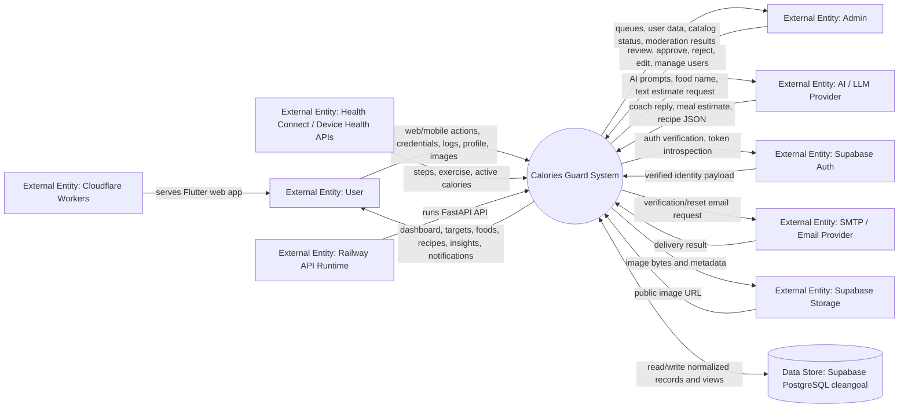

## Level 1 - Main Process Decomposition

```mermaid
flowchart TB
    User[User]
    Admin[Admin]
    AI[AI / LLM Provider]
    Auth[Supabase Auth]
    Email[SMTP / Email Provider]
    Storage[Supabase Storage]
    Health[Health Connect / Device Health APIs]

    P1((P1 Auth and Account Lifecycle))
    P2((P2 Profile, Targets, Preferences))
    P3((P3 Food Catalogue, Ingredients, Recipes))
    P4((P4 Meal Logging and Daily Summaries))
    P5((P5 Water, Weight, Exercise, Progress))
    P6((P6 Insights, Dashboard, Reports))
    P7((P7 Social, Favorites, Reviews, Allergies))
    P8((P8 Gamification and Streaks))
    P9((P9 Notifications and Content))
    P10((P10 Admin Moderation and Governance))
    P11((P11 AI Coach, Meal Estimate, Recipe Generation))
    P12((P12 Uploads and Storage))

    D1[(D1 Identity Store)]
    D2[(D2 Preferences Store)]
    D3[(D3 Food Catalogue Store)]
    D4[(D4 Ingredient and Recipe Store)]
    D5[(D5 User Log Store)]
    D6[(D6 Social Store)]
    D7[(D7 Moderation Store)]
    D8[(D8 Notification Store)]
    D9[(D9 Gamification Store)]
    D10[(D10 Content Store)]
    D12[(D12 Read Models)]
    D13[(D13 Object Storage)]
    D14[(D14 Local Device Cache)]

    User --> P1
    P1 <--> Auth
    P1 --> Email
    P1 <--> D1
    P1 --> D8
    P1 --> User

    User --> P2
    P2 <--> D1
    P2 <--> D2
    P2 --> User

    User --> P3
    P3 <--> D3
    P3 <--> D4
    P3 --> D12
    P3 --> User

    User --> P4
    P4 <--> D3
    P4 <--> D5
    P4 --> User

    User --> P5
    Health --> P5
    P5 <--> D5
    P5 --> User

    User --> P6
    P6 <--> D1
    P6 <--> D5
    P6 <--> D3
    P6 <--> D12
    P6 --> User

    User --> P7
    P7 <--> D6
    P7 <--> D1
    P7 <--> D3
    P7 --> User

    User --> P8
    P8 <--> D9
    P8 <--> D1
    P8 <--> D14
    P8 --> User

    User --> P9
    P9 <--> D8
    P9 <--> D10
    P9 --> User

    Admin --> P10
    P10 <--> D1
    P10 <--> D3
    P10 <--> D4
    P10 <--> D7
    P10 <--> D9
    P10 --> Admin

    User --> P11
    P11 <--> D1
    P11 <--> D3
    P11 <--> D4
    P11 <--> D5
    P11 <--> AI
    P11 --> User

    User --> P12
    P12 <--> Storage
    P12 <--> D3
    P12 <--> D1
    P12 <--> D13
    P12 --> User
```

## Level 2 - Auth and Account Lifecycle

Related endpoints:

- `GET /check-email`
- `POST /register`
- `POST /verify-email`
- `POST /resend-verification-email`
- `POST /login`
- `POST /social-login`
- `POST /password-reset/request`
- `POST /password-reset/verify`
- `POST /password-reset/confirm`

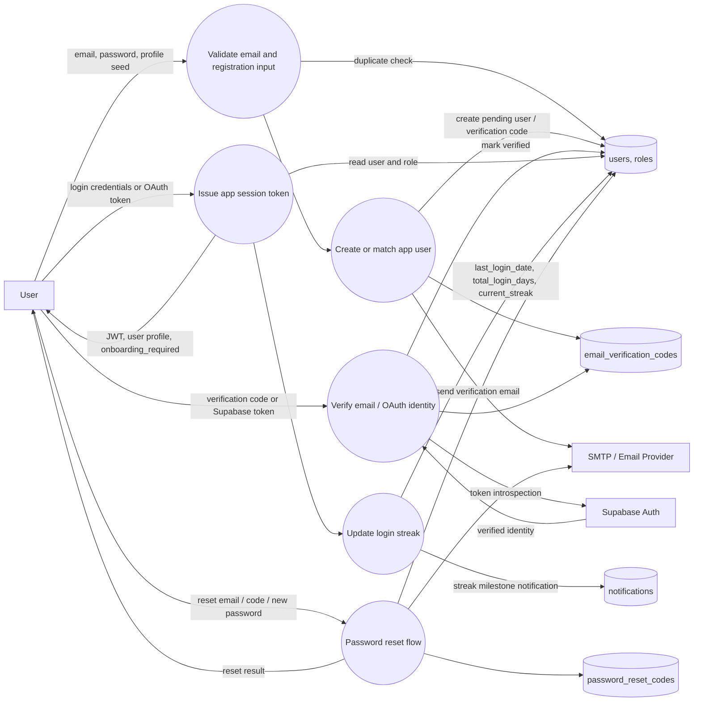

Key controls:

- Login and protected endpoints enforce user ownership via auth dependency checks.
- Streak updates happen during login/social login and may create notification rows.
- Email verification uses Supabase confirmation/token checks plus backend user state.

## Level 2 - Profile, Targets, Goals, and Preferences

Related endpoints:

- `GET /users/{user_id}`
- `PUT /users/{user_id}`
- `GET /users/{user_id}/region`
- `PUT /users/{user_id}/region`
- `POST /users/{user_id}/recalc_tdee`
- `GET /users/{user_id}/export`
- `DELETE /users/{user_id}`
- `GET/POST /users/{user_id}/allergies`

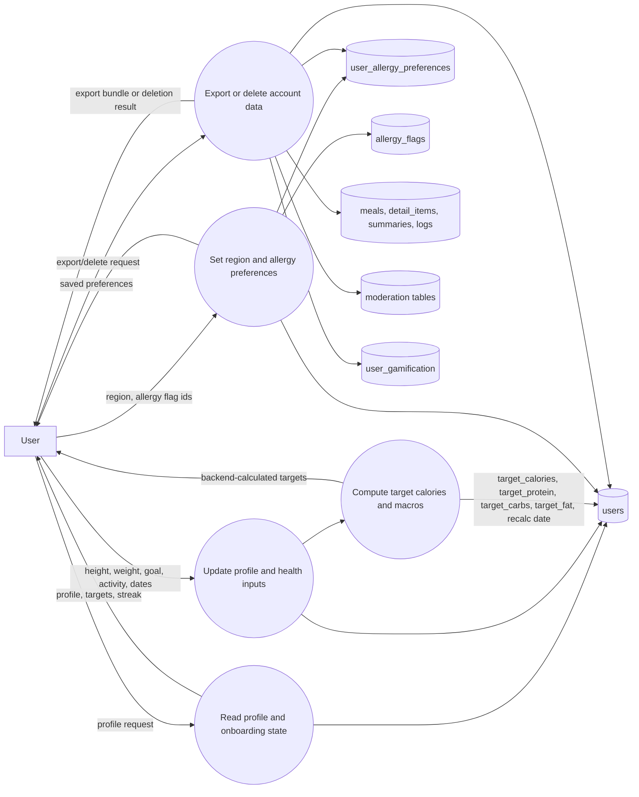

Important calculation direction:

- Backend-calculated targets are the primary source of truth.
- Flutter formula should be treated as fallback or preview only and labelled as estimated.

## Level 2 - Food Catalogue, Ingredients, Units, and Recipes

Related endpoints:

- `GET /foods`
- `GET /foods/search`
- `GET /recommended-food`
- `POST /foods/auto-add`
- `GET /recipes/{food_id}`
- `GET /foods/{food_id}/regional-names`
- `POST /foods/{food_id}/regional-names`
- `GET /units`
- `GET /unit_conversions`
- Admin food endpoints covered in the admin section

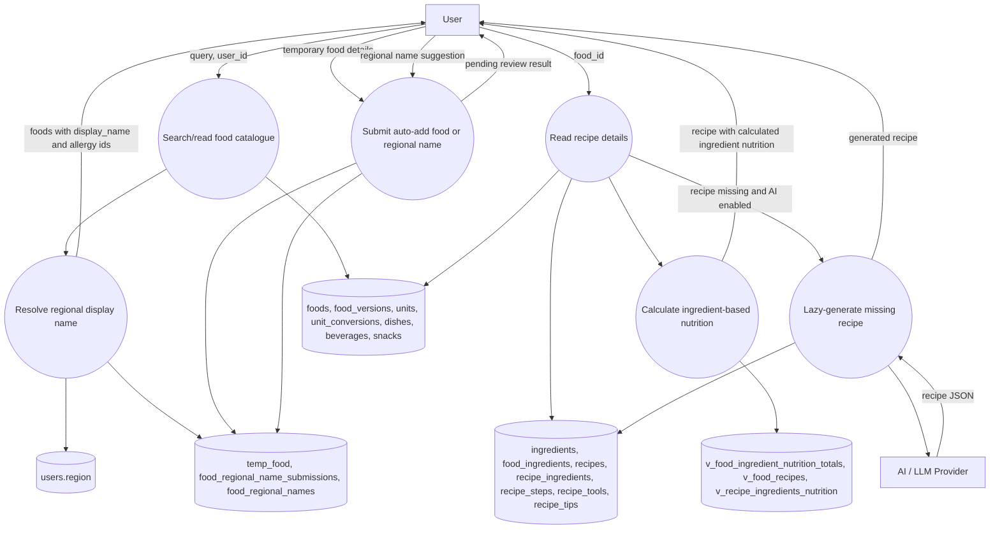

Ingredient calculation flow:

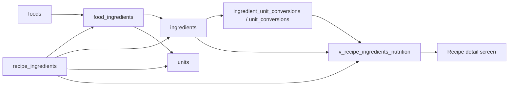

## Level 2 - Meal Logging and Food Snapshot Preservation

Related endpoints:

- `POST /meals/{user_id}`
- `GET /daily_summary/{user_id}`
- `GET /meals/{user_id}/detail`
- `GET /daily_logs/{user_id}`
- `GET /daily_logs/{user_id}/calendar`
- `GET /daily_logs/{user_id}/weekly`
- `DELETE /meals/clear/{user_id}`

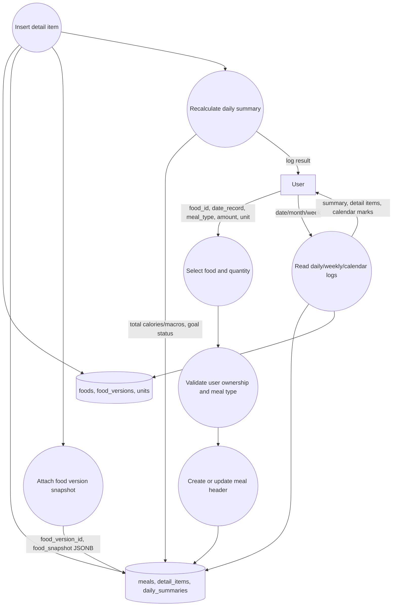

Why this flow matters:

- `foods` can change later due to admin edits.
- `food_versions` and `detail_items.food_snapshot` keep user history reproducible.
- Deleting a catalogue food should be soft-delete, not historical log deletion.

## Level 2 - Water, Weight, Exercise, and Progress

Related endpoints:

- `GET /water_logs/{user_id}`
- `POST /water_logs/{user_id}`
- `POST /weight_logs/{user_id}`
- `GET /users/{user_id}/weight_logs`
- `GET /users/{user_id}/goal_progress`
- `GET /weight_status/{user_id}`
- `GET /progress_summary/{user_id}`

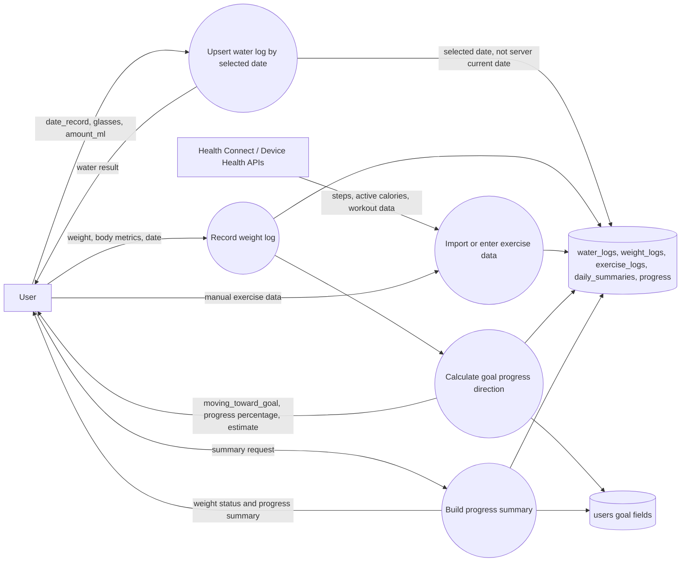

Important controls:

- Water logs must use the selected date from the client.
- Goal progress direction must depend on goal type: loss, gain, or maintain.
- Wearable/exercise calories should be shown as estimates and source-labelled when imported.

## Level 2 - Dashboard, Insights, and Reports

Related endpoints:

- `GET /insights/{user_id}`
- `GET /insights/{user_id}/top_foods`
- `GET /insights/{user_id}/calorie_trend`
- `GET /insights/{user_id}/macro_balance`
- `GET /daily_summary/{user_id}`
- `GET /users/{user_id}/food-frequency`

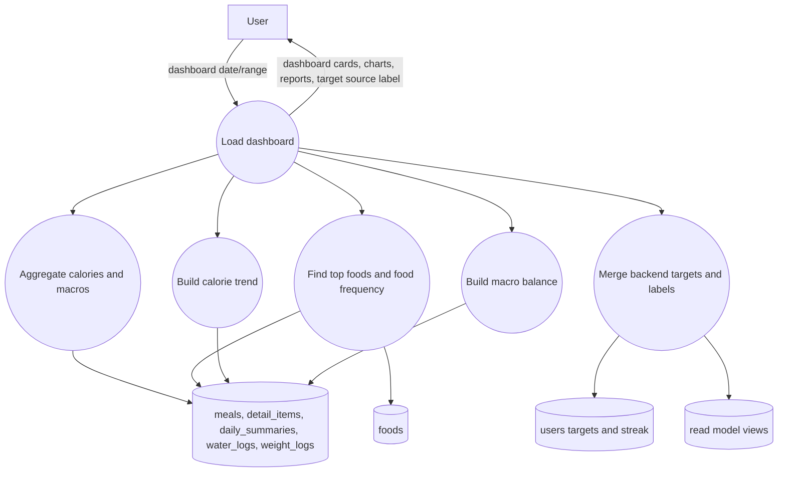

Target display rule:

- If backend target values exist, UI displays backend-calculated values.
- If backend targets are missing and Flutter uses fallback values, UI must label them as estimated.

## Level 2 - Gamification, Tama Points, Badges, and Leaderboard

Related endpoints:

- `GET /users/{user_id}/tama-points`
- `PATCH /users/{user_id}/tama-points`
- `PATCH /admin/users/{user_id}/tama`
- `GET /leaderboard`
- Login/social login streak updates in auth endpoints

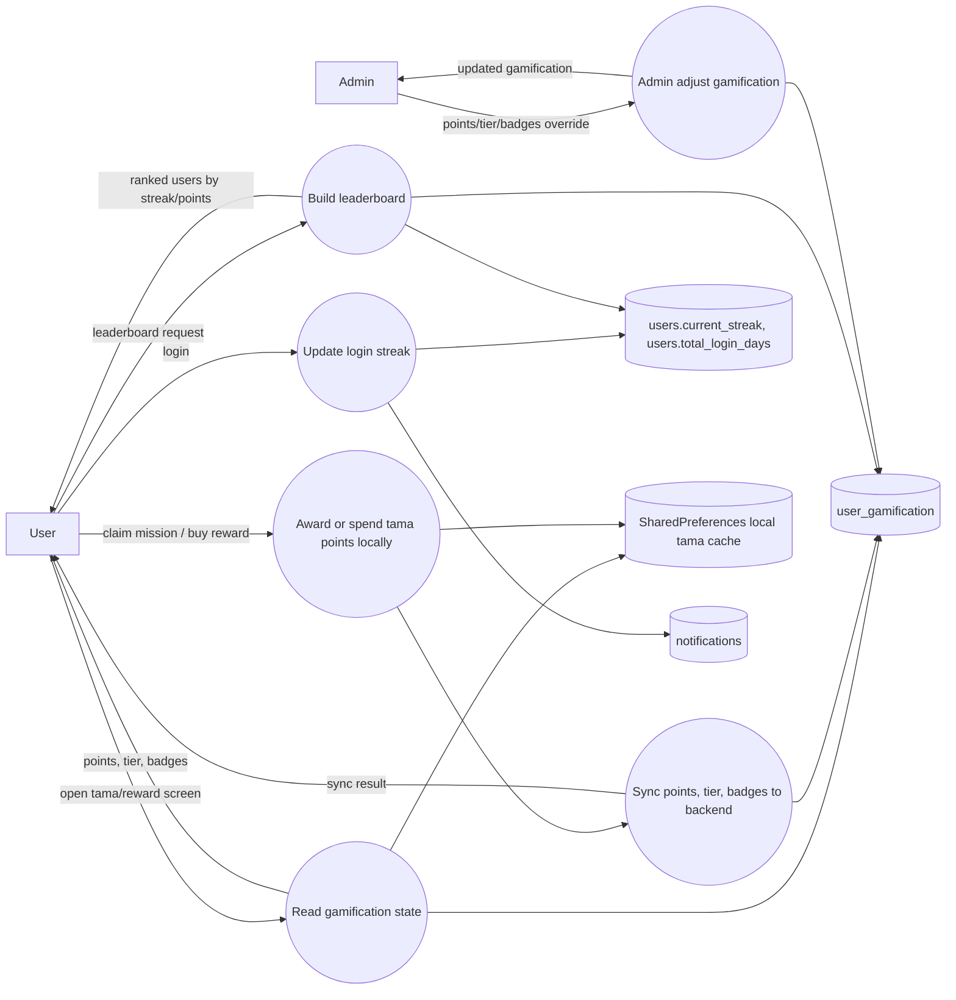

Notes:

- Flutter currently keeps a local point cache and syncs to backend via tama endpoints.
- Backend stores persistent `user_gamification` state for cross-device consistency.
- Login streak is stored on `users`, not only `user_gamification`.

## Level 2 - Social, Favorites, Reviews, and Allergies

Related endpoints:

- `GET /recipes/{food_id}/favorite/{user_id}`
- `POST /recipes/{food_id}/favorite/{user_id}`
- `GET /users/{user_id}/favorites`
- `GET /recipes/{food_id}/reviews`
- `POST /recipes/{food_id}/review`
- `GET /allergy_flags`
- `GET /users/{user_id}/allergies`
- `POST /users/{user_id}/allergies`
- `GET /leaderboard`

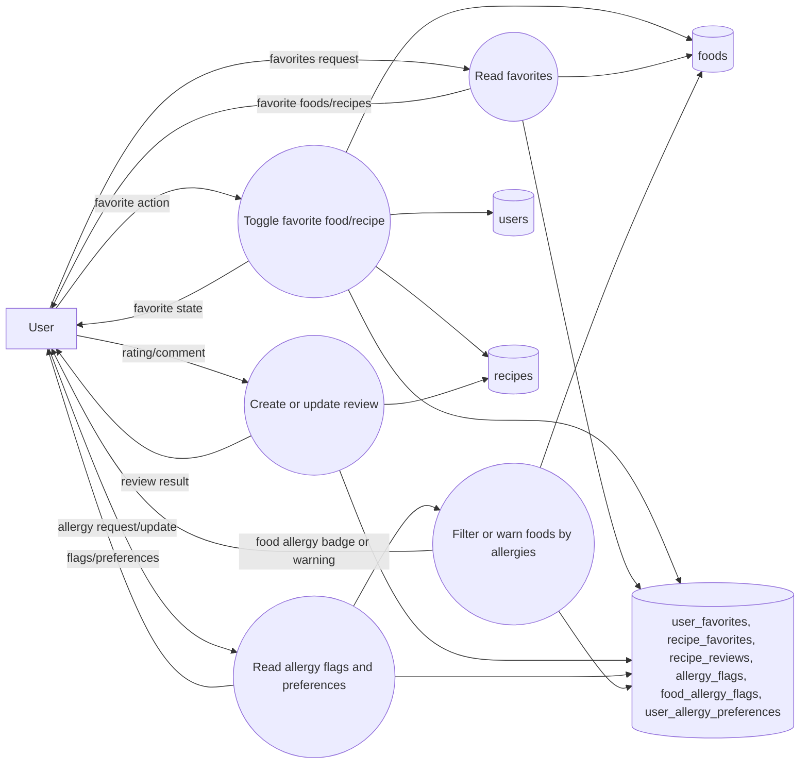

## Level 2 - Notifications and Health Content

Related endpoints:

- `GET /notifications/{user_id}`
- `GET /notifications/{user_id}/unread_count`
- `PUT /notifications/{user_id}/read_all`
- Health contents are stored in `health_contents` and can be exposed by content routes/features.

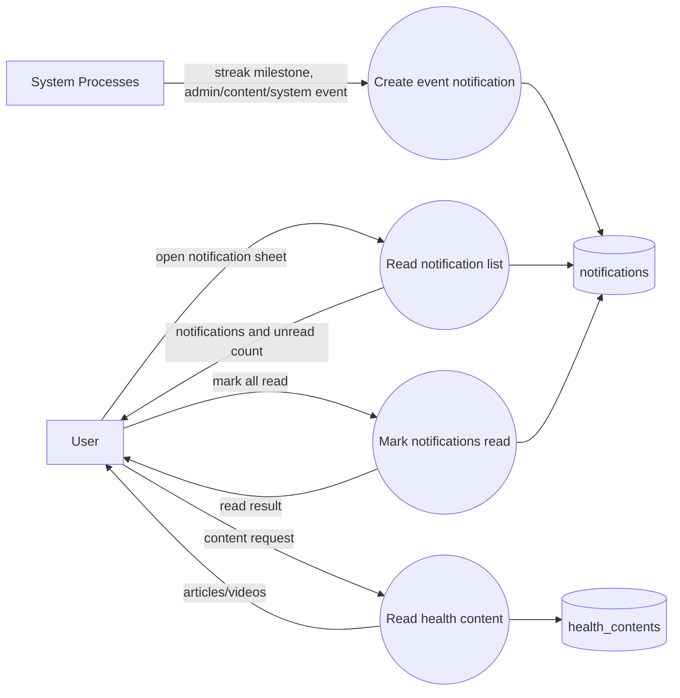

## Level 2 - Admin Moderation and Data Governance

Related endpoints:

- `GET /admin/users`
- `GET /admin/users/{user_id}`
- `PATCH /admin/users/{user_id}`
- `DELETE /admin/users/{user_id}`
- `GET /admin/temp-foods/pending-count`
- `GET /admin/temp-foods`
- `GET /admin/foods/similar`
- `POST /admin/temp-foods/{tf_id}/approve`
- `DELETE /admin/temp-foods/{tf_id}`
- `GET /admin/regional-name-submissions`
- `POST /admin/regional-name-submissions/{submission_id}/approve`
- `POST /admin/regional-name-submissions/{submission_id}/reject`
- `POST /foods`
- `PUT /foods/{food_id}`
- `PATCH /foods/{food_id}`
- `DELETE /foods/{food_id}`

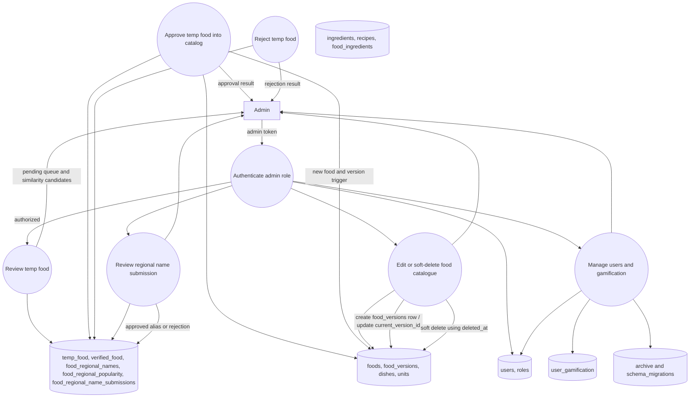

Governance rules:

- Admin food edits create or update immutable food version records.
- Soft delete protects existing user history.
- Regional names are moderated before becoming searchable/displayable.
- Temporary food approval should normalize values into catalog tables and mark review state.

## Level 2 - AI Coach, Meal Estimate, and Recipe Generation

Related endpoints:

- `POST /api/chat/coach`
- `POST /api/meals/estimate`
- `POST /api/chat/multi`
- `GET /recipes/{food_id}` may lazy-generate a recipe if missing and AI is configured.

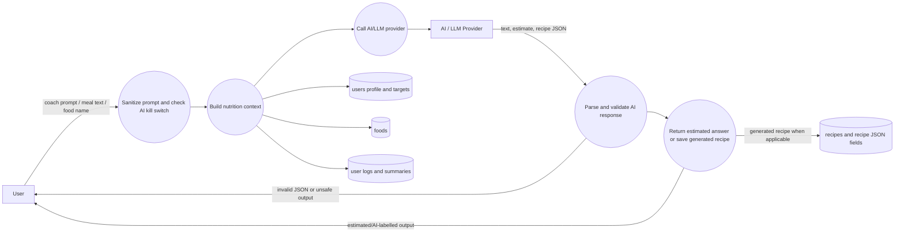

AI safety constraints:

- AI meal estimates are not treated as exact nutrition values until the user confirms.
- AI-generated recipes must be parsed/validated before storing.
- AI coach should not make diagnosis or treatment claims.
- AI endpoints are disabled when the backend kill switch/config says AI is off.

## Level 2 - Uploads and Storage

Related endpoints:

- `POST /upload-image/`
- `POST /upload_image`

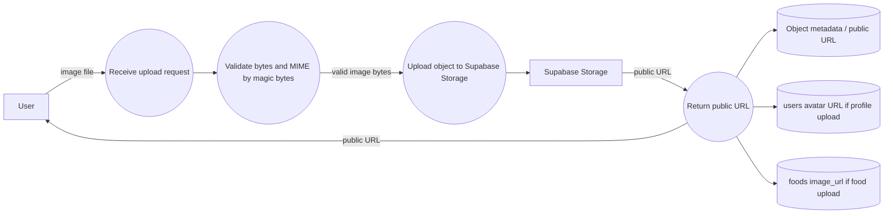

Controls:

- Validate content from bytes, not only client-provided content type.
- Store only public URL or storage path in database, not image bytes.

## Cross-Cutting Data Flows

### Authorization and Ownership

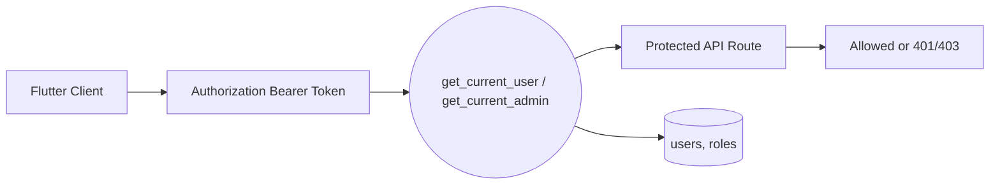

### Food Edit to Historical Log Protection

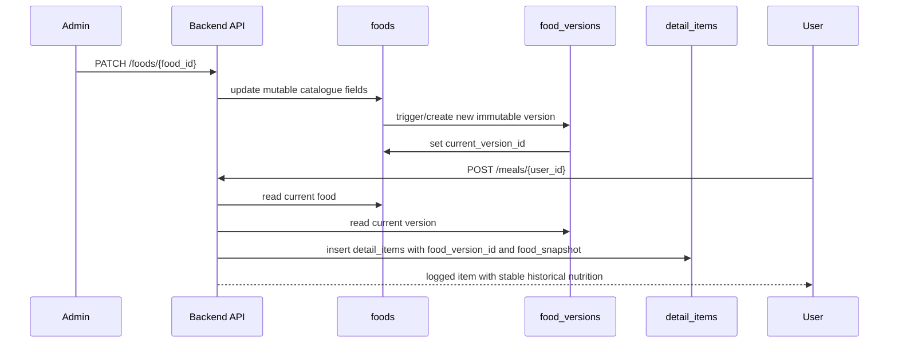

### User Dashboard Refresh

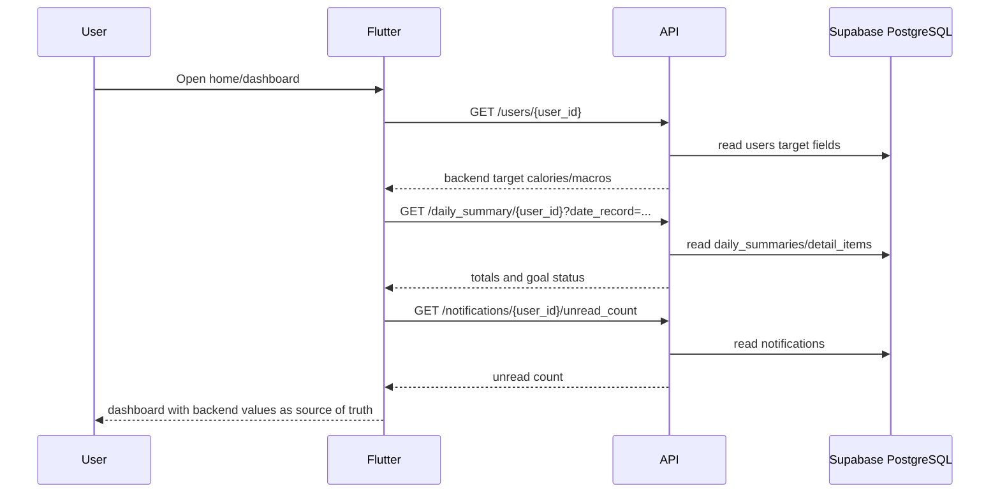

## CRUD Matrix by Main Data Store

| Data Store | Create | Read | Update | Delete / Soft Delete |
|---|---|---|---|---|
| D1 Identity Store | register, social-login | profile/admin users | profile, login streak, password reset | user delete/soft delete |
| D2 Preferences Store | set allergies/region | profile/allergies | update allergies/region | replace allergy preferences |
| D3 Food Catalogue Store | admin approve/create food | foods/search/recommended | admin edit food, version trigger | soft delete food |
| D4 Ingredient and Recipe Store | generated/manual recipes, ingredients via migration/admin | recipes/ingredient views | recipe/admin maintenance | usually retain or archive |
| D5 User Log Store | meals, water, weight, exercise | daily/weekly/calendar/progress | summaries, water upsert | clear meal type, user deletion cascade |
| D6 Social Store | favorites, reviews, allergy mapping | favorites/reviews/allergy flags | upsert review/allergies | toggle favorite/delete review where supported |
| D7 Moderation Store | temp food, regional submissions | admin pending queues | approve/reject state | reject/delete pending item |
| D8 Notification Store | streak/system/content events | notification list/unread count | mark all read | retention cleanup if added later |
| D9 Gamification Store | first tama sync | tama points/leaderboard | points, tier, claimed badges | admin/user deletion cascade |
| D10 Content Store | admin/seed content | health content | content updates | content removal/soft delete if added |
| D13 Object Storage | image upload | public URL | overwrite/delete-then-upload for avatar | object cleanup if added |

## Open Technical Debt and Risk Notes

| Area | Current Risk | Recommended Control |
|---|---|---|
| AI meal estimate | AI outputs can be approximate or wrong | Require explicit estimated label and user confirmation before saving |
| Flutter local gamification cache | Local points can temporarily diverge from backend | Keep backend sync as final state and resolve conflicts by latest backend update |
| Health data imports | Wearable active calories are estimates | Store source and timestamp; avoid double-counting in TDEE/exercise |
| Food catalog edits | Mutable food data can alter historical meaning | Continue using `food_versions` and `detail_items.food_snapshot` |
| Ingredient conversion gaps | `ingredient_unit_conversions` currently may be sparse | Add conversions for common Thai household units per ingredient |
| Archive tables | Archive tables exist in full schema but are not product stores | Keep out of app queries except migration/admin diagnostics |
| Admin moderation | Duplicate/low-quality food submissions can pollute catalog | Use similarity check, review status, and audit trail |

## Traceability to Current Backend Routes

| Process | Main Routers |
|---|---|
| P1 Auth and Account Lifecycle | `backend/app/routers/auth.py` |
| P2 Profile, Targets, Preferences | `backend/app/routers/users.py`, `backend/app/routers/social.py` |
| P3 Food Catalogue, Ingredients, Recipes | `backend/app/routers/foods.py`, `backend/app/routers/health.py` |
| P4 Meal Logging and Daily Summaries | `backend/app/routers/meals.py` |
| P5 Water, Weight, Exercise, Progress | `backend/app/routers/water.py`, `backend/app/routers/weight.py` |
| P6 Insights, Dashboard, Reports | `backend/app/routers/insights.py`, `backend/app/routers/meals.py` |
| P7 Social, Favorites, Reviews, Allergies | `backend/app/routers/social.py` |
| P8 Gamification and Streaks | `backend/app/routers/users.py`, `backend/app/routers/admin.py`, `backend/app/routers/auth.py` |
| P9 Notifications and Content | `backend/app/routers/notifications.py` |
| P10 Admin Moderation and Governance | `backend/app/routers/admin.py`, `backend/app/routers/foods.py` |
| P11 AI Coach and Estimate | `backend/app/routers/chat.py`, `backend/app/routers/foods.py` |
| P12 Uploads and Storage | `backend/app/routers/health.py` |

