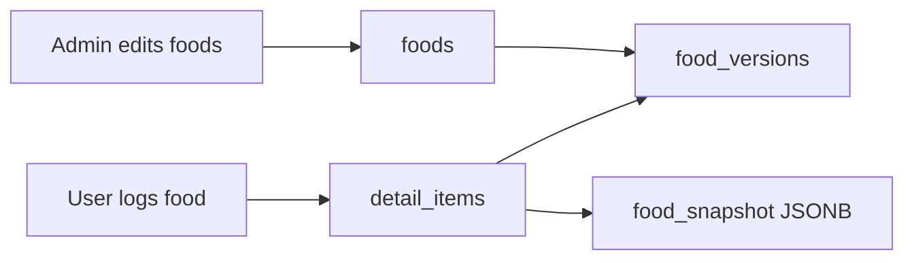
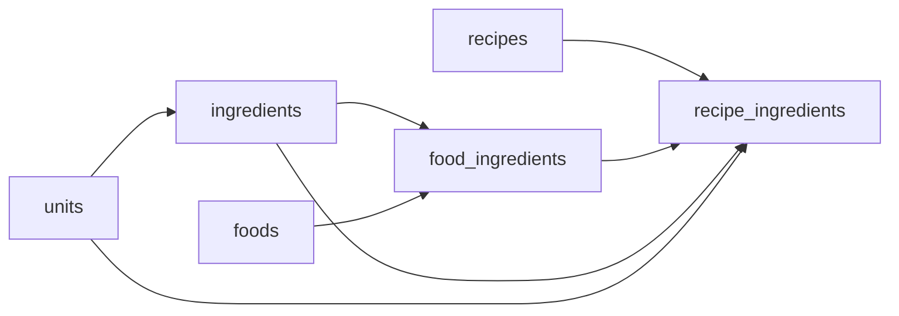

# ER Diagram Full Version - Calories Guard

- Generated at: 2026-05-05 11:34:30 +0700 (Asia/Bangkok)
- Source: live Supabase/PostgreSQL schema `cleangoal`
- Latest migration context: `backend/migrations/v26_food_versioning_and_log_snapshots.sql`
- Scope: 48 base tables, 4 views, 65 foreign keys, 9 enums

## Reading Guide

- `PK` = primary key, `FK` = foreign key, `UK` = unique key.
- Mermaid relationships use parent `||--o{` child for one-to-many and `||--o|` when the child FK is unique.
- Archive and migration tables are included because this is the full live schema, but they are not part of the main user-facing domain model.

## Domain Overview

| Domain | Tables |
|---|---|
| Identity & Access | email_verification_codes, password_reset_codes, roles, users |
| Food Catalog & Nutrition Master | allergy_flags, beverages, dish_categories, dishes, food_allergy_flags, food_ingredients, food_versions, foods, ingredient_unit_conversions, ingredients, snacks, unit_conversions, units |
| Recipes | recipe_favorites, recipe_ingredients, recipe_reviews, recipe_steps, recipe_tips, recipe_tools, recipes |
| Logging & Summaries | daily_summaries, detail_items, exercise_logs, meals, water_logs, weight_logs |
| Goals & Personalization | user_allergy_preferences, user_meal_plans |
| Moderation & Regionalization | food_regional_name_submissions, food_regional_names, food_regional_popularity, temp_food, verified_food |
| Content & Notifications | health_contents, notifications, user_favorites |
| Gamification | user_gamification |
| Migration / Archive / Audit Support | food_ingredients_archive, food_requests_archive, ingredients_archive, recipe_relation_orphan_archive, recipe_reviews_orphan_archive, schema_migrations, unit_conversion_orphan_archive |
| Other / Extension | v_admin_temp_food_review, v_food_ingredient_nutrition_totals, v_food_recipes, v_recipe_ingredients_nutrition |

## Full Mermaid ER Diagram

```mermaid
erDiagram
    allergy_flags {
        integer flag_id PK
        character_varying name
        character_varying description
    }
    beverages {
        bigint beverage_id PK
        bigint food_id FK UK
        numeric volume_ml
        boolean is_alcoholic
        numeric caffeine_mg
        character_varying sugar_level_label
        character_varying container_type
    }
    daily_summaries {
        bigint summary_id PK
        bigint user_id FK
        date date_record
        numeric total_calories_intake
        numeric total_protein
        numeric total_carbs
        numeric total_fat
        integer water_glasses
        integer goal_calories
        boolean is_goal_met
        timestamp_with_time_zone updated_at
    }
    detail_items {
        bigint item_id PK
        bigint meal_id FK
        bigint plan_id FK
        bigint summary_id FK
        bigint food_id FK
        character_varying food_name
        integer day_number
        numeric amount
        integer unit_id FK
        numeric cal_per_unit
        numeric protein_per_unit
        numeric carbs_per_unit
        numeric fat_per_unit
        character_varying note
        timestamp_with_time_zone created_at
        timestamp_with_time_zone updated_at
        bigint food_version_id FK
        jsonb food_snapshot
    }
    dish_categories {
        bigint dish_category_id PK
        character_varying category_name
        food_type canonical_food_type
        text description
        integer display_order
        timestamp_with_time_zone created_at
    }
    dishes {
        bigint dish_id PK
        character_varying dish_name
        bigint dish_category_id FK
        food_type canonical_food_type
        character_varying cuisine
        text description
        character_varying image_url
        timestamp_with_time_zone created_at
        timestamp_with_time_zone updated_at
        timestamp_with_time_zone deleted_at
    }
    email_verification_codes {
        bigint id PK
        bigint user_id FK
        character_varying code
        timestamp_with_time_zone expires_at
        boolean used
        timestamp_with_time_zone created_at
    }
    exercise_logs {
        bigint log_id PK
        bigint user_id FK
        date date_record
        character_varying activity_name
        integer duration_minutes
        numeric calories_burned
        character_varying intensity
        character_varying note
        timestamp_with_time_zone created_at
        timestamp_with_time_zone updated_at
    }
    food_allergy_flags {
        bigint food_id PK FK
        integer flag_id PK FK
    }
    food_ingredients {
        bigint food_ing_id PK
        bigint food_id FK
        bigint ingredient_id FK
        numeric amount
        integer unit_id FK
        numeric calculated_grams
        character_varying note
        integer sort_order
        timestamp_with_time_zone created_at
        timestamp_with_time_zone updated_at
    }
    food_ingredients_archive {
        bigint food_ing_id
        bigint food_id
        bigint ingredient_id
        numeric amount
        integer unit_id
        numeric calculated_grams
        character_varying note
    }
    food_regional_name_submissions {
        bigint submission_id PK
        bigint food_id FK
        thai_region region
        character_varying name_th
        smallint popularity
        bigint user_id FK
        request_status status
        bigint reviewed_by FK
        timestamp_with_time_zone reviewed_at
        timestamp_with_time_zone created_at
    }
    food_regional_names {
        bigint variant_id PK
        bigint food_id FK
        thai_region region
        character_varying name_th
        boolean is_primary
        bigint created_by FK
        bigint approved_by FK
        timestamp_with_time_zone created_at
        timestamp_with_time_zone updated_at
        timestamp_with_time_zone deleted_at
    }
    food_regional_popularity {
        bigint food_id PK FK
        thai_region region PK
        smallint popularity
        character_varying note
        timestamp_with_time_zone updated_at
    }
    food_requests_archive {
        bigint request_id
        bigint user_id
        character_varying food_name
        request_status status
        jsonb ingredients_json
        bigint reviewed_by
        timestamp_with_time_zone created_at
    }
    food_versions {
        bigint food_version_id PK
        bigint food_id FK
        integer version_number
        character_varying food_name
        food_type food_type
        numeric calories
        numeric protein
        numeric carbs
        numeric fat
        numeric sodium
        numeric sugar
        numeric cholesterol
        numeric fiber_g
        numeric serving_quantity
        integer serving_unit_id FK
        bigint dish_id FK
        character_varying image_url
        character_varying source
        text change_reason
        boolean is_current
        timestamp_with_time_zone effective_from
        timestamp_with_time_zone effective_to
        timestamp_with_time_zone created_at
        bigint created_by FK
    }
    foods {
        bigint food_id PK
        character_varying food_name UK
        food_type food_type
        numeric calories
        numeric protein
        numeric carbs
        numeric fat
        numeric sodium
        numeric sugar
        numeric cholesterol
        numeric serving_quantity
        character_varying image_url
        timestamp_with_time_zone created_at
        timestamp_with_time_zone updated_at
        timestamp_with_time_zone deleted_at
        numeric fiber_g
        integer serving_unit_id FK
        bigint dish_id FK
        bigint current_version_id FK
    }
    health_contents {
        bigint content_id PK
        character_varying title
        content_type type
        character_varying thumbnail_url
        character_varying resource_url
        text description
        character_varying category_tag
        character_varying difficulty_level
        boolean is_published
        timestamp_with_time_zone created_at
    }
    ingredient_unit_conversions {
        bigint ingredient_unit_conversion_id PK
        bigint ingredient_id FK
        integer from_unit_id FK
        integer to_unit_id FK
        numeric factor
        character_varying note
        timestamp_with_time_zone created_at
    }
    ingredients {
        bigint ingredient_id PK
        character_varying name
        character_varying category
        integer default_unit_id FK
        numeric calories_per_unit
        numeric protein_per_unit
        numeric carbs_per_unit
        numeric fat_per_unit
        numeric calories_per_100g
        numeric protein_per_100g
        numeric carbs_per_100g
        numeric fat_per_100g
        numeric sodium_mg_per_100g
        numeric sugar_g_per_100g
        numeric cholesterol_mg_per_100g
        numeric density_g_per_ml
        character_varying source_reference
        timestamp_with_time_zone created_at
        timestamp_with_time_zone updated_at
        character_varying source_food_code
        character_varying name_en
        character_varying scientific_name
        numeric nutrition_basis_quantity
        integer nutrition_basis_unit_id FK
        numeric fiber_g_per_100g
        numeric water_g_per_100g
        numeric calcium_mg_per_100g
        numeric phosphorus_mg_per_100g
        numeric iron_mg_per_100g
    }
    ingredients_archive {
        bigint ingredient_id
        character_varying name
        character_varying category
        integer default_unit_id
        numeric calories_per_unit
        timestamp_with_time_zone created_at
    }
    meals {
        bigint meal_id PK
        bigint user_id FK
        timestamp_with_time_zone meal_time
        numeric total_amount
        timestamp_with_time_zone created_at
        timestamp_with_time_zone updated_at
        meal_type meal_type
    }
    notifications {
        bigint notification_id PK
        bigint user_id FK
        character_varying title
        text message
        notification_type type
        boolean is_read
        timestamp_with_time_zone created_at
    }
    password_reset_codes {
        bigint id PK
        bigint user_id FK
        character_varying code
        timestamp_with_time_zone expires_at
        boolean used
        timestamp_with_time_zone created_at
    }
    recipe_favorites {
        bigint fav_id PK
        bigint recipe_id FK
        bigint user_id FK
        timestamp_with_time_zone created_at
    }
    recipe_ingredients {
        bigint ing_id PK
        bigint recipe_id FK
        character_varying ingredient_name
        numeric quantity
        character_varying unit
        boolean is_optional
        character_varying note
        integer sort_order
        timestamp_with_time_zone created_at
        bigint food_ing_id FK
        bigint ingredient_id FK
        integer unit_id FK
        numeric calculated_grams
        numeric calculated_calories
        numeric calculated_protein
        numeric calculated_carbs
        numeric calculated_fat
        timestamp_with_time_zone updated_at
    }
    recipe_relation_orphan_archive {
        bigint archive_id PK
        character_varying source_table
        bigint source_pk
        bigint legacy_recipe_id
        bigint legacy_user_id
        jsonb row_data
        text archive_reason
        timestamp_with_time_zone archived_at
    }
    recipe_reviews {
        bigint review_id PK
        bigint recipe_id FK
        bigint user_id FK
        smallint rating
        text comment
        timestamp_with_time_zone created_at
    }
    recipe_reviews_orphan_archive {
        bigint archive_id PK
        bigint review_id
        bigint legacy_recipe_id
        bigint legacy_food_id
        bigint user_id
        smallint rating
        text comment
        timestamp_with_time_zone created_at
        timestamp_with_time_zone archived_at
        text archive_reason
    }
    recipe_steps {
        bigint step_id PK
        bigint recipe_id FK
        integer step_number
        character_varying title
        text instruction
        integer time_minutes
        character_varying image_url
        text tips
        timestamp_with_time_zone created_at
    }
    recipe_tips {
        bigint tip_id PK
        bigint recipe_id FK
        text tip_text
        integer sort_order
        timestamp_with_time_zone created_at
    }
    recipe_tools {
        bigint tool_id PK
        bigint recipe_id FK
        character_varying tool_name
        character_varying tool_emoji
        integer sort_order
        timestamp_with_time_zone created_at
    }
    recipes {
        bigint recipe_id PK
        bigint food_id FK UK
        character_varying description
        text instructions
        integer prep_time_minutes
        integer cooking_time_minutes
        numeric serving_people
        character_varying source_reference
        character_varying image_url
        timestamp_with_time_zone created_at
        timestamp_with_time_zone deleted_at
        numeric avg_rating
        integer review_count
        jsonb ingredients_json
        jsonb tools_json
        jsonb tips_json
        character_varying generated_by
        integer favorite_count
    }
    roles {
        integer role_id PK
        character_varying role_name UK
    }
    schema_migrations {
        character_varying version PK
        timestamp_with_time_zone applied_at
    }
    snacks {
        bigint snack_id PK
        bigint food_id FK UK
        boolean is_sweet
        character_varying packaging_type
        numeric trans_fat
    }
    temp_food {
        bigint tf_id PK
        character_varying food_name
        numeric protein
        numeric fat
        numeric carbs
        numeric calories
        bigint user_id FK
        timestamp_with_time_zone created_at
        timestamp_with_time_zone updated_at
    }
    unit_conversion_orphan_archive {
        bigint archive_id PK
        integer conversion_id
        integer from_unit_id
        integer to_unit_id
        jsonb row_data
        text archive_reason
        timestamp_with_time_zone archived_at
    }
    unit_conversions {
        integer conversion_id PK
        integer from_unit_id FK
        integer to_unit_id FK
        numeric factor
        character_varying note
        timestamp_with_time_zone created_at
    }
    units {
        integer unit_id PK
        character_varying name
        numeric quantity
    }
    user_allergy_preferences {
        bigint user_id PK FK
        integer flag_id PK FK
        character_varying preference_type
        timestamp_with_time_zone created_at
    }
    user_favorites {
        bigint id PK
        bigint user_id FK
        bigint food_id FK
        timestamp_with_time_zone created_at
    }
    user_gamification {
        integer user_id PK FK
        integer tama_points
        smallint tier_level
        timestamp_with_time_zone updated_at
        ARRAY claimed_badges
    }
    user_meal_plans {
        bigint plan_id PK
        bigint user_id FK
        character_varying name
        text description
        character_varying source_type
        boolean is_premium
        timestamp_with_time_zone created_at
    }
    users {
        bigint user_id PK
        character_varying username
        character_varying email UK
        character_varying password_hash
        gender_type gender
        date birth_date
        numeric height_cm
        numeric current_weight_kg
        goal_type_enum goal_type
        numeric target_weight_kg
        integer target_calories
        integer target_protein
        integer target_carbs
        integer target_fat
        activity_level activity_level
        date goal_start_date
        date goal_target_date
        date last_kpi_check_date
        integer current_streak
        timestamp_with_time_zone last_login_date
        integer total_login_days
        character_varying avatar_url
        integer role_id FK
        boolean is_email_verified
        timestamp_with_time_zone consent_accepted_at
        timestamp_with_time_zone created_at
        timestamp_with_time_zone updated_at
        timestamp_with_time_zone deleted_at
        date last_tdee_recalc_date
        thai_region region
        character_varying region_source
    }
    verified_food {
        bigint vf_id PK
        bigint tf_id FK UK
        boolean is_verify
        bigint verified_by FK
        timestamp_with_time_zone verified_at
        timestamp_with_time_zone created_at
        timestamp_with_time_zone updated_at
    }
    water_logs {
        bigint log_id PK
        bigint user_id FK
        date date_record
        integer glasses
        timestamp_with_time_zone updated_at
        integer amount_ml
    }
    weight_logs {
        bigint log_id PK
        bigint user_id FK
        numeric weight_kg
        date recorded_date
        timestamp_with_time_zone created_at
    }
    allergy_flags ||--o{ food_allergy_flags : "faf_flag_id_fkey"
    allergy_flags ||--o{ user_allergy_preferences : "user_allergy_preferences_flag_id_fkey"
    daily_summaries ||--o{ detail_items : "detail_items_summary_id_fkey"
    dish_categories ||--o{ dishes : "dishes_dish_category_id_fkey"
    dishes ||--o{ food_versions : "food_versions_dish_id_fkey"
    dishes ||--o{ foods : "foods_dish_id_fkey"
    food_ingredients ||--o{ recipe_ingredients : "recipe_ingredients_food_ing_id_fkey"
    food_versions ||--o{ detail_items : "detail_items_food_version_id_fkey"
    food_versions ||--o{ foods : "foods_current_version_id_fkey"
    foods ||--o| beverages : "beverages_food_id_fkey"
    foods ||--o{ detail_items : "fk_detail_items_food"
    foods ||--o{ food_allergy_flags : "faf_food_id_fkey"
    foods ||--o{ food_ingredients : "food_ingredients_food_id_fkey"
    foods ||--o{ food_regional_name_submissions : "food_regional_name_submissions_food_id_fkey"
    foods ||--o{ food_regional_names : "food_regional_names_food_id_fkey"
    foods ||--o{ food_regional_popularity : "food_regional_popularity_food_id_fkey"
    foods ||--o{ food_versions : "food_versions_food_id_fkey"
    foods ||--o| recipes : "recipes_food_id_fkey"
    foods ||--o| snacks : "snacks_food_id_fkey"
    foods ||--o{ user_favorites : "user_favorites_food_id_fkey"
    ingredients ||--o{ food_ingredients : "food_ingredients_ingredient_id_fkey"
    ingredients ||--o{ ingredient_unit_conversions : "ingredient_unit_conversions_ingredient_id_fkey"
    ingredients ||--o{ recipe_ingredients : "recipe_ingredients_ingredient_id_fkey"
    meals ||--o{ detail_items : "detail_items_meal_id_fkey"
    recipes ||--o{ recipe_favorites : "recipe_favorites_recipe_id_fkey"
    recipes ||--o{ recipe_ingredients : "recipe_ingredients_recipe_id_fkey"
    recipes ||--o{ recipe_reviews : "recipe_reviews_recipe_id_fkey"
    recipes ||--o{ recipe_steps : "recipe_steps_recipe_id_fkey"
    recipes ||--o{ recipe_tips : "recipe_tips_recipe_id_fkey"
    recipes ||--o{ recipe_tools : "recipe_tools_recipe_id_fkey"
    roles ||--o{ users : "users_role_id_fkey"
    temp_food ||--o| verified_food : "verified_food_tf_id_fkey"
    units ||--o{ detail_items : "detail_items_unit_id_fkey"
    units ||--o{ food_ingredients : "food_ingredients_unit_id_fkey"
    units ||--o{ food_versions : "food_versions_serving_unit_id_fkey"
    units ||--o{ foods : "foods_serving_unit_id_fkey"
    units ||--o{ ingredient_unit_conversions : "ingredient_unit_conversions_from_unit_id_fkey"
    units ||--o{ ingredient_unit_conversions : "ingredient_unit_conversions_to_unit_id_fkey"
    units ||--o{ ingredients : "ingredients_default_unit_id_fkey"
    units ||--o{ ingredients : "ingredients_nutrition_basis_unit_id_fkey"
    units ||--o{ recipe_ingredients : "recipe_ingredients_unit_id_fkey"
    units ||--o{ unit_conversions : "unit_conversions_from_unit_id_fkey"
    units ||--o{ unit_conversions : "unit_conversions_to_unit_id_fkey"
    user_meal_plans ||--o{ detail_items : "fk_detail_items_plan"
    users ||--o{ daily_summaries : "daily_summaries_user_id_fkey"
    users ||--o{ email_verification_codes : "email_verification_codes_user_id_fkey"
    users ||--o{ exercise_logs : "exercise_logs_user_id_fkey"
    users ||--o{ food_regional_name_submissions : "food_regional_name_submissions_reviewed_by_fkey"
    users ||--o{ food_regional_name_submissions : "food_regional_name_submissions_user_id_fkey"
    users ||--o{ food_regional_names : "food_regional_names_approved_by_fkey"
    users ||--o{ food_regional_names : "food_regional_names_created_by_fkey"
    users ||--o{ food_versions : "food_versions_created_by_fkey"
    users ||--o{ meals : "fk_meals_user"
    users ||--o{ notifications : "notifications_user_id_fkey"
    users ||--o{ password_reset_codes : "password_reset_codes_user_id_fkey"
    users ||--o{ recipe_favorites : "recipe_favorites_user_id_fkey"
    users ||--o{ recipe_reviews : "recipe_reviews_user_id_fkey"
    users ||--o{ temp_food : "temp_food_user_id_fkey"
    users ||--o{ user_allergy_preferences : "user_allergy_preferences_user_id_fkey"
    users ||--o{ user_favorites : "user_favorites_user_id_fkey"
    users ||--o| user_gamification : "user_gamification_user_id_fkey"
    users ||--o{ user_meal_plans : "user_meal_plans_user_id_fkey"
    users ||--o{ verified_food : "verified_food_verified_by_fkey"
    users ||--o{ water_logs : "water_logs_user_id_fkey"
    users ||--o{ weight_logs : "weight_logs_user_id_fkey"
```

## Relationship Catalogue

| # | From child table.column | To parent table.column | On update | On delete | Constraint |
|---:|---|---|---|---|---|
| 1 | `beverages.food_id` | `foods.food_id` | NO ACTION | NO ACTION | `beverages_food_id_fkey` |
| 2 | `daily_summaries.user_id` | `users.user_id` | NO ACTION | CASCADE | `daily_summaries_user_id_fkey` |
| 3 | `detail_items.food_version_id` | `food_versions.food_version_id` | NO ACTION | SET NULL | `detail_items_food_version_id_fkey` |
| 4 | `detail_items.meal_id` | `meals.meal_id` | NO ACTION | CASCADE | `detail_items_meal_id_fkey` |
| 5 | `detail_items.summary_id` | `daily_summaries.summary_id` | NO ACTION | CASCADE | `detail_items_summary_id_fkey` |
| 6 | `detail_items.unit_id` | `units.unit_id` | NO ACTION | SET NULL | `detail_items_unit_id_fkey` |
| 7 | `detail_items.food_id` | `foods.food_id` | NO ACTION | SET NULL | `fk_detail_items_food` |
| 8 | `detail_items.plan_id` | `user_meal_plans.plan_id` | NO ACTION | CASCADE | `fk_detail_items_plan` |
| 9 | `dishes.dish_category_id` | `dish_categories.dish_category_id` | NO ACTION | RESTRICT | `dishes_dish_category_id_fkey` |
| 10 | `email_verification_codes.user_id` | `users.user_id` | NO ACTION | CASCADE | `email_verification_codes_user_id_fkey` |
| 11 | `exercise_logs.user_id` | `users.user_id` | NO ACTION | CASCADE | `exercise_logs_user_id_fkey` |
| 12 | `food_allergy_flags.flag_id` | `allergy_flags.flag_id` | NO ACTION | CASCADE | `faf_flag_id_fkey` |
| 13 | `food_allergy_flags.food_id` | `foods.food_id` | NO ACTION | CASCADE | `faf_food_id_fkey` |
| 14 | `food_ingredients.food_id` | `foods.food_id` | NO ACTION | CASCADE | `food_ingredients_food_id_fkey` |
| 15 | `food_ingredients.ingredient_id` | `ingredients.ingredient_id` | NO ACTION | RESTRICT | `food_ingredients_ingredient_id_fkey` |
| 16 | `food_ingredients.unit_id` | `units.unit_id` | NO ACTION | SET NULL | `food_ingredients_unit_id_fkey` |
| 17 | `food_regional_name_submissions.food_id` | `foods.food_id` | NO ACTION | CASCADE | `food_regional_name_submissions_food_id_fkey` |
| 18 | `food_regional_name_submissions.reviewed_by` | `users.user_id` | NO ACTION | SET NULL | `food_regional_name_submissions_reviewed_by_fkey` |
| 19 | `food_regional_name_submissions.user_id` | `users.user_id` | NO ACTION | CASCADE | `food_regional_name_submissions_user_id_fkey` |
| 20 | `food_regional_names.approved_by` | `users.user_id` | NO ACTION | SET NULL | `food_regional_names_approved_by_fkey` |
| 21 | `food_regional_names.created_by` | `users.user_id` | NO ACTION | SET NULL | `food_regional_names_created_by_fkey` |
| 22 | `food_regional_names.food_id` | `foods.food_id` | NO ACTION | CASCADE | `food_regional_names_food_id_fkey` |
| 23 | `food_regional_popularity.food_id` | `foods.food_id` | NO ACTION | CASCADE | `food_regional_popularity_food_id_fkey` |
| 24 | `food_versions.created_by` | `users.user_id` | NO ACTION | SET NULL | `food_versions_created_by_fkey` |
| 25 | `food_versions.dish_id` | `dishes.dish_id` | NO ACTION | SET NULL | `food_versions_dish_id_fkey` |
| 26 | `food_versions.food_id` | `foods.food_id` | NO ACTION | CASCADE | `food_versions_food_id_fkey` |
| 27 | `food_versions.serving_unit_id` | `units.unit_id` | NO ACTION | SET NULL | `food_versions_serving_unit_id_fkey` |
| 28 | `foods.current_version_id` | `food_versions.food_version_id` | NO ACTION | SET NULL | `foods_current_version_id_fkey` |
| 29 | `foods.dish_id` | `dishes.dish_id` | NO ACTION | SET NULL | `foods_dish_id_fkey` |
| 30 | `foods.serving_unit_id` | `units.unit_id` | NO ACTION | SET NULL | `foods_serving_unit_id_fkey` |
| 31 | `ingredient_unit_conversions.from_unit_id` | `units.unit_id` | NO ACTION | RESTRICT | `ingredient_unit_conversions_from_unit_id_fkey` |
| 32 | `ingredient_unit_conversions.ingredient_id` | `ingredients.ingredient_id` | NO ACTION | CASCADE | `ingredient_unit_conversions_ingredient_id_fkey` |
| 33 | `ingredient_unit_conversions.to_unit_id` | `units.unit_id` | NO ACTION | RESTRICT | `ingredient_unit_conversions_to_unit_id_fkey` |
| 34 | `ingredients.default_unit_id` | `units.unit_id` | NO ACTION | SET NULL | `ingredients_default_unit_id_fkey` |
| 35 | `ingredients.nutrition_basis_unit_id` | `units.unit_id` | NO ACTION | SET NULL | `ingredients_nutrition_basis_unit_id_fkey` |
| 36 | `meals.user_id` | `users.user_id` | NO ACTION | CASCADE | `fk_meals_user` |
| 37 | `notifications.user_id` | `users.user_id` | NO ACTION | CASCADE | `notifications_user_id_fkey` |
| 38 | `password_reset_codes.user_id` | `users.user_id` | NO ACTION | CASCADE | `password_reset_codes_user_id_fkey` |
| 39 | `recipe_favorites.recipe_id` | `recipes.recipe_id` | NO ACTION | CASCADE | `recipe_favorites_recipe_id_fkey` |
| 40 | `recipe_favorites.user_id` | `users.user_id` | NO ACTION | CASCADE | `recipe_favorites_user_id_fkey` |
| 41 | `recipe_ingredients.food_ing_id` | `food_ingredients.food_ing_id` | NO ACTION | SET NULL | `recipe_ingredients_food_ing_id_fkey` |
| 42 | `recipe_ingredients.ingredient_id` | `ingredients.ingredient_id` | NO ACTION | SET NULL | `recipe_ingredients_ingredient_id_fkey` |
| 43 | `recipe_ingredients.recipe_id` | `recipes.recipe_id` | NO ACTION | CASCADE | `recipe_ingredients_recipe_id_fkey` |
| 44 | `recipe_ingredients.unit_id` | `units.unit_id` | NO ACTION | SET NULL | `recipe_ingredients_unit_id_fkey` |
| 45 | `recipe_reviews.recipe_id` | `recipes.recipe_id` | NO ACTION | CASCADE | `recipe_reviews_recipe_id_fkey` |
| 46 | `recipe_reviews.user_id` | `users.user_id` | NO ACTION | CASCADE | `recipe_reviews_user_id_fkey` |
| 47 | `recipe_steps.recipe_id` | `recipes.recipe_id` | NO ACTION | CASCADE | `recipe_steps_recipe_id_fkey` |
| 48 | `recipe_tips.recipe_id` | `recipes.recipe_id` | NO ACTION | CASCADE | `recipe_tips_recipe_id_fkey` |
| 49 | `recipe_tools.recipe_id` | `recipes.recipe_id` | NO ACTION | CASCADE | `recipe_tools_recipe_id_fkey` |
| 50 | `recipes.food_id` | `foods.food_id` | NO ACTION | NO ACTION | `recipes_food_id_fkey` |
| 51 | `snacks.food_id` | `foods.food_id` | NO ACTION | NO ACTION | `snacks_food_id_fkey` |
| 52 | `temp_food.user_id` | `users.user_id` | NO ACTION | CASCADE | `temp_food_user_id_fkey` |
| 53 | `unit_conversions.from_unit_id` | `units.unit_id` | NO ACTION | CASCADE | `unit_conversions_from_unit_id_fkey` |
| 54 | `unit_conversions.to_unit_id` | `units.unit_id` | NO ACTION | CASCADE | `unit_conversions_to_unit_id_fkey` |
| 55 | `user_allergy_preferences.flag_id` | `allergy_flags.flag_id` | NO ACTION | CASCADE | `user_allergy_preferences_flag_id_fkey` |
| 56 | `user_allergy_preferences.user_id` | `users.user_id` | NO ACTION | CASCADE | `user_allergy_preferences_user_id_fkey` |
| 57 | `user_favorites.food_id` | `foods.food_id` | NO ACTION | CASCADE | `user_favorites_food_id_fkey` |
| 58 | `user_favorites.user_id` | `users.user_id` | NO ACTION | CASCADE | `user_favorites_user_id_fkey` |
| 59 | `user_gamification.user_id` | `users.user_id` | NO ACTION | CASCADE | `user_gamification_user_id_fkey` |
| 60 | `user_meal_plans.user_id` | `users.user_id` | NO ACTION | SET NULL | `user_meal_plans_user_id_fkey` |
| 61 | `users.role_id` | `roles.role_id` | NO ACTION | NO ACTION | `users_role_id_fkey` |
| 62 | `verified_food.tf_id` | `temp_food.tf_id` | NO ACTION | CASCADE | `verified_food_tf_id_fkey` |
| 63 | `verified_food.verified_by` | `users.user_id` | NO ACTION | SET NULL | `verified_food_verified_by_fkey` |
| 64 | `water_logs.user_id` | `users.user_id` | NO ACTION | CASCADE | `water_logs_user_id_fkey` |
| 65 | `weight_logs.user_id` | `users.user_id` | NO ACTION | CASCADE | `weight_logs_user_id_fkey` |

## Key System Flows Reflected In ER

### Food Catalog Versioning

`foods` keeps the active catalog row, while `food_versions` stores immutable catalog snapshots. `detail_items.food_version_id` and `detail_items.food_snapshot` preserve what the user logged even if an admin edits or soft-deletes a food later.



### Ingredient and Recipe Nutrition

`ingredients` is the strong entity for raw materials. `food_ingredients` defines the ingredient composition of a food/menu. `recipe_ingredients` can point to `food_ingredients`, `ingredients`, and `units` so recipe nutrition can be calculated from quantities instead of plain text only.



## Views

| View | Purpose / Usage |
|---|---|
| `v_admin_temp_food_review` | Admin review view combining temp food and reviewer/user data. |
| `v_food_ingredient_nutrition_totals` | View that totals nutrition from food ingredient composition. |
| `v_food_recipes` | View connecting foods with recipe display data. |
| `v_recipe_ingredients_nutrition` | View that calculates recipe ingredient nutrition from quantities and units. |
