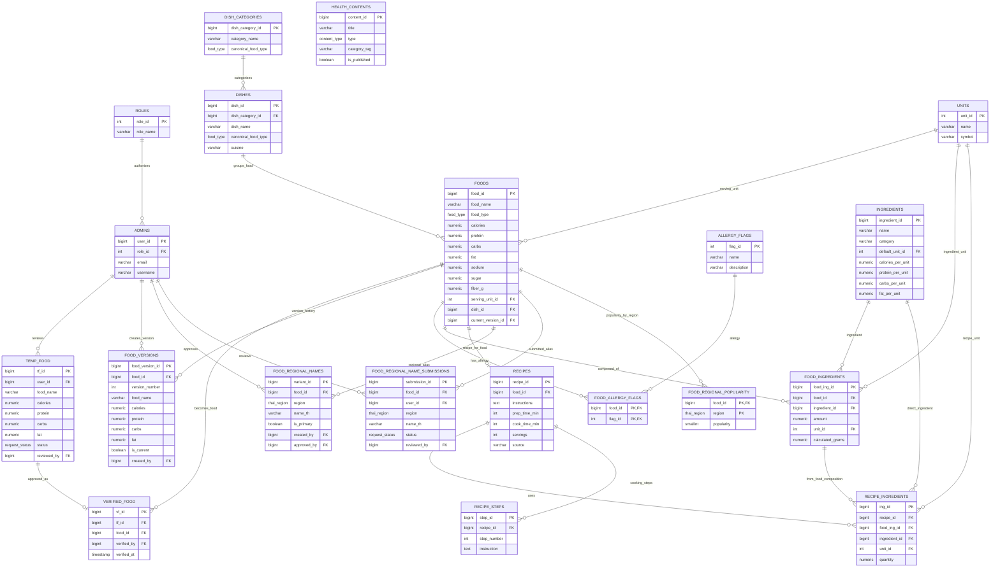
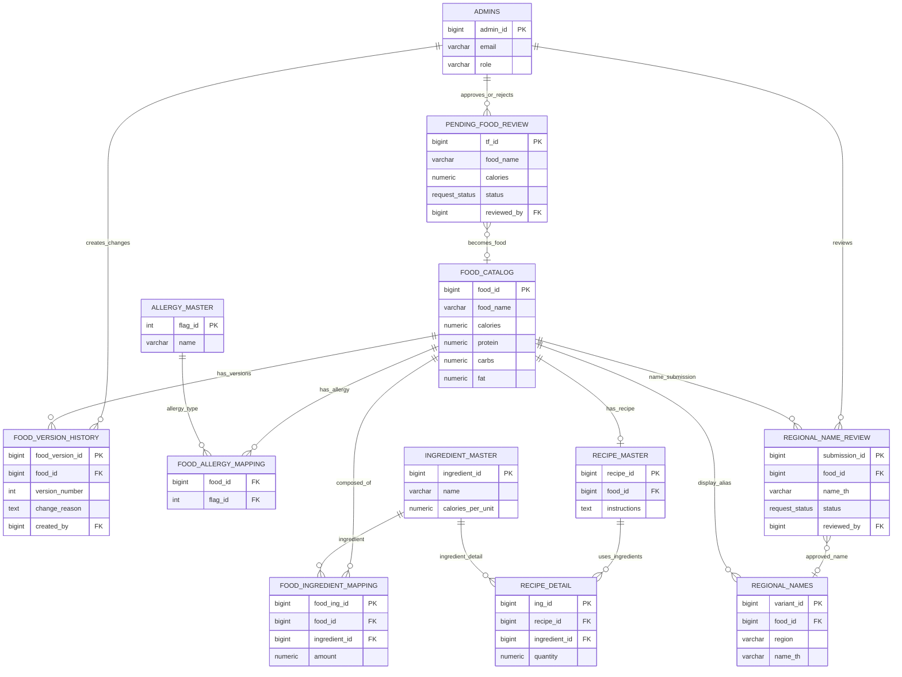

# ER Diagram แบบแบ่งฝั่ง User และ Admin - Slide Version

เอกสารนี้เป็น ER Diagram เวอร์ชันย่อยสำหรับใส่สไลด์ โดยแยกมุมมองเป็น 2 ฝั่ง:

1. **User Side** - ตารางที่เกี่ยวกับผู้ใช้ทั่วไป การตั้งเป้าหมาย บันทึกอาหาร น้ำ น้ำหนัก ความคืบหน้า และการโต้ตอบกับสูตรอาหาร
2. **Admin Side** - ตารางที่เกี่ยวกับผู้ดูแลระบบ การจัดการข้อมูลอาหาร สูตรอาหาร วัตถุดิบ allergy regional names และการตรวจสอบข้อมูลที่ผู้ใช้ส่งเข้ามา

> หมายเหตุ: ในฐานข้อมูลจริง `Admin` ไม่ได้แยกเป็นตารางใหม่ แต่ใช้ตาราง `users` ร่วมกัน แล้วแยกสิทธิ์ด้วย `role_id` ที่เชื่อมกับ `roles`

---

## 1. User Side ER Diagram

ใช้สไลด์นี้เพื่ออธิบายว่า **ผู้ใช้ทำอะไรได้บ้าง และข้อมูลถูกบันทึกอย่างไร**

```mermaid
erDiagram
    USERS {
        bigint user_id PK
        int role_id FK
        varchar email
        varchar username
        gender_type gender
        date birth_date
        numeric height_cm
        numeric current_weight_kg
        goal_type_enum goal_type
        numeric target_weight_kg
        int target_calories
        int target_protein
        int target_carbs
        int target_fat
        activity_level activity_level
        thai_region region
    }

    ROLES {
        int role_id PK
        varchar role_name
    }

    MEALS {
        bigint meal_id PK
        bigint user_id FK
        meal_type meal_type
        timestamp meal_time
        numeric total_amount
    }

    DETAIL_ITEMS {
        bigint item_id PK
        bigint meal_id FK
        bigint food_id FK
        bigint food_version_id FK
        int unit_id FK
        varchar food_name
        numeric amount
        numeric cal_per_unit
        numeric protein_per_unit
        numeric carbs_per_unit
        numeric fat_per_unit
        jsonb food_snapshot
    }

    DAILY_SUMMARIES {
        bigint summary_id PK
        bigint user_id FK
        date date_record
        numeric total_calories_intake
        numeric total_protein
        numeric total_carbs
        numeric total_fat
        int water_glasses
        int goal_calories
        boolean is_goal_met
    }

    WATER_LOGS {
        bigint log_id PK
        bigint user_id FK
        date date_record
        int amount_ml
        int glasses
    }

    WEIGHT_LOGS {
        bigint log_id PK
        bigint user_id FK
        date recorded_date
        numeric weight_kg
    }

    EXERCISE_LOGS {
        bigint log_id PK
        bigint user_id FK
        date date_record
        varchar activity_name
        int duration_minutes
        numeric calories_burned
    }

    NOTIFICATIONS {
        bigint notification_id PK
        bigint user_id FK
        varchar title
        text message
        varchar type
        boolean is_read
    }

    USER_ALLERGY_PREFERENCES {
        bigint user_id PK,FK
        int flag_id PK,FK
    }

    ALLERGY_FLAGS {
        int flag_id PK
        varchar name
        varchar description
    }

    FOODS {
        bigint food_id PK
        varchar food_name
        food_type food_type
        numeric calories
        numeric protein
        numeric carbs
        numeric fat
        int serving_unit_id FK
        bigint current_version_id FK
    }

    FOOD_VERSIONS {
        bigint food_version_id PK
        bigint food_id FK
        int version_number
        varchar food_name
        numeric calories
        numeric protein
        numeric carbs
        numeric fat
        boolean is_current
    }

    UNITS {
        int unit_id PK
        varchar name
        varchar symbol
    }

    USER_FAVORITES {
        bigint id PK
        bigint user_id FK
        bigint food_id FK
    }

    RECIPES {
        bigint recipe_id PK
        bigint food_id FK
        text instructions
        int prep_time_min
        int cook_time_min
        int servings
    }

    RECIPE_REVIEWS {
        bigint review_id PK
        bigint recipe_id FK
        bigint user_id FK
        int rating
        text comment
    }

    RECIPE_FAVORITES {
        bigint fav_id PK
        bigint recipe_id FK
        bigint user_id FK
    }

    USER_GAMIFICATION {
        bigint user_id PK,FK
        int points
        int level
        int streak_days
        jsonb badges
    }

    ROLES ||--o{ USERS : has
    USERS ||--o{ MEALS : logs
    MEALS ||--o{ DETAIL_ITEMS : contains
    FOODS ||--o{ DETAIL_ITEMS : selected_food
    FOOD_VERSIONS ||--o{ DETAIL_ITEMS : snapshot_version
    UNITS ||--o{ DETAIL_ITEMS : amount_unit

    USERS ||--o{ DAILY_SUMMARIES : daily_result
    USERS ||--o{ WATER_LOGS : drinks
    USERS ||--o{ WEIGHT_LOGS : tracks_weight
    USERS ||--o{ EXERCISE_LOGS : tracks_activity
    USERS ||--o{ NOTIFICATIONS : receives

    USERS ||--o{ USER_ALLERGY_PREFERENCES : selects
    ALLERGY_FLAGS ||--o{ USER_ALLERGY_PREFERENCES : allergy

    USERS ||--o{ USER_FAVORITES : favorites_food
    FOODS ||--o{ USER_FAVORITES : favorited

    FOODS ||--o| RECIPES : has_recipe
    RECIPES ||--o{ RECIPE_REVIEWS : reviewed
    USERS ||--o{ RECIPE_REVIEWS : writes_review
    RECIPES ||--o{ RECIPE_FAVORITES : saved_recipe
    USERS ||--o{ RECIPE_FAVORITES : saves_recipe

    USERS ||--o| USER_GAMIFICATION : game_state
```



### คำอธิบายสำหรับพูดในสไลด์ User Side

> ฝั่ง User จะเริ่มจากตาราง `users` ซึ่งเก็บข้อมูลบัญชี โปรไฟล์สุขภาพ เป้าหมาย น้ำหนัก ส่วนสูง ระดับกิจกรรม และเป้าหมายสารอาหารของผู้ใช้ จากนั้นข้อมูลการใช้งานประจำวันจะถูกแยกเก็บเป็นกลุ่ม เช่น `meals` และ `detail_items` สำหรับบันทึกอาหาร, `water_logs` สำหรับบันทึกน้ำ, `weight_logs` สำหรับน้ำหนัก, และ `exercise_logs` สำหรับกิจกรรม

> เมื่อผู้ใช้บันทึกอาหาร ระบบจะสร้าง meal header ใน `meals` และรายการอาหารแต่ละรายการใน `detail_items` โดย `detail_items` จะเก็บ snapshot ของอาหารและโภชนาการ ณ ตอนที่บันทึก เพื่อป้องกันปัญหาหากข้อมูลอาหารกลางถูกแก้ไขภายหลัง

> ตาราง `daily_summaries` ใช้เก็บสรุปรายวัน เช่น แคลอรี่รวม โปรตีน คาร์บ ไขมัน และน้ำดื่ม เพื่อให้หน้า Dashboard อ่านข้อมูลได้เร็ว ส่วน `notifications` ใช้แจ้งเตือนผู้ใช้ เช่น กินน้อยเกินไป ดื่มน้ำน้อย หรือแคลอรี่เกินเป้าหมาย

> นอกจากนี้ยังมี `user_allergy_preferences` ที่เชื่อมผู้ใช้กับ allergy flags เพื่อใช้เตือนหรือกรองอาหารที่เสี่ยง และมี `user_gamification` สำหรับเก็บคะแนน เลเวล streak และ badge เพื่อเพิ่มแรงจูงใจในการใช้งานต่อเนื่อง

---

## 2. Admin Side ER Diagram

ใช้สไลด์นี้เพื่ออธิบายว่า **Admin จัดการข้อมูลหลักและตรวจสอบข้อมูลในระบบอย่างไร**

> สำหรับสไลด์ แนะนำให้ใช้คำว่า `ADMINS` แทน `users` เพื่อไม่ให้กรรมการสับสน แต่ให้ระบุหมายเหตุว่า `ADMINS` คือ row ในตาราง `users` ที่มี `role = admin`



### คำอธิบายสำหรับพูดในสไลด์ Admin Side

> ฝั่ง Admin จะเน้นที่การจัดการข้อมูลหลักของระบบ โดยในฐานข้อมูลจริง Admin คือผู้ใช้ในตาราง `users` ที่มีสิทธิ์ผ่าน `roles` แต่ในสไลด์นี้ผมแสดงเป็น `ADMINS` เพื่อให้อ่านง่ายและไม่สับสนกับผู้ใช้ทั่วไป

> ตารางหลักที่ Admin ดูแลคือ `foods` ซึ่งเป็นฐานข้อมูลเมนูอาหารและโภชนาการ ส่วน `food_versions` ใช้เก็บประวัติการเปลี่ยนแปลงของอาหาร เพื่อให้ตรวจสอบย้อนหลังได้ว่าอาหารแต่ละเมนูถูกแก้ไขอย่างไร

> ถ้าผู้ใช้เพิ่มเมนูอาหารด่วนหรือ AI พบอาหารที่ยังไม่มีในระบบ ข้อมูลจะเข้า `temp_food` เพื่อรอการตรวจสอบ เมื่อ Admin อนุมัติจะเชื่อมไปยัง `verified_food` และสามารถนำไปสร้างหรืออัปเดตข้อมูลใน `foods`

> สำหรับความปลอดภัยด้าน allergy ตาราง `allergy_flags` เป็น master ของกลุ่มอาหารที่แพ้ และ `food_allergy_flags` ใช้ระบุว่าอาหารแต่ละเมนูเกี่ยวข้องกับ allergy ใดบ้าง

> ด้านสูตรอาหารและวัตถุดิบ Admin สามารถจัดการ `ingredients`, `food_ingredients`, `recipes`, `recipe_ingredients` และ `recipe_steps` เพื่อให้ระบบคำนวณโภชนาการจากส่วนผสมและแสดงสูตรอาหารได้เป็นระบบ

> ระบบยังรองรับชื่ออาหารตามภูมิภาคผ่าน `food_regional_names` และ `food_regional_name_submissions` เพื่อให้ผู้ใช้ไทยค้นหาอาหารด้วยชื่อที่คุ้นเคยในแต่ละพื้นที่ได้

---

## 3. Admin Side ER Diagram แบบ Simple ที่แนะนำที่สุดสำหรับสไลด์

ถ้ากรรมการดูภาพละเอียดแล้วงง ให้ใช้ภาพนี้แทน เพราะสื่อบทบาท Admin ได้ชัดกว่า:



### คำอธิบายภาพ Simple Admin

> ภาพนี้แสดงมุมมองของ Admin โดยไม่เน้นตารางผู้ใช้ทั่วไป จุดศูนย์กลางคือ `Food Catalog` หรือฐานข้อมูลอาหารกลางของระบบ Admin ทำหน้าที่ตรวจสอบอาหารที่ผู้ใช้ส่งเข้ามา จัดการข้อมูลโภชนาการ ดูประวัติการแก้ไขอาหาร กำหนด allergy ของอาหาร จัดการวัตถุดิบและสูตรอาหาร รวมถึงตรวจสอบชื่ออาหารตามภูมิภาค

> แม้ในฐานข้อมูลจริง Admin จะอยู่ในตาราง users แต่ในเชิงการอธิบายระบบ เราแยกเป็น `ADMINS` เพื่อให้เห็นบทบาทชัดว่า Admin ไม่ได้เป็นเจ้าของ food log รายวัน แต่เป็นผู้ควบคุมคุณภาพของข้อมูลกลาง

---

## 4. เวอร์ชันย่อมากสำหรับใส่สไลด์เดียว

ถ้าพื้นที่สไลด์จำกัดมาก ให้ใช้ข้อความนี้แทน ER เต็ม:

### User Data Scope

```text
users
 ├─ meals ─ detail_items ─ foods / food_versions / units
 ├─ daily_summaries
 ├─ water_logs
 ├─ weight_logs
 ├─ exercise_logs
 ├─ notifications
 ├─ user_allergy_preferences ─ allergy_flags
 ├─ recipe_reviews / recipe_favorites ─ recipes
 └─ user_gamification
```

### Admin Data Scope

```text
users(role=admin)
 ├─ foods ─ food_versions
 ├─ temp_food ─ verified_food
 ├─ allergy_flags ─ food_allergy_flags
 ├─ ingredients ─ food_ingredients
 ├─ recipes ─ recipe_ingredients / recipe_steps
 ├─ food_regional_name_submissions ─ food_regional_names
 └─ health_contents
```

---

## 5. ประโยคสรุปสำหรับกรรมการ

> ER Diagram ถูกแบ่งเป็น 2 มุมมองเพื่อให้อ่านง่าย ฝั่ง User แสดงข้อมูลที่เกิดจากการใช้งานจริง เช่น โปรไฟล์ เป้าหมาย บันทึกอาหาร น้ำ น้ำหนัก การแจ้งเตือน และ gamification ส่วนฝั่ง Admin แสดงข้อมูลที่ใช้ดูแลระบบ เช่น ฐานข้อมูลอาหาร สูตรอาหาร วัตถุดิบ allergy ชื่ออาหารตามภูมิภาค และข้อมูลที่รอตรวจสอบจากผู้ใช้

> การแยกแบบนี้ช่วยให้เห็นชัดว่า User เป็นผู้สร้างข้อมูลพฤติกรรมรายวัน ส่วน Admin เป็นผู้ควบคุมคุณภาพข้อมูลกลางของระบบ
