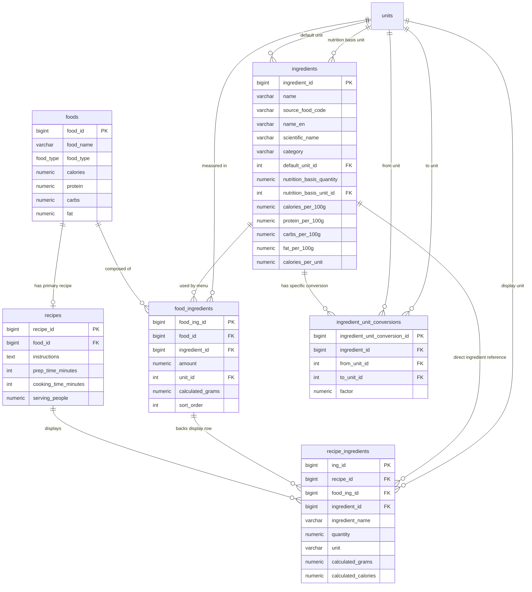

# แผนคืนตาราง Ingredients และการเชื่อมสูตรอาหาร

วันที่จัดทำ: 5 พฤษภาคม 2569  
บทบาทผู้ตรวจ: Senior Database Engineer / Senior Software Engineer  
ขอบเขต: Supabase schema `cleangoal`, ตารางอาหาร, สูตรอาหาร, วัตถุดิบ และข้อมูลโภชนาการ

---

## 1. สรุปคำตัดสิน

ควรนำ `ingredients` และ `food_ingredients` กลับมาใช้งาน เพราะ requirement ปัจจุบันต้องการให้วัตถุดิบเป็นแหล่งข้อมูลโภชนาการกลาง ไม่ใช่แค่ข้อความประกอบสูตรอาหาร

หลักสำคัญที่ต้องยึด: `ingredients` ต้องเชื่อม `units` โดยตรง เพื่อบอกว่าค่าโภชนาการของวัตถุดิบอ้างอิงหน่วยอะไร เช่น ThaiFCD ให้ค่า “ต่อ 100 g of food” ดังนั้นวัตถุดิบอย่าง “หมู ขาหลัง เนื้อล้วน ดิบ” ต้องมี `nutrition_basis_quantity = 100` และ `nutrition_basis_unit_id -> units(g)` แล้วสูตรอาหารจึงนำปริมาณที่ใช้จริง เช่น 80 g, 120 g ไปคำนวณสัดส่วนโภชนาการ

โครงสร้างที่แนะนำ:

| ตาราง | บทบาท |
|---|---|
| `ingredients` | Strong entity เก็บวัตถุดิบทั้งหมด เช่น ข้าวสวย, ไก่ต้ม, น้ำตาล, นมสด พร้อมค่าโภชนาการ |
| `units` | Lookup หน่วย เช่น g, ml, piece, tbsp ใช้ทั้งกับวัตถุดิบและปริมาณในสูตร |
| `unit_conversions` | แปลงหน่วยทั่วไป เช่น kg -> g, l -> ml |
| `ingredient_unit_conversions` | แปลงหน่วยเฉพาะวัตถุดิบ เช่น ไข่ 1 ฟอง = 50 g, กล้วย 1 ลูก = 100 g |
| `food_ingredients` | Bridge ระหว่างเมนูใน `foods` กับวัตถุดิบใน `ingredients` เพื่อบอกว่าเมนูนี้ประกอบด้วยอะไร ปริมาณเท่าไร |
| `recipes` | สูตรอาหารของเมนู เชื่อมกับ `foods` ผ่าน `recipes.food_id` |
| `recipe_ingredients` | รายการวัตถุดิบที่แสดงในหน้าสูตรอาหาร เชื่อมกลับไปหา `food_ingredients` และ `ingredients` เพื่อดึงชื่อและค่าโภชนาการได้ |

ประเด็นเรื่อง `food_recipe`: ปัจจุบันไม่จำเป็นต้องสร้างตาราง physical ชื่อ `food_recipe` แยก เพราะ `recipes.food_id` คือความสัมพันธ์ food-to-recipe อยู่แล้ว และมี unique constraint ทำให้ 1 เมนูมีได้ 0 หรือ 1 สูตรหลัก

ถ้าอนาคตต้องการ 1 เมนูมีหลายสูตร เช่น สูตรคลีน, สูตรต้นตำรับ, สูตรร้านค้า, ค่อยสร้างตาราง bridge ชื่อ `food_recipes`

---

## 2. สถานะฐานข้อมูลก่อนแก้

ตรวจ live Supabase แล้วพบว่า migration `v22_drop_unused_tables` ถูก apply แล้ว

| ตาราง | สถานะปัจจุบัน |
|---|---|
| `ingredients` | ถูก drop แล้ว |
| `food_ingredients` | ถูก drop แล้ว |
| `ingredients_archive` | ยังอยู่ |
| `food_ingredients_archive` | ยังอยู่ |
| `recipes` | ยังอยู่ และเชื่อม `foods` ผ่าน `recipes.food_id` |
| `recipe_ingredients` | ยังอยู่ แต่เดิมเป็น free-text ไม่มี FK ไป `ingredients` |

ผลกระทบของสถานะเดิม:

| ปัญหา | ผลกระทบ |
|---|---|
| วัตถุดิบเป็นข้อความใน `recipe_ingredients.ingredient_name` | ดึงโภชนาการต่อวัตถุดิบไม่ได้อย่างแม่นยำ |
| ไม่มี `food_ingredients` | ไม่รู้ว่าเมนูหนึ่งประกอบจากวัตถุดิบใดในเชิง relational |
| สูตรอาหารกับส่วนผสมไม่มี FK ถึงวัตถุดิบจริง | ตรวจคุณภาพข้อมูลและคำนวณ nutrition จาก ingredient catalog ยาก |

---

## 3. ERD ที่แนะนำ



---

## 4. เหตุผลที่ไม่สร้าง `food_recipe` เป็นตารางจริงตอนนี้

ความสัมพันธ์ปัจจุบัน:

```text
foods.food_id 1--0/1 recipes.food_id
```

นี่เพียงพอสำหรับ requirement ปัจจุบันที่ 1 เมนูมี 1 สูตรหลัก

หากสร้าง `food_recipe` เพิ่มตอนนี้จะเกิดความซ้ำซ้อน:

| ซ้ำซ้อนกับ | ปัญหา |
|---|---|
| `recipes.food_id` | มี 2 ที่บอกว่า recipe นี้เป็นของ food ไหน |
| endpoint `GET /recipes/{food_id}` | โค้ดปัจจุบัน resolve recipe จาก `recipes.food_id` |
| unique recipe per food | ต้องย้าย constraint ไปอีกตารางโดยยังไม่มีความจำเป็น |

สิ่งที่เพิ่มแทน:

| สิ่งที่เพิ่ม | เหตุผล |
|---|---|
| `v_food_recipes` | เป็น read model ที่แสดง food-to-recipe ชัดเจนเหมือนมี food_recipe |
| comment ใน DB | อธิบายว่าความสัมพันธ์ food_recipe ตอนนี้อยู่ที่ `recipes.food_id` |

---

## 5. กรณีที่ควรสร้าง `food_recipes` จริงในอนาคต

ควรสร้างตาราง bridge ถ้าเกิด requirement ต่อไปนี้:

| Requirement | เหตุผลที่ต้องมี bridge |
|---|---|
| 1 เมนูมีหลายสูตร | เช่น สูตรคลีน, สูตรต้นตำรับ, สูตรร้านค้า |
| สูตรเดียวใช้กับหลายเมนู | เช่น ซอส/น้ำจิ้มพื้นฐาน reused |
| มี version สูตร | เช่น v1, v2, published/draft |
| มี recipe owner/source หลายเจ้า | ต้องแยกสิทธิ์และ metadata ของสูตร |

ตัวอย่าง schema ในอนาคต:

```sql
CREATE TABLE cleangoal.food_recipes (
    food_recipe_id BIGSERIAL PRIMARY KEY,
    food_id BIGINT NOT NULL REFERENCES cleangoal.foods(food_id) ON DELETE CASCADE,
    recipe_id BIGINT NOT NULL REFERENCES cleangoal.recipes(recipe_id) ON DELETE CASCADE,
    is_primary BOOLEAN NOT NULL DEFAULT false,
    recipe_variant VARCHAR(80),
    created_at TIMESTAMPTZ NOT NULL DEFAULT NOW(),
    UNIQUE (food_id, recipe_id)
);
```

แต่สำหรับตอนนี้ยังไม่ควรเพิ่ม เพราะจะกระทบ endpoint และ data model โดยไม่จำเป็น

---

## 6. Migration ที่สร้าง

ไฟล์:

```text
backend/migrations/v25_restore_ingredients_relations.sql
```

สิ่งที่ migration ทำ:

| ลำดับ | การเปลี่ยนแปลง |
|---:|---|
| 1 | สร้าง `ingredients` กลับมาเป็น strong entity |
| 2 | เพิ่ม column โภชนาการต่อ 100g และต่อ unit |
| 3 | restore archived rows จาก `ingredients_archive` ถ้ามี |
| 4 | สร้าง `food_ingredients` กลับมาเป็น bridge ระหว่าง `foods` กับ `ingredients` |
| 5 | restore archived rows จาก `food_ingredients_archive` ถ้ามีและ FK ถูกต้อง |
| 6 | เพิ่ม FK columns ใน `recipe_ingredients`: `food_ing_id`, `ingredient_id`, `unit_id` |
| 7 | เพิ่ม calculated nutrition columns ใน `recipe_ingredients` |
| 8 | เพิ่ม sequence default ให้ `recipe_ingredients.ing_id` เพื่อ insert mockup ได้ |
| 9 | เพิ่ม `ingredient_unit_conversions` สำหรับหน่วยเฉพาะวัตถุดิบ |
| 10 | สร้าง view `v_food_recipes` |
| 11 | สร้าง view `v_recipe_ingredients_nutrition` |
| 12 | สร้าง view `v_food_ingredient_nutrition_totals` |
| 13 | ตั้ง RLS public read สำหรับ reference tables |
| 14 | บันทึก migration version `v25_restore_ingredients_relations` |

---

## 6.1 การแมปข้อมูล ThaiFCD เข้าตาราง

ไฟล์ที่ตรวจ:

| ไฟล์ | Food code | ชื่อ |
|---|---|---|
| `ThaiFCD-Food-search-by-food-name-A6-260505083717jUvndoSkDTm87cNSl1I5.pdf` | A6 | ข้าวกล้องงอก ดิบ |
| `ThaiFCD-food-search-by-food-name-F176_260505083935yAT61w5Dz.xls` | F176 | หมู ขาหลัง เนื้อล้วน ดิบ |

ThaiFCD ระบุหน่วยเป็น:

```text
Content per 100 g of food
```

ดังนั้นควร map แบบนี้:

| ThaiFCD field | ตาราง/column ที่ควรลง |
|---|---|
| Food Code | `ingredients.source_food_code` เช่น `THAIFCD:F176` |
| Thai name | `ingredients.name` |
| English name | `ingredients.name_en` |
| Scientific name | `ingredients.scientific_name` |
| Unit = g | `ingredients.nutrition_basis_unit_id -> units(g)` |
| Content per 100 g | `ingredients.nutrition_basis_quantity = 100` |
| ENERC kcal | `ingredients.calories_per_100g` |
| PROTCNT g | `ingredients.protein_per_100g` |
| CHOAVLDF g | `ingredients.carbs_per_100g` |
| FAT g | `ingredients.fat_per_100g` |
| FIBTG g | `ingredients.fiber_g_per_100g` |
| WATER g | `ingredients.water_g_per_100g` |
| NA mg | `ingredients.sodium_mg_per_100g` |
| SUGAR g | `ingredients.sugar_g_per_100g` |
| CHOLE mg | `ingredients.cholesterol_mg_per_100g` |
| CA mg | `ingredients.calcium_mg_per_100g` |
| P mg | `ingredients.phosphorus_mg_per_100g` |
| FE mg | `ingredients.iron_mg_per_100g` |

Seed ที่เพิ่ม:

```text
backend/seeds/thaifcd_sample_ingredients.sql
```

---

## 6.2 สูตรการคำนวณจากหน่วย

กรณี ThaiFCD ต่อ 100g:

```text
ingredient_calories = ingredient.calories_per_100g * used_grams / 100
ingredient_protein  = ingredient.protein_per_100g  * used_grams / 100
ingredient_carbs    = ingredient.carbs_per_100g    * used_grams / 100
ingredient_fat      = ingredient.fat_per_100g      * used_grams / 100
```

ตัวอย่าง:

```text
หมู ขาหลัง เนื้อล้วน ดิบ = 148 kcal ต่อ 100 g
สูตรใช้หมู 80 g
calories = 148 * 80 / 100 = 118.4 kcal
```

ตำแหน่งที่เก็บปริมาณ:

| ปริมาณ | ตาราง/column |
|---|---|
| หน่วยหลักของวัตถุดิบ | `ingredients.default_unit_id` |
| หน่วยอ้างอิงของ nutrition | `ingredients.nutrition_basis_unit_id` |
| จำนวนอ้างอิงของ nutrition | `ingredients.nutrition_basis_quantity` |
| ปริมาณวัตถุดิบที่ใช้ในเมนู | `food_ingredients.amount` |
| หน่วยของปริมาณที่ใช้ในเมนู | `food_ingredients.unit_id` |
| ปริมาณที่ normalize เป็นกรัม | `food_ingredients.calculated_grams` |
| ปริมาณที่แสดงในสูตรอาหาร | `recipe_ingredients.quantity` + `recipe_ingredients.unit_id` |

---

## 7. Mockup Data ที่สร้าง

ไฟล์:

```text
backend/seeds/mock_ingredient_recipe_links.sql
```

เมนูตัวอย่าง:

| ประเภท | เมนู |
|---|---|
| dish | ข้าวมันไก่ต้ม |
| dish | ผัดไทยกุ้งสด |
| beverage/drink | ชาไทยเย็น |

ตัวอย่าง chain ที่ seed สร้าง:

```text
foods: ข้าวมันไก่ต้ม
  -> recipes: สูตรข้าวมันไก่ต้ม
    -> recipe_ingredients: ข้าวสวย 180g
      -> food_ingredients: composition row ของข้าวมันไก่ต้ม
        -> ingredients: ข้าวสวย พร้อม nutrition per 100g
```

---

## 8. Query สำหรับตรวจสอบหลัง apply

### 8.1 ตรวจว่าตารางกลับมาแล้ว

```sql
SELECT table_name
FROM information_schema.tables
WHERE table_schema = 'cleangoal'
  AND table_name IN ('ingredients', 'food_ingredients', 'recipe_ingredients', 'recipes')
ORDER BY table_name;
```

### 8.2 ตรวจ chain ความสัมพันธ์

```sql
SELECT
    food_name,
    recipe_id,
    ingredient_name,
    quantity,
    unit,
    calculated_calories,
    calculated_protein,
    calculated_carbs,
    calculated_fat
FROM cleangoal.v_recipe_ingredients_nutrition
WHERE food_name IN ('ข้าวมันไก่ต้ม', 'ผัดไทยกุ้งสด', 'ชาไทยเย็น')
ORDER BY food_name, sort_order;
```

### 8.3 ตรวจ nutrition รวมต่อเมนูจากวัตถุดิบ

```sql
SELECT *
FROM cleangoal.v_food_ingredient_nutrition_totals
WHERE food_name IN ('ข้าวมันไก่ต้ม', 'ผัดไทยกุ้งสด', 'ชาไทยเย็น')
ORDER BY food_name;
```

---

## 9. วิธีปรับปรุง backend ต่อจากนี้

### 9.1 ปรับ `GET /recipes/{food_id}`

ปัจจุบัน query:

```sql
SELECT ingredient_name, quantity, unit, is_optional, note
FROM recipe_ingredients
WHERE recipe_id = %s
ORDER BY sort_order
```

แนะนำให้เปลี่ยนเป็น:

```sql
SELECT
    ingredient_name,
    quantity,
    unit,
    is_optional,
    note,
    calculated_grams,
    calculated_calories,
    calculated_protein,
    calculated_carbs,
    calculated_fat
FROM cleangoal.v_recipe_ingredients_nutrition
WHERE recipe_id = %s
ORDER BY sort_order
```

ผลลัพธ์: หน้าสูตรอาหารจะแสดงทั้งชื่อวัตถุดิบและค่าโภชนาการที่คำนวณจาก `ingredients`

### 9.2 ปรับ admin food editor

ควรให้ admin เพิ่ม/แก้ส่วนผสมผ่าน `food_ingredients` แทนการพิมพ์ free text อย่างเดียว

Flow ที่แนะนำ:

```text
Admin เลือกเมนูใน foods
  -> เพิ่มวัตถุดิบจาก ingredients
  -> ระบุ amount/unit/calculated_grams
  -> ระบบคำนวณ nutrition รวม
  -> sync หรือ compare กับ foods.calories/protein/carbs/fat
```

### 9.3 ปรับ AI generated recipe

ถ้า AI สร้างวัตถุดิบใหม่:

```text
1. match ชื่อกับ ingredients เดิม
2. ถ้าไม่เจอ ให้สร้าง ingredient draft หรือ temp ingredient
3. สร้าง food_ingredients
4. สร้าง recipe_ingredients ที่ชี้ food_ing_id
```

ไม่ควรปล่อยให้วัตถุดิบอยู่แค่ JSONB/free text ระยะยาว

---

## 10. ข้อควรระวัง

| เรื่อง | คำแนะนำ |
|---|---|
| ค่าโภชนาการ mockup | ใช้เพื่อทดสอบ relation ไม่ใช่ official nutrition database |
| `foods.calories` กับผลรวมจากวัตถุดิบ | อาจไม่ตรง 100% เพราะ serving size และสูตรจริงต่างกัน |
| `recipes.ingredients_json` | ควรเก็บเป็น cache ได้ แต่ไม่ควรเป็น source of truth |
| `recipe_ingredients.ingredient_name` | ยังเก็บไว้เพื่อ backward compatibility และ display fallback |
| RLS | ตาราง reference เปิด read ได้ แต่ write ควรผ่าน backend/admin เท่านั้น |

---

## 11. สรุปสุดท้าย

การออกแบบที่ถูกต้องสำหรับ requirement ปัจจุบันคือ:

```text
ingredients = แม่ข้อมูลวัตถุดิบ
food_ingredients = เมนูนี้ประกอบด้วยวัตถุดิบอะไร
recipes = สูตรอาหารของเมนู เชื่อมกับ foods ผ่าน food_id
recipe_ingredients = รายการวัตถุดิบที่แสดงในสูตร และ link กลับไปหา food_ingredients/ingredients
```

`food_recipe` ไม่ต้องเป็นตารางจริงตอนนี้ เพราะ `recipes.food_id` ทำหน้าที่นั้นแล้ว แต่เพิ่ม `v_food_recipes` เพื่อให้เห็นความสัมพันธ์และใช้ตรวจสอบได้ง่าย
