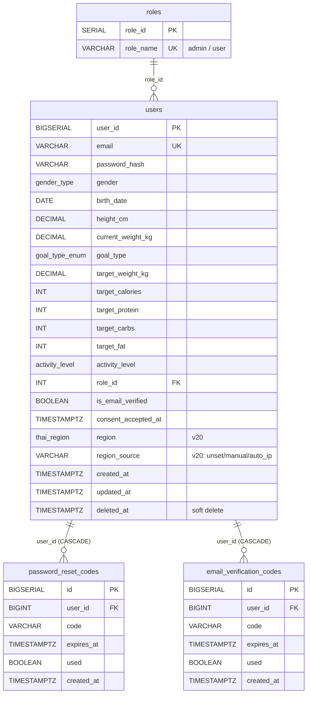
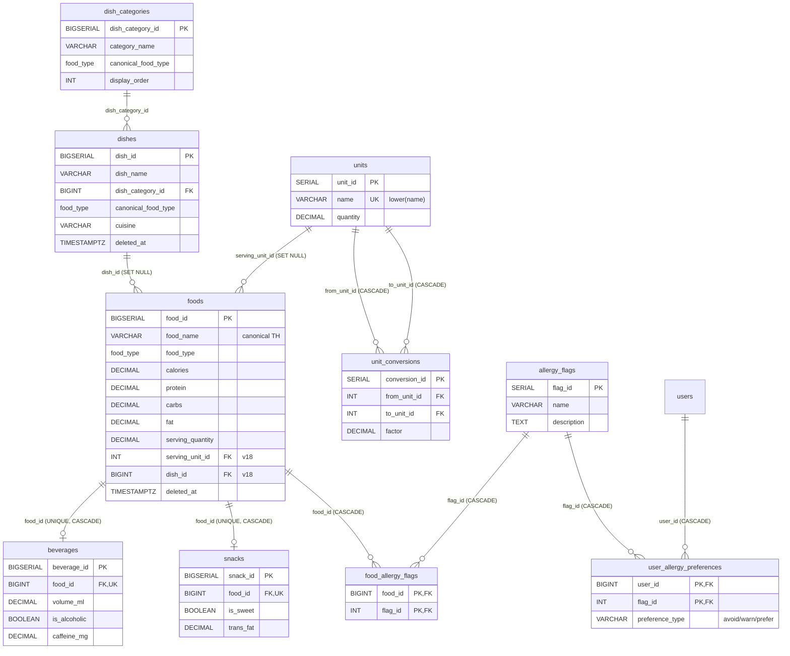
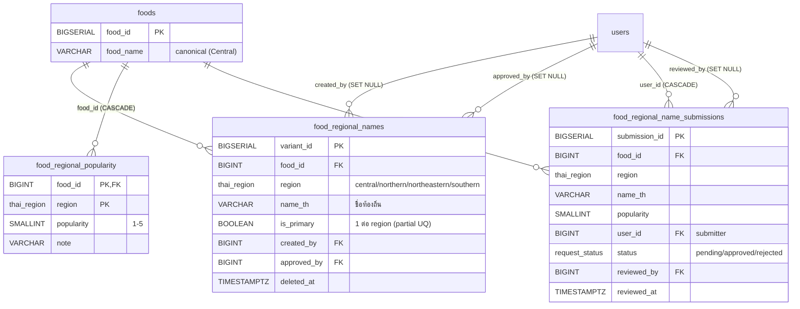
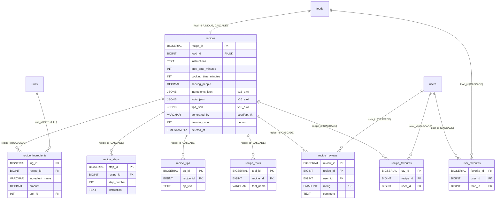
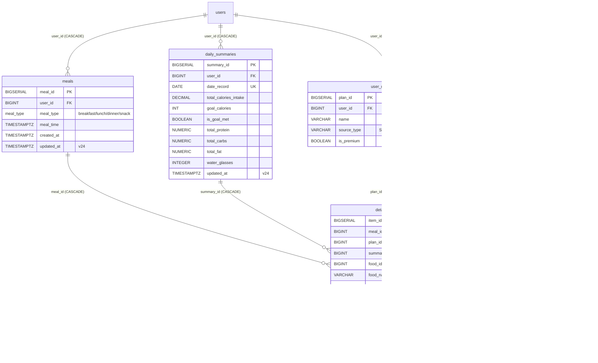
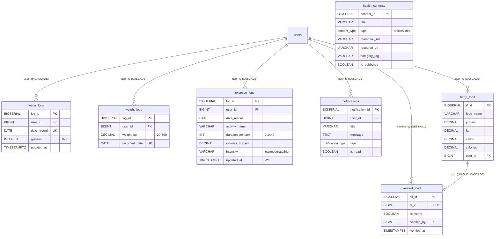

# Calories Guard — Schema Diagram (Mermaid)

**Schema:** `cleangoal` บน Supabase Postgres 17
**Generated:** 2026-04-26 (หลัง v24)
**ภาษา:** ไทย

เอกสารนี้แบ่ง schema ออกเป็น 6 diagram ตาม **domain** เพื่อให้อ่านง่าย (ตารางทั้งหมด 30+ ตัว ถ้าวาดในรูปเดียวจะอ่านไม่ออก) แต่ละ diagram มีคำอธิบายลึกของความสัมพันธ์.

หมายเหตุการอ่าน Mermaid ER:
- `||--o{` = 1 → many (mandatory parent, optional children)
- `||--||` = 1 → 1
- `}o--||` = many → 1
- ลูกศรในตารางคือ FK column

## สารบัญ
1. [Identity & Authentication](#1-identity--authentication)
2. [Food Catalog & Taxonomy](#2-food-catalog--taxonomy)
3. [Regional Names (v20)](#3-regional-names-v20)
4. [Recipes & Social](#4-recipes--social)
5. [Meal Logging & Daily Tracking](#5-meal-logging--daily-tracking)
6. [Goals, Activity, Health, Notifications](#6-goals-activity-health-notifications)
7. [Master Diagram (overview)](#7-master-diagram-overview)

---

## 1. Identity & Authentication

**คำอธิบาย:**
- `users.role_id` default = 2 (= "user"); admin role_id = 1 ตอน seed
- `users` ใช้ Supabase Auth ผ่าน trigger `public.handle_new_user()` ที่สร้าง row ใน `cleangoal.users` อัตโนมัติเมื่อมีคน sign up ผ่าน auth.users
- `users.deleted_at` = soft delete (PDPA: เก็บ 30 วันก่อนลบจริง). มี partial index `users_deleted_at_idx` กรอง row ที่ marked deleted ได้เร็ว
- `users.region` (v20) เป็น ENUM 4 ภาค ใช้เลือกชื่อท้องถิ่น (ดู §3)
- `users.region_source` ติดตามว่าค่ามาจากไหน — manual = ผู้ใช้เลือกเอง / auto_ip = derive จาก IP / unset = ยังไม่ได้ตั้ง
- `password_reset_codes` และ `email_verification_codes` ทั้งคู่ CASCADE เมื่อ user ถูกลบ

---

## 2. Food Catalog & Taxonomy

**คำอธิบาย:**
- ลำดับชั้น taxonomy: `dish_categories` (อาหารไทย/ตะวันตก) → `dishes` (เมนู เช่น "ผัดกะเพรา") → `foods` (รายการอาหารจริง). foods 1 row อาจ map กับ dish หรือไม่ก็ได้ (raw_ingredient ไม่ต้องมี dish)
- v18 เพิ่ม `foods.dish_id` และ `foods.serving_unit_id` (FK) แล้ว v21 drop คอลัมน์เก่า `food_category` (VARCHAR) และ `serving_unit` (VARCHAR) — ดู [DB_MIGRATIONS_V20_V24_SUMMARY.md](DB_MIGRATIONS_V20_V24_SUMMARY.md)
- `beverages` และ `snacks` เป็น **subtype** ของ foods แบบ 1:1 (UNIQUE on food_id) — ใช้เก็บข้อมูลเฉพาะของชนิด เช่น `caffeine_mg` มีในเครื่องดื่มเท่านั้น
- `food_allergy_flags` = many-to-many ระหว่าง foods กับ allergy_flags
- `user_allergy_preferences` = many-to-many ระหว่าง users กับ allergy_flags + เก็บ "preference_type" (จะเลี่ยง / ระวัง / ชอบ)
- `unit_conversions` self-reference 2 ครั้ง (from + to) ทำให้แปลงข้ามหน่วยได้ เช่น kg→g (factor=1000)

---

## 3. Regional Names (v20)

**คำอธิบาย:**
- `food_regional_names` มี partial UNIQUE index `(food_id, region) WHERE is_primary AND deleted_at IS NULL` — บังคับว่า primary name ต่อ region มีได้แค่ 1 ชื่อ. แต่ alt-name ไม่ใช่ primary มีได้หลายชื่อ
- ค้น index `(region, lower(name_th))` ใช้สำหรับ search "ผู้ใช้พิมพ์ ข้าวปุ้น แล้วต้องเจอ ขนมจีน"
- Flow contribute: user ส่งผ่าน `food_regional_name_submissions` → admin review → ถ้า approve copy ลง `food_regional_names` (mirror pattern เดียวกับ `temp_food` → `verified_food`)
- `food_regional_popularity` แยกออกมาเพราะเป็น single value per (food, region) — ไม่ได้เป็น list เหมือน names
- เมื่อ user ถูกลบ: `created_by`/`approved_by`/`reviewed_by` SET NULL, แต่ `submissions.user_id` CASCADE (data ไม่มีค่าถ้าไม่มีคนเสนอ)

---

## 4. Recipes & Social

**คำอธิบาย:**
- `recipes` 1:1 กับ `foods` — สูตรหนึ่งสูตรผูกกับอาหาร 1 รายการเสมอ. ถ้าอยากเก็บ "ส้มตำไก่ทอด" เป็นสูตรใหม่ต้องสร้าง food row ใหม่ก่อน
- 4 ตารางย่อย (`recipe_ingredients/steps/tips/tools`) เก็บ structured detail. นอกจากนี้ `recipes` ก็เก็บ `*_json` ที่ AI generate ออกมาด้วย (v16_a) — สำหรับสูตรที่ admin ยังไม่ได้ migrate ลงตารางย่อย
- มี **2 ตาราง favorite ที่ทับซ้อนกัน**: `recipe_favorites` (legacy) และ `user_favorites` (active mobile API). v17 comment ระบุว่ามือถือใช้ `user_favorites(food_id)` แทน
- `recipes.favorite_count` denormalize — sync ด้วย trigger `update_recipe_favorite_count()` เมื่อ `recipe_favorites` insert/delete
- `recipe_reviews` มี trigger `update_recipe_rating()` aggregate rating หลัง insert/update/delete

---

## 5. Meal Logging & Daily Tracking

**คำอธิบาย:**
- ⚠ `detail_items` เป็น **polymorphic** — มี FK 3 ตัว (`meal_id`, `plan_id`, `summary_id`) ที่ exclusive (CHECK บังคับให้ไม่ NULL แค่ 1 ตัว) → 2NF violation. **Phase 4** จะแยกเป็น 3 ตาราง (deferred)
- `daily_summaries` มี UNIQUE `(user_id, date_record)` — 1 row ต่อ (user, day)
- ⛓ Trigger chain ที่ sync `daily_summaries`:
  1. user log อาหาร → row ใน `meals` + `detail_items(meal_id=...)`
  2. `trg_sync_daily_summary` (AFTER INSERT/UPDATE/DELETE บน detail_items) เรียก `fn_sync_daily_summary()` → recompute `total_calories_intake/protein/carbs/fat`
  3. `trg_sync_water_to_daily` (บน water_logs) sync `water_glasses` ใน `daily_summaries`
  4. v24 trigger `trg_foods_sync_detail_items` (บน foods AFTER UPDATE) → ถ้าค่า nutrition ใน foods เปลี่ยน push ลง `detail_items.cal_per_unit` ทุกแถวที่ food_id ตรงกัน
- `detail_items.food_name`/`cal_per_unit`/etc. เป็น **snapshot/cache** — เก็บค่าตอน log เผื่อ admin แก้ foods ภายหลัง (พร้อม trigger sync)

---

## 6. Goals, Activity, Health, Notifications

**คำอธิบาย:**
- `water_logs` UNIQUE `(user_id, date_record)` → 1 row ต่อวัน, `glasses` cap ที่ 30 (≈7.5 ลิตร)
- `weight_logs` UNIQUE ต่อวัน → ถ้าชั่งซ้ำต้อง UPDATE row เดิม
- `exercise_logs` ไม่ unique ต่อวัน — log ได้หลายครั้งต่อวัน (เช้า + เย็น)
- `temp_food` + `verified_food` เป็นคู่กัน 1:1: user เพิ่มอาหารใหม่ → trigger `trg_create_verified_food` (AFTER INSERT) สร้าง verified_food row อัตโนมัติด้วย `is_verify=false` → admin verify → trigger `trg_verified_food_touch_updated_at` ตั้ง `verified_at`
- `notifications.type` มี 4 ชนิด — system_alert / achievement / content_update / system_announcement
- `health_contents` ไม่ผูกกับ user — เป็น public content

---

## 7. Master Diagram (overview)

```mermaid
erDiagram
    users ||--o{ meals : ""
    users ||--o{ daily_summaries : ""
    users ||--o{ water_logs : ""
    users ||--o{ weight_logs : ""
    users ||--o{ exercise_logs : ""
    users ||--o{ notifications : ""
    users ||--o{ user_allergy_preferences : ""
    users ||--o{ user_favorites : ""
    users ||--o{ recipe_reviews : ""
    users ||--o{ temp_food : ""
    users ||--o{ user_meal_plans : ""
    users ||--o{ food_regional_name_submissions : ""
    roles ||--o{ users : ""

    dish_categories ||--o{ dishes : ""
    dishes ||--o{ foods : ""
    units ||--o{ foods : ""
    foods ||--|| recipes : ""
    foods ||--o| beverages : ""
    foods ||--o| snacks : ""
    foods ||--o{ food_allergy_flags : ""
    foods ||--o{ food_regional_names : ""
    foods ||--o{ food_regional_popularity : ""
    foods ||--o{ user_favorites : ""
    foods ||--o{ detail_items : ""
    allergy_flags ||--o{ food_allergy_flags : ""
    allergy_flags ||--o{ user_allergy_preferences : ""

    recipes ||--o{ recipe_ingredients : ""
    recipes ||--o{ recipe_steps : ""
    recipes ||--o{ recipe_tips : ""
    recipes ||--o{ recipe_tools : ""
    recipes ||--o{ recipe_reviews : ""
    recipes ||--o{ recipe_favorites : ""

    meals ||--o{ detail_items : ""
    daily_summaries ||--o{ detail_items : ""
    user_meal_plans ||--o{ detail_items : ""

    temp_food ||--|| verified_food : ""
```

**ภาพรวม:**
- `users` เป็น hub กลาง — ทุก user-owned table CASCADE จาก users
- `foods` เป็น hub ของฝั่งโภชนาการ — recipes, beverages, snacks, regional names, allergens, favorites, detail_items ทุกอันชี้กลับมา
- 3 polymorphic links จาก `detail_items` → meals/plans/summaries (Phase 4 จะแยก)

---

## หมายเหตุเรื่อง Soft Delete

ตารางที่มี `deleted_at`:
- `users` — PDPA 30-day retention
- `foods` — เก็บประวัติ (detail_items ที่อ้างอยู่ก็ยังเห็นชื่อ)
- `dishes` — โต๊ะ admin
- `recipes` — เก็บประวัติ
- `food_regional_names` — undo การ approve

ตารางที่ **ไม่มี** `deleted_at` (hard delete หรือไม่จำเป็น): `meals`, `detail_items`, `daily_summaries`, `water/weight/exercise_logs`, `notifications`, ฯลฯ — ลบจริงเมื่อไม่ต้องการแล้ว

---

## หมายเหตุเรื่อง Audit Columns

หลัง v24 ทุกตารางที่ผู้ใช้แก้ไขบ่อยมี `created_at` + `updated_at` ครบ:

| Table | created_at | updated_at | trigger |
|---|---|---|---|
| users | ✓ | ✓ | (manual update) |
| meals | ✓ | ✓ (v24) | trg_meals_updated_at |
| detail_items | ✓ | ✓ (v24) | trg_detail_items_updated_at |
| daily_summaries | ✓ | ✓ (v24) | trg_daily_summaries_updated_at |
| exercise_logs | ✓ | ✓ (v24) | trg_exercise_logs_updated_at |
| foods | ✓ | ✓ | (manual + trg_foods_sync_detail_items) |
| dishes | ✓ | ✓ | — |

---

**END OF SCHEMA DIAGRAM**
