# Calories Guard — Sequence Diagrams

**Generated:** 2026-04-26 (หลัง v24 + Supabase auth fix)
**ภาษา:** ไทย
**Scope:** ครอบคลุมทุก flow หลักของแอป (auth, food, tracking, AI, admin)

หมายเหตุ:
- `Flutter` = mobile + web client (`flutter_application_1`)
- `API` = FastAPI backend (`backend/app`)
- `DB` = Supabase Postgres schema `cleangoal`
- `Supabase` = Supabase Auth + Storage
- `Ollama` = self-hosted LLM proxy (DeepSeek หรือ local model)

## สารบัญ

### Authentication
1. [Register + Email Verification](#1-register--email-verification)
2. [Login (Email/Password)](#2-login-emailpassword)
3. [Login (Supabase Social / Web)](#3-login-supabase-social--web)
4. [Password Reset](#4-password-reset)

### Food & Meal Logging
5. [Search Food (with Regional Names)](#5-search-food-with-regional-names)
6. [Record Meal → Auto Daily Summary](#6-record-meal--auto-daily-summary)
7. [Submit New Food (temp_food → admin)](#7-submit-new-food-temp_food--admin)
8. [Submit Regional Name (variant → admin)](#8-submit-regional-name-variant--admin)
9. [View Recipe Detail + Review](#9-view-recipe-detail--review)

### Tracking
10. [Water Log (1 row/day)](#10-water-log-1-rowday)
11. [Weight Log + Goal Progress](#11-weight-log--goal-progress)

### AI / Coach
12. [Chat Coach (Ollama Proxy)](#12-chat-coach-ollama-proxy)
13. [Meal Estimation from Photo](#13-meal-estimation-from-photo)

### User Profile
14. [Update Profile + Recalc TDEE](#14-update-profile--recalc-tdee)
15. [Set User Region (v20)](#15-set-user-region-v20)
16. [PDPA Soft-Delete Account](#16-pdpa-soft-delete-account)

### Admin
17. [Approve temp_food](#17-approve-temp_food)
18. [Approve/Reject Regional Name Submission](#18-approvereject-regional-name-submission)

### Notifications
19. [Login Streak → Notification](#19-login-streak--notification)

---

## 1. Register + Email Verification

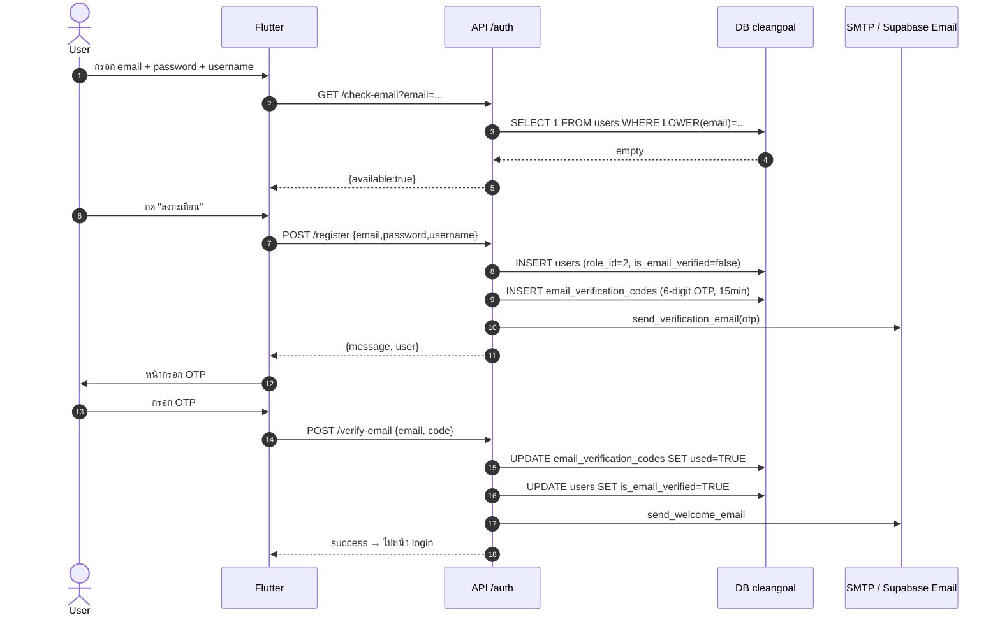

**จุดสำคัญ:**
- OTP เก็บใน `email_verification_codes` (15 นาที, used=FALSE)
- ถ้า Flutter ใช้ Supabase Auth verify OTP เอง → backend route ยังรับเป็น mirror ได้ (race-safe)
- Send email failure → **ไม่** ทำให้ register fail (user resend ได้)

---

## 2. Login (Email/Password)

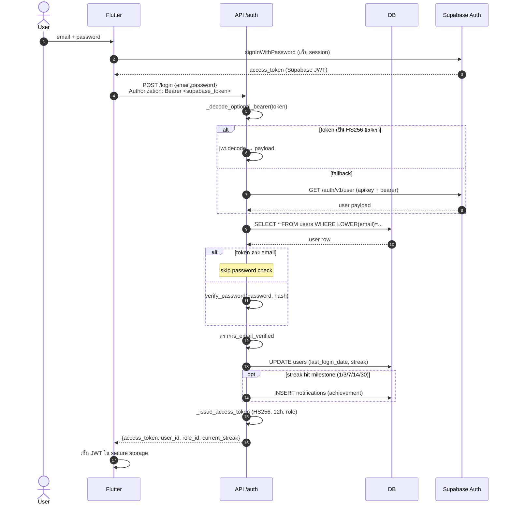

**จุดสำคัญ:**
- ระบบรับ **2 ชนิด token**: backend HS256 (ของเอง) และ Supabase token (fallback ผ่าน `/auth/v1/user`)
- การ verify password ข้ามได้ถ้า Supabase token พิสูจน์ email แล้ว (กรณี social/web)
- streak ทำใน transaction เดียวกับ last_login_date — ถ้าครั้งแรกของวัน จึงนับ +1

---

## 3. Login (Supabase Social / Web)

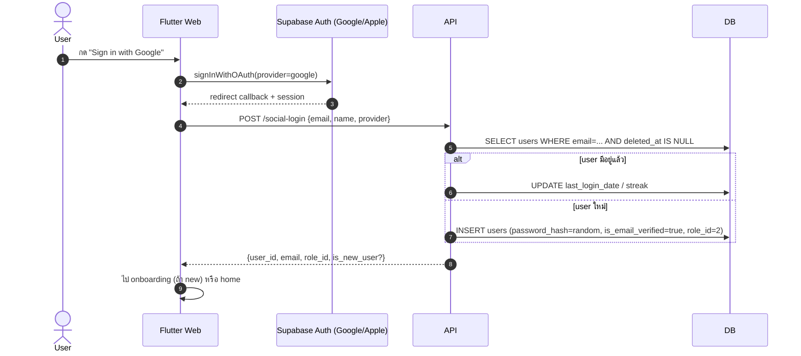

**จุดสำคัญ:**
- Social login ไม่มีรหัสผ่านจริง — เก็บ `secrets.token_hex(32)` เป็น placeholder
- Email ถือว่าตรวจแล้ว (Google/Apple ตรวจให้)
- New user → ส่ง flag `is_new_user=true` → Flutter route ไป `setting_screen` เพื่อให้กรอกข้อมูล TDEE

---

## 4. Password Reset

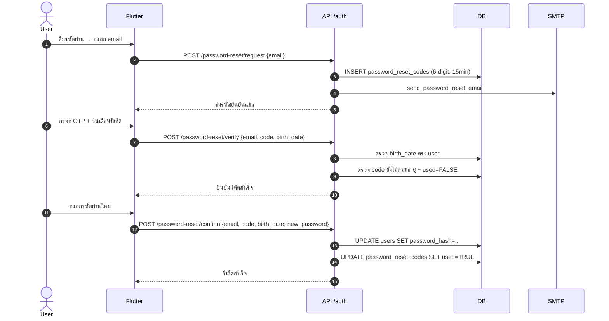

**จุดสำคัญ:**
- มี **2 factor**: OTP ทาง email + birth_date (กัน account hijack ถ้า email ถูก compromise)
- Code ใช้ครั้งเดียว (`used=TRUE`)

---

## 5. Search Food (with Regional Names)

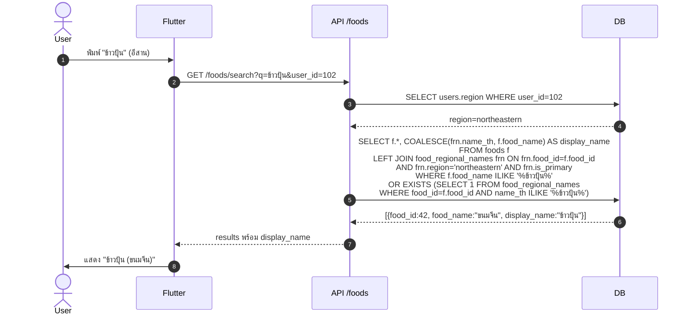

**จุดสำคัญ:**
- การค้นหาตี match ทั้ง canonical name (`foods.food_name`) และ alt names (`food_regional_names.name_th`)
- การแสดงผลใช้ `display_name` ที่ผูกกับ `users.region` (ถ้ามี is_primary ของภาคนั้น)
- ถ้า `users.region IS NULL` → fallback ใช้ `food_name` (Central) เป็น display

---

## 6. Record Meal → Auto Daily Summary

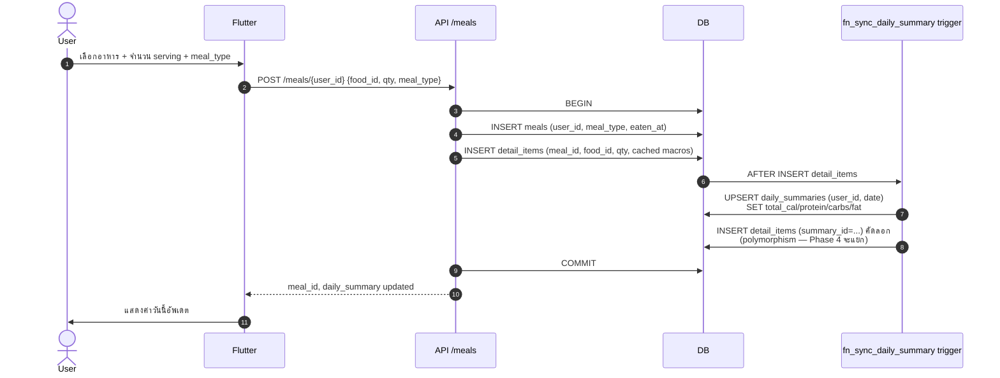

**จุดสำคัญ:**
- `detail_items` มี cached columns (`food_name`, `cal_per_unit`, ...) — v24 trigger `trg_foods_sync_detail_items` ทำให้ sync เมื่อ foods แก้
- `daily_summaries` เป็น materialized aggregate — trigger รันเองเวลา insert/update detail_items
- คอลัมน์ polymorphism (meal_id | plan_id | summary_id) ใน detail_items — CHECK บังคับว่าเลือก 1 (Phase 4)

---

## 7. Submit New Food (temp_food → admin)

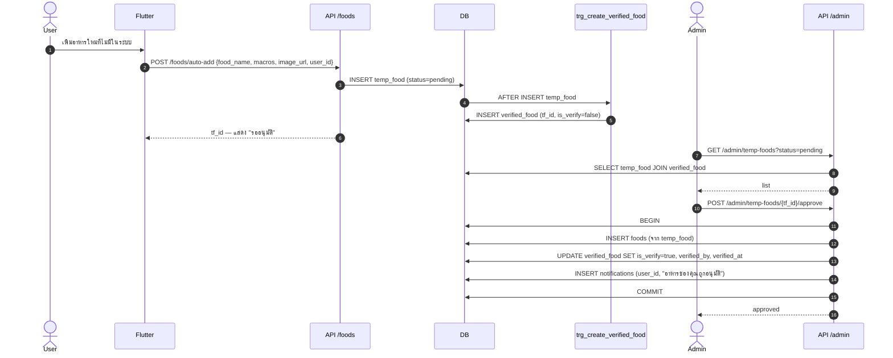

**จุดสำคัญ:**
- `temp_food` 1:1 กับ `verified_food` (trigger สร้างให้อัตโนมัติ)
- approve flow ผูกกับ admin role (`role_id=1`) — RLS ป้องกันคน normal เรียกได้
- notification ส่งกลับให้ user เจ้าของ

---

## 8. Submit Regional Name (variant → admin)

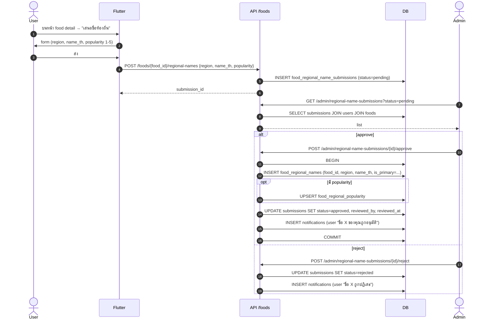

**จุดสำคัญ:**
- มี UNIQUE `(food_id, region, name_th)` กัน duplicate
- มี partial index `WHERE is_primary AND deleted_at IS NULL` กัน is_primary ซ้ำต่อ (food, region)

---

## 9. View Recipe Detail + Review

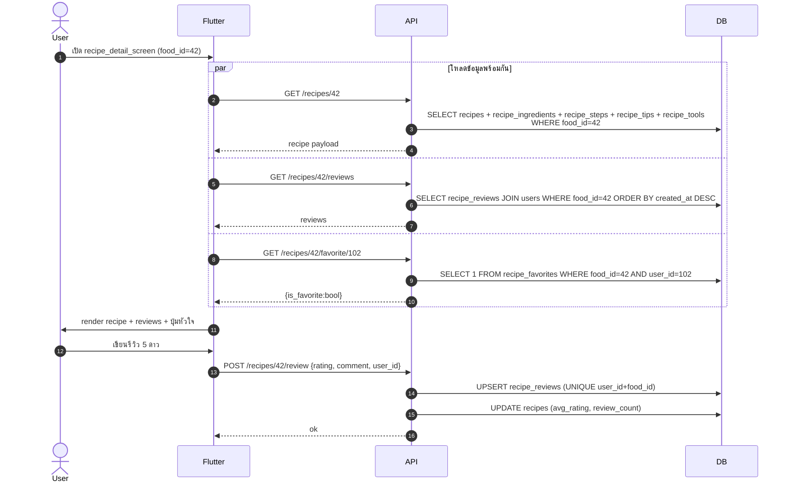

**จุดสำคัญ:**
- 3 calls ขนานกันลด latency
- review เป็น UPSERT — user 1 คนรีวิว 1 ครั้งต่อ recipe

---

## 10. Water Log (1 row/day)

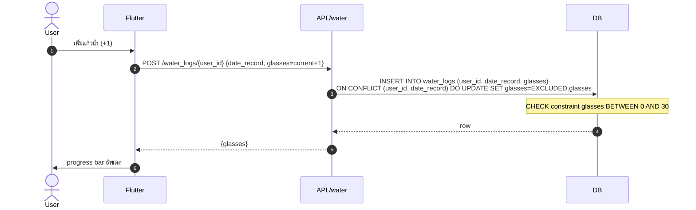

**จุดสำคัญ:**
- UNIQUE `(user_id, date_record)` — UPSERT pattern
- cap ที่ 30 แก้ว (~7.5 ลิตร)

---

## 11. Weight Log + Goal Progress

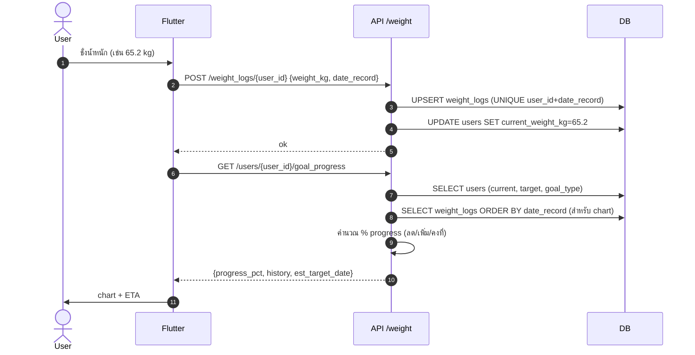

**จุดสำคัญ:**
- UPSERT ต่อวัน — ถ้าชั่งซ้ำในวันเดียวกัน update row เดิม
- `current_weight_kg` บน users sync จาก log ล่าสุด (เพื่อ TDEE calc)

---

## 12. Chat Coach (Ollama Proxy)

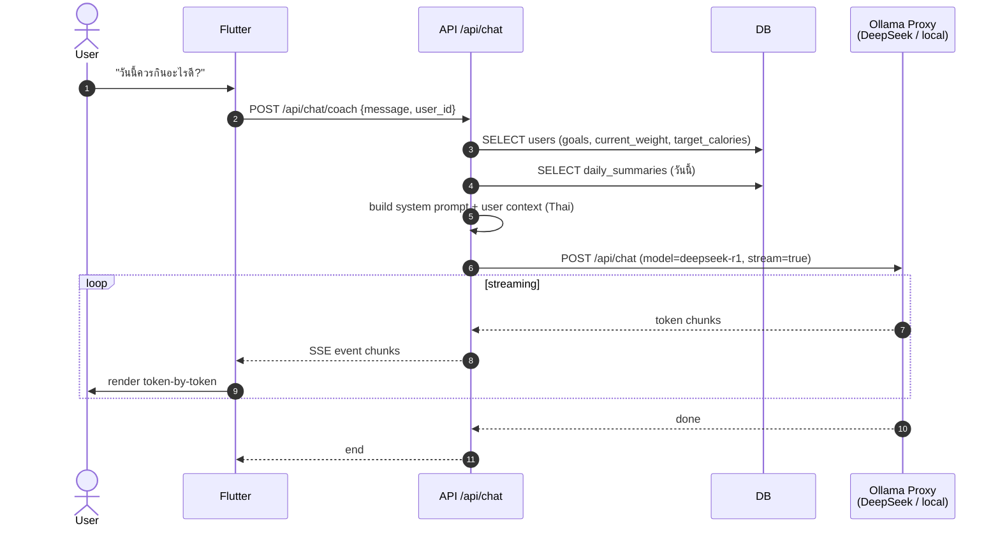

**จุดสำคัญ:**
- LLM provider configurable: Ollama local / DeepSeek cloud — ตัด AbstractProvider ใน `app/services/ai/`
- Streaming ผ่าน Server-Sent Events
- System prompt บรรจุ user goal + remaining calories ของวัน → ตอบเฉพาะตัว

---

## 13. Meal Estimation from Photo

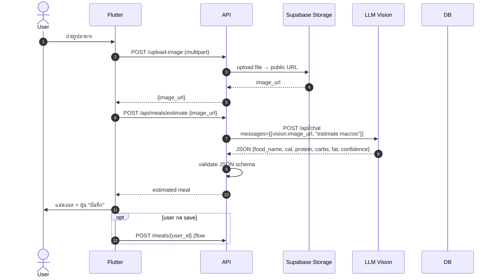

**จุดสำคัญ:**
- Image hosting ผ่าน Supabase Storage bucket `food-photos` (RLS public read, authenticated write)
- LLM response ต้อง JSON parse — มี retry ถ้า invalid
- Confidence score < 0.5 → Flutter แสดงคำเตือน "ผลอาจไม่แม่น"

---

## 14. Update Profile + Recalc TDEE

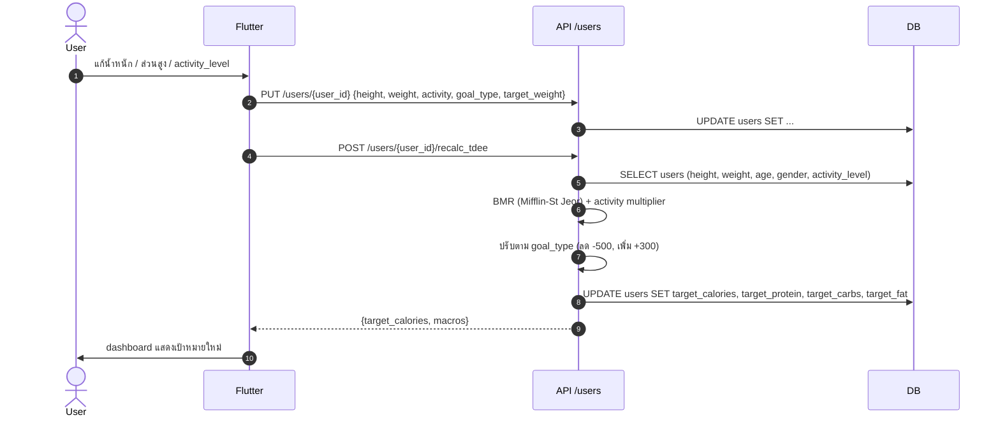

**จุดสำคัญ:**
- TDEE = BMR × activity_multiplier (1.2 sedentary → 1.9 very_active)
- macro split: protein 30% / carbs 45% / fat 25% (default; user override ใน setting)

---

## 15. Set User Region (v20)

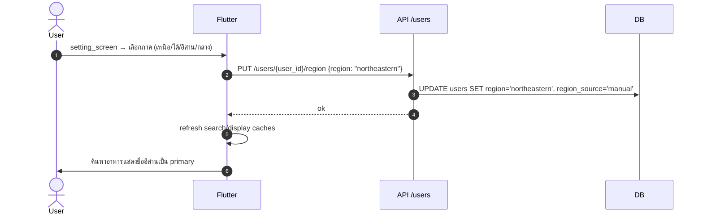

**จุดสำคัญ:**
- ENUM `thai_region` — รองรับ 4 ค่า
- `region_source`: manual / auto_ip / unset (placeholder สำหรับ future geo IP)
- ทันทีที่ตั้ง region → search ใช้ regional name ทันที (flow #5)

---

## 16. PDPA Soft-Delete Account

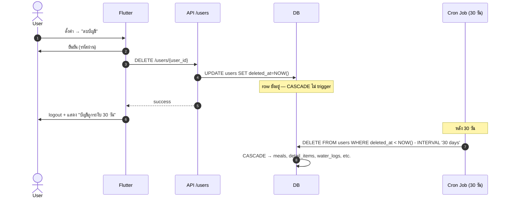

**จุดสำคัญ:**
- Soft delete = `deleted_at` set, row คงอยู่ — user undo ได้ภายใน 30 วัน
- Cron job (ยังไม่ deploy) จะ hard delete ตามนโยบาย PDPA
- export `/users/{user_id}/export` คืน JSON ทุก data ของ user ก่อนลบ

---

## 17. Approve temp_food

ดู Flow #7 (มี admin path อยู่แล้ว). เน้นเพิ่มจุด:

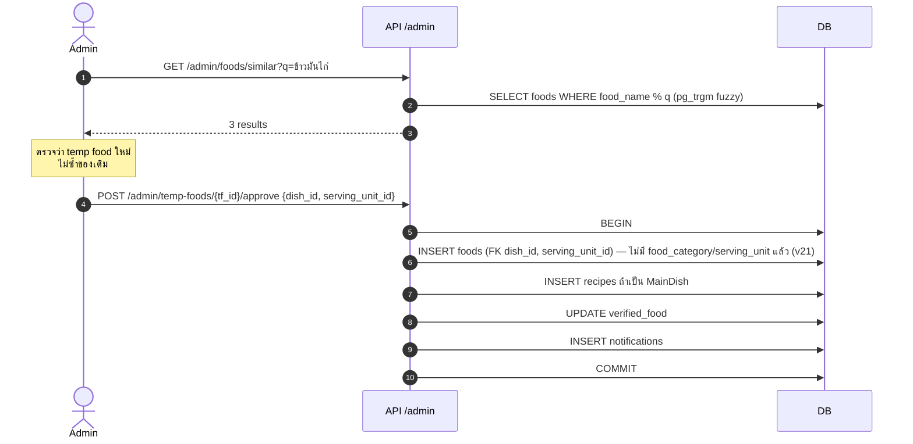

**จุดสำคัญหลัง v21:**
- foods ใหม่ต้องระบุ `dish_id` + `serving_unit_id` — ไม่มี free-text columns แล้ว
- มี similar-search ป้องกัน admin approve duplicate

---

## 18. Approve/Reject Regional Name Submission

ดู Flow #8 (รวมไว้). จุดเพิ่ม: **decay rule** เมื่อ approve เป็น primary.

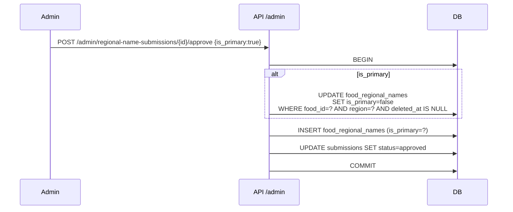

**จุดสำคัญ:**
- การตั้งใหม่เป็น primary ทำ **demote** ของเดิม (constraint partial index บังคับ 1 primary ต่อ region)

---

## 19. Login Streak → Notification

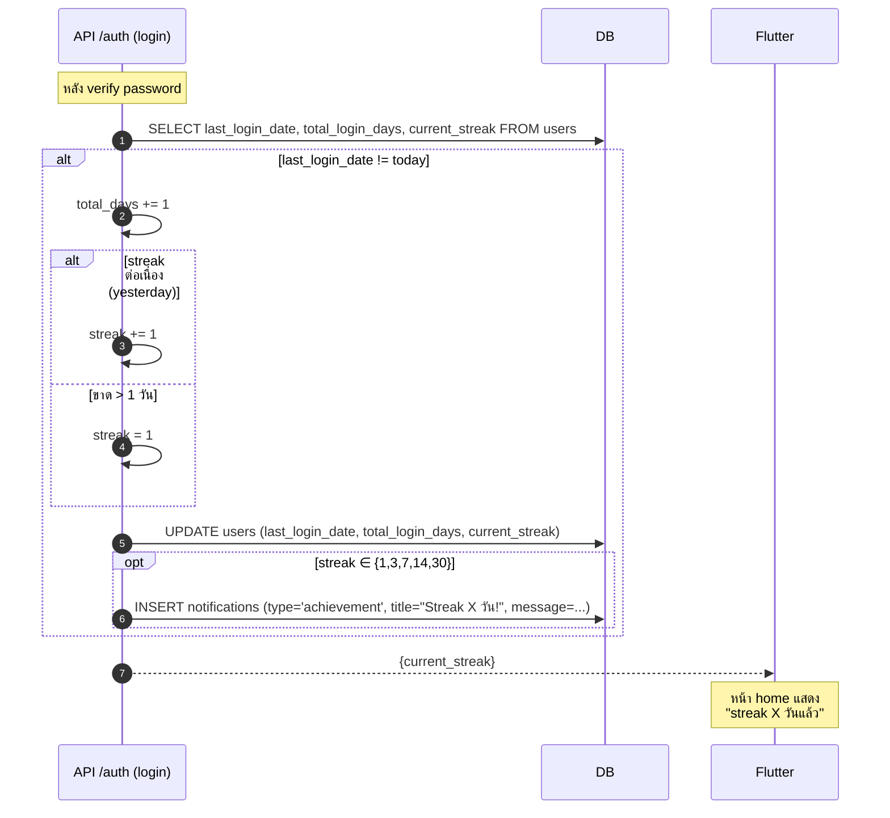

**จุดสำคัญ:**
- streak reset ถ้าขาดเกิน 1 วัน
- milestone notification กัน duplicate ด้วย `ON CONFLICT DO NOTHING` (UNIQUE on user_id + title + date)
- bell icon ที่ home pull `/notifications/{user_id}/unread_count`

---

## หมายเหตุการอ่าน

- ทุก flow ที่มี `Authorization: Bearer <token>` (ไม่ render ในทุก diagram) จะถูก validate โดย `get_current_user` (HS256 + Supabase fallback)
- RLS layer ทำงานคู่ขนาน — ถ้า request มาจาก anon key (ไม่มี JWT) → policies เช่น `deny_anon` block ก่อนถึง code
- error path (4xx/5xx) ไม่วาดเพื่อให้ diagram อ่านง่าย — ดู [routers source](../backend/app/routers/) สำหรับ HTTPException details

---

**END OF SEQUENCE DIAGRAMS**
