# Calories Guard — Current ER Diagram, Sequence Diagrams, Flow Charts และขั้นตอนการทำงานระบบ

**สถานะเอกสาร:** อ้างอิงโค้ดใน repository ปัจจุบัน ณ 2026-05-04  
**Scope:** Flutter mobile/web app, Admin web, FastAPI backend, Supabase Auth/Database/Storage, AI Coach, Railway, Cloudflare  
**Source of truth ที่ใช้ตรวจ:** `backend/main.py`, `backend/app/routers/*`, `backend/app/models/schemas.py`, `backend/migrations/v8-v24`, `docs/DATA_DICTIONARY_FULL.md`, `flutter_application_1/lib/*`, `admin-web/src/*`

> เอกสารนี้ตั้งใจใช้เป็นฉบับกรรมการ/วิศวกรอาวุโส: diagram ใช้ Mermaid เพื่อ render ได้ใน Markdown viewer ที่รองรับ Mermaid และคำอธิบายเน้น state ปัจจุบันของระบบ ไม่ใช่แผนอนาคต

---

## 1. System Context Diagram

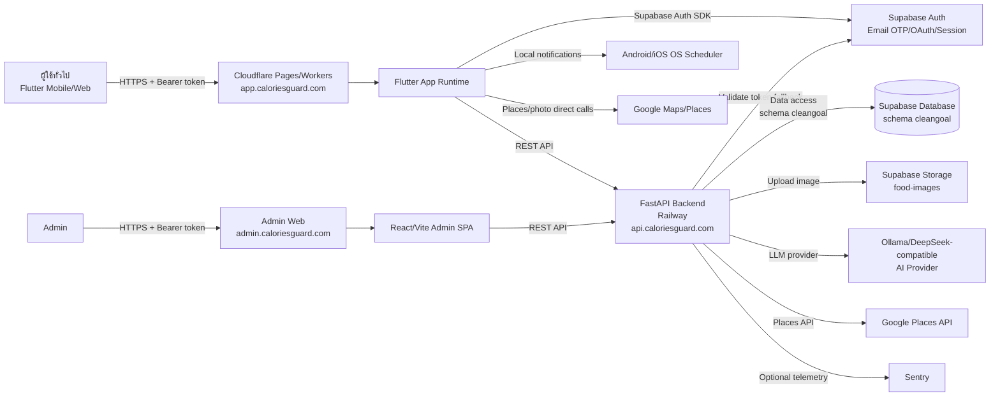

### ภาพรวมหน้าที่ของแต่ละส่วน

| Component | หน้าที่หลัก | Technology |
|---|---|---|
| Flutter app | แอพผู้ใช้: สมัคร, onboarding, บันทึกอาหาร/น้ำ/น้ำหนัก, AI Coach, profile, Tamagotchi, dashboard | Flutter, Riverpod, Supabase Flutter, HTTP |
| Admin web | จัดการอาหาร, ตรวจคำขออาหาร, ตรวจชื่อท้องถิ่น, ดู users | React, Vite, TypeScript |
| FastAPI backend | Business logic, auth sync, data ownership guard, transaction, AI orchestration, upload, admin moderation | FastAPI, slowapi |
| Supabase Auth | Email OTP, password login, OAuth, password recovery | Supabase Auth |
| Supabase Database | Operational data ทั้งหมดใน schema `cleangoal` | Supabase |
| Supabase Storage | รูปอาหารและรูปที่ upload | Supabase Storage |
| Cloudflare | Hosting frontend/admin + domain/routing | Pages/Workers, DNS |
| Railway | Runtime backend API | Docker/FastAPI |
| AI provider | AI Coach, meal estimate, recipe generation | Ollama/local/legacy provider ผ่าน `ai_models.llm_provider` |

---

## 2. ER Diagram ปัจจุบัน

### 2.1 Legend

- `PK` = Primary Key
- `FK` = Foreign Key
- `UQ` = Unique
- `CK` = Check constraint
- `SOFT` = มี `deleted_at`
- `AUDIT` = มี `created_at`/`updated_at`
- เส้นประใน Mermaid ใช้กับ relation ที่เป็น logical/ผ่าน code หรือ relation ที่เอกสารเดิมระบุว่าเคยมี gap/ปรับด้วย migration ภายหลัง

### 2.2 Full Logical ER Diagram

```mermaid
erDiagram
    roles ||--o{ users : role_id
    users ||--o{ email_verification_codes : user_id
    users ||--o{ password_reset_codes : user_id
    users ||--o{ notifications : user_id
    users ||--o{ meals : user_id
    users ||--o{ daily_summaries : user_id
    users ||--o{ water_logs : user_id
    users ||--o{ weight_logs : user_id
    users ||--o{ exercise_logs : user_id
    users ||--o{ user_allergy_preferences : user_id
    users ||--o{ user_favorites : user_id
    users ||--o{ user_meal_plans : user_id
    users ||--o{ temp_food : user_id
    users ||--o{ food_regional_name_submissions : user_id
    users ||--o{ food_regional_names : created_by
    users ||--o{ food_regional_names : approved_by
    users ||--|| user_gamification : user_id

    allergy_flags ||--o{ user_allergy_preferences : flag_id
    allergy_flags ||--o{ food_allergy_flags : flag_id

    dish_categories ||--o{ dishes : dish_category_id
    dishes ||--o{ foods : dish_id
    units ||--o{ foods : serving_unit_id
    foods ||--o| beverages : food_id
    foods ||--o| snacks : food_id
    foods ||--o{ food_allergy_flags : food_id
    foods ||--o{ user_favorites : food_id
    foods ||--o{ detail_items : food_id
    foods ||--o| recipes : food_id
    foods ||--o{ food_regional_names : food_id
    foods ||--o{ food_regional_popularity : food_id
    foods ||--o{ food_regional_name_submissions : food_id

    units ||--o{ detail_items : unit_id
    units ||--o{ unit_conversions : from_unit_id
    units ||--o{ unit_conversions : to_unit_id

    meals ||--o{ detail_items : meal_id
    daily_summaries ||..o{ detail_items : summary_id
    user_meal_plans ||..o{ detail_items : plan_id

    temp_food ||--|| verified_food : tf_id

    recipes ||--o{ recipe_ingredients : recipe_id
    recipes ||--o{ recipe_steps : recipe_id
    recipes ||--o{ recipe_tips : recipe_id
    recipes ||--o{ recipe_tools : recipe_id
    recipes ||--o{ recipe_reviews : recipe_id
    recipes ||--o{ recipe_favorites : recipe_id
    users ||--o{ recipe_reviews : user_id
    users ||--o{ recipe_favorites : user_id

    roles {
        int role_id PK
        varchar role_name UQ
    }

    users {
        bigint user_id PK
        varchar username
        varchar email UQ
        varchar password_hash
        gender_type gender
        date birth_date
        numeric height_cm
        numeric current_weight_kg
        goal_type_enum goal_type
        numeric target_weight_kg
        int target_calories
        int target_protein
        int target_carbs
        int target_fat
        activity_level activity_level
        date goal_start_date
        date goal_target_date
        timestamptz last_login_date
        int current_streak
        int total_login_days
        varchar avatar_url
        int role_id FK
        boolean is_email_verified
        timestamptz consent_accepted_at
        thai_region region
        varchar region_source
        timestamptz deleted_at SOFT
        timestamptz created_at
        timestamptz updated_at
    }

    email_verification_codes {
        bigint id PK
        bigint user_id FK
        varchar code
        timestamptz expires_at
        boolean used
        timestamptz created_at
    }

    password_reset_codes {
        bigint id PK
        bigint user_id FK
        varchar code
        timestamptz expires_at
        boolean used
        timestamptz created_at
    }

    notifications {
        bigint notification_id PK
        bigint user_id FK
        varchar title
        text message
        notification_type type
        boolean is_read
        timestamptz created_at
    }

    dish_categories {
        bigint dish_category_id PK
        varchar category_name UQ
        food_type canonical_food_type
        int display_order
        timestamptz created_at
    }

    dishes {
        bigint dish_id PK
        varchar dish_name
        bigint dish_category_id FK
        food_type canonical_food_type
        varchar cuisine
        varchar image_url
        timestamptz created_at
        timestamptz updated_at
    }

    units {
        int unit_id PK
        varchar name UQ
        numeric quantity
    }

    unit_conversions {
        int conversion_id PK
        int from_unit_id FK
        int to_unit_id FK
        numeric factor
        varchar note
        timestamptz created_at
    }

    foods {
        bigint food_id PK
        varchar food_name
        food_type food_type
        numeric calories
        numeric protein
        numeric carbs
        numeric fat
        numeric sodium
        numeric sugar
        numeric cholesterol
        numeric fiber_g
        numeric serving_quantity
        int serving_unit_id FK
        bigint dish_id FK
        varchar image_url
        timestamptz deleted_at SOFT
        timestamptz created_at
        timestamptz updated_at
    }

    beverages {
        bigint beverage_id PK
        bigint food_id FK_UQ
        numeric volume_ml
        boolean is_alcoholic
        numeric caffeine_mg
        varchar sugar_level_label
        varchar container_type
    }

    snacks {
        bigint snack_id PK
        bigint food_id FK_UQ
        boolean is_sweet
        varchar packaging_type
        numeric trans_fat
    }

    allergy_flags {
        int flag_id PK
        varchar name
        varchar description
    }

    food_allergy_flags {
        bigint food_id PK_FK
        int flag_id PK_FK
    }

    user_allergy_preferences {
        bigint user_id PK_FK
        int flag_id PK_FK
        varchar preference_type
        timestamptz created_at
    }

    meals {
        bigint meal_id PK
        bigint user_id FK
        timestamptz meal_time
        numeric total_amount
        meal_type meal_type
        timestamptz created_at
        timestamptz updated_at AUDIT
    }

    detail_items {
        bigint item_id PK
        bigint meal_id FK
        bigint plan_id FK
        bigint summary_id FK
        bigint food_id FK
        varchar food_name
        numeric amount
        int unit_id FK
        numeric cal_per_unit
        numeric protein_per_unit
        numeric carbs_per_unit
        numeric fat_per_unit
        varchar note
        timestamptz created_at
        timestamptz updated_at AUDIT
    }

    daily_summaries {
        bigint summary_id PK
        bigint user_id FK
        date date_record UQ
        numeric total_calories_intake
        numeric total_protein
        numeric total_carbs
        numeric total_fat
        int water_glasses
        int goal_calories
        boolean is_goal_met
        timestamptz updated_at AUDIT
    }

    water_logs {
        bigint log_id PK
        bigint user_id FK
        date date_record UQ
        int amount_ml
        int glasses
        timestamptz updated_at
    }

    weight_logs {
        bigint log_id PK
        bigint user_id FK
        numeric weight_kg
        date recorded_date UQ
        timestamptz created_at
    }

    exercise_logs {
        bigint log_id PK
        bigint user_id FK
        date date_record
        varchar activity_name
        int duration_minutes
        numeric calories_burned
        varchar intensity
        varchar note
        timestamptz created_at
        timestamptz updated_at AUDIT
    }

    user_meal_plans {
        bigint plan_id PK
        bigint user_id FK
        varchar name
        text description
        varchar source_type
        boolean is_premium
        timestamptz created_at
    }

    temp_food {
        bigint tf_id PK
        varchar food_name
        numeric calories
        numeric protein
        numeric carbs
        numeric fat
        bigint user_id FK
        timestamptz created_at
        timestamptz updated_at
    }

    verified_food {
        bigint vf_id PK
        bigint tf_id FK_UQ
        boolean is_verify
        bigint verified_by FK
        timestamptz verified_at
        timestamptz created_at
        timestamptz updated_at
    }

    recipes {
        bigint recipe_id PK
        bigint food_id FK_UQ
        text description
        text instructions
        int prep_time_minutes
        int cooking_time_minutes
        numeric serving_people
        jsonb ingredients_json
        jsonb tools_json
        jsonb tips_json
        varchar generated_by
        numeric rating_avg
        int review_count
        int favorite_count
        varchar image_url
        timestamptz created_at
        timestamptz deleted_at SOFT
    }

    recipe_ingredients {
        bigint ing_id PK
        bigint recipe_id FK
        varchar ingredient_name
        numeric quantity
        varchar unit
        boolean is_optional
        int sort_order
        timestamptz created_at
    }

    recipe_steps {
        bigint step_id PK
        bigint recipe_id FK
        int step_number
        varchar title
        text instruction
        int time_minutes
        varchar image_url
        text tips
        timestamptz created_at
    }

    recipe_tips {
        bigint tip_id PK
        bigint recipe_id FK
        text tip_text
        int sort_order
        timestamptz created_at
    }

    recipe_tools {
        bigint tool_id PK
        bigint recipe_id FK
        varchar tool_name
        varchar tool_emoji
        int sort_order
        timestamptz created_at
    }

    recipe_reviews {
        bigint review_id PK
        bigint recipe_id FK
        bigint user_id FK
        smallint rating
        text comment
        timestamptz created_at
    }

    recipe_favorites {
        bigint fav_id PK
        bigint recipe_id FK
        bigint user_id FK
        timestamptz created_at
    }

    user_favorites {
        bigint id PK
        bigint user_id FK
        bigint food_id FK
        timestamptz created_at
    }

    food_regional_names {
        bigint variant_id PK
        bigint food_id FK
        thai_region region
        varchar name_th
        boolean is_primary
        bigint created_by FK
        bigint approved_by FK
        timestamptz created_at
        timestamptz updated_at
        timestamptz deleted_at SOFT
    }

    food_regional_popularity {
        bigint food_id PK_FK
        thai_region region PK
        smallint popularity
        varchar note
        timestamptz updated_at
    }

    food_regional_name_submissions {
        bigint submission_id PK
        bigint food_id FK
        thai_region region
        varchar name_th
        smallint popularity
        bigint user_id FK
        request_status status
        bigint reviewed_by FK
        timestamptz reviewed_at
        timestamptz created_at
    }

    health_contents {
        bigint content_id PK
        varchar title
        content_type type
        varchar thumbnail_url
        varchar resource_url
        text description
        varchar category_tag
        boolean is_published
        timestamptz created_at
    }

    user_gamification {
        bigint user_id PK_FK
        int tama_points
        int tier_level
        text_array claimed_badges
        timestamptz updated_at
    }
```

### 2.3 Domain Clusters

| Domain | Tables | ความหมาย |
|---|---|---|
| Identity/Auth | `roles`, `users`, `email_verification_codes`, `password_reset_codes` | บัญชี, สิทธิ์, OTP legacy/backend, password reset legacy/backend |
| Nutrition profile | `users`, `weight_logs`, `daily_summaries`, `water_logs`, `exercise_logs` | เป้าหมาย, น้ำหนัก, สรุปรายวัน, น้ำดื่ม, ออกกำลังกาย |
| Food catalog | `foods`, `dish_categories`, `dishes`, `units`, `unit_conversions`, `beverages`, `snacks` | ฐานข้อมูลอาหารแบบ normalize |
| Allergy | `allergy_flags`, `food_allergy_flags`, `user_allergy_preferences` | ข้อมูลแพ้อาหารและ preference |
| Meal logging | `meals`, `detail_items`, `daily_summaries` | บันทึกมื้ออาหาร + item + trigger sync สรุปรายวัน |
| Recipe/social | `recipes`, `recipe_*`, `user_favorites`, `recipe_favorites`, `recipe_reviews` | สูตรอาหาร, รีวิว, favorite |
| Admin moderation | `temp_food`, `verified_food`, `v_admin_temp_food_review` | ผู้ใช้ส่งอาหารใหม่, admin ตรวจ, promote เข้า `foods` |
| Regional names | `food_regional_names`, `food_regional_popularity`, `food_regional_name_submissions` | ชื่ออาหารท้องถิ่น 4 ภาค + workflow review |
| Gamification | `user_gamification`, `users.current_streak`, `users.total_login_days` | คะแนน Tama, badge, streak |
| Content/notifications | `health_contents`, `notifications` | บทความ/วิดีโอสุขภาพ, แจ้งเตือนในระบบ |
| Archive/infra | `schema_migrations`, `*_archive` | migration state และข้อมูล archive จากการ normalize/drop |

### 2.4 Enum Types

| Enum | Values |
|---|---|
| `goal_type_enum` | `lose_weight`, `maintain_weight`, `gain_muscle` |
| `activity_level` | `sedentary`, `lightly_active`, `moderately_active`, `very_active` |
| `content_type` | `article`, `video` |
| `food_type` | `raw_ingredient`, `recipe_dish` และใน code บางจุดมี fallback `dish` ตาม schema/runtime |
| `gender_type` | `male`, `female` |
| `meal_type` | `breakfast`, `lunch`, `dinner`, `snack` |
| `notification_type` | `system_alert`, `achievement`, `content_update`, `system_announcement`; code บางจุด insert `warning`/`tip` ตาม runtime compatibility |
| `request_status` | `pending`, `approved`, `rejected` |
| `thai_region` | `central`, `northern`, `northeastern`, `southern` |

### 2.5 Trigger/Sync ที่สำคัญ

| Trigger | Table | Event | ผลลัพธ์ |
|---|---|---|---|
| `trg_sync_daily_summary` | `detail_items` | insert/update/delete | รวม calories/protein/carbs/fat กลับไป `daily_summaries` |
| `trg_sync_water_to_daily` | `water_logs` | insert/update/delete | sync `water_glasses` ไป `daily_summaries` |
| `trg_create_verified_food` | `temp_food` | after insert | สร้าง row `verified_food` อัตโนมัติ |
| `trg_temp_food_touch_updated_at` | `temp_food` | before update | ตั้ง `updated_at` |
| `trg_verified_food_touch_updated_at` | `verified_food` | before update | ตั้ง `updated_at` และ `verified_at` |
| `trg_*_updated_at` | `meals`, `detail_items`, `daily_summaries`, `exercise_logs` | before update | ตั้ง audit `updated_at` |
| `trg_foods_sync_detail_items` | `foods` | after update | sync cache nutrition ใน `detail_items` เมื่ออาหารเปลี่ยน |
| `update_recipe_rating` | `recipe_reviews` | insert/update/delete | คำนวณ rating aggregate ใน `recipes` |
| `update_recipe_favorite_count` | `recipe_favorites` | insert/delete | คำนวณ favorite count ใน `recipes` |

---

## 3. API Endpoint Map ปัจจุบัน

### 3.1 Public/health/upload/reference

| Method | Endpoint | Auth | ใช้ทำอะไร |
|---|---|---|---|
| GET | `/` | Public | root health text |
| GET | `/health` | Public | liveness + `api_version` |
| GET | `/debug-auth` | Public/debug | ตรวจว่า header Authorization เข้ามาไหม |
| POST | `/upload-image/` | Public + rate limit | upload image ไป Supabase Storage, optional `food_id` |
| POST | `/upload_image` | Public + rate limit | upload image endpoint สำรอง |
| GET | `/units` | Public | รายการหน่วย |
| GET | `/unit_conversions` | Public | conversion factor |

### 3.2 Auth

| Method | Endpoint | Auth | ใช้ทำอะไร |
|---|---|---|---|
| GET | `/check-email` | Public + rate limit | live email availability |
| POST | `/register` | Public + rate limit | sync user row หลัง Supabase sign up |
| POST | `/verify-email` | Public | sync `users.is_email_verified=true` หลัง Supabase verify OTP |
| POST | `/resend-verification-email` | Public | legacy compatibility, แจ้งให้ใช้ Supabase email |
| POST | `/login` | Public + optional Supabase token | login backend, issue backend JWT, update streak |
| POST | `/social-login` | Public | sync OAuth user กับ DB, issue backend JWT |
| POST | `/password-reset/request` | Public | legacy backend reset code |
| POST | `/password-reset/verify` | Public | legacy reset verify |
| POST | `/password-reset/confirm` | Public | legacy reset confirm |

### 3.3 User/Profile/PDPA/Gamification

| Method | Endpoint | Auth | ใช้ทำอะไร |
|---|---|---|---|
| GET | `/users/{user_id}` | User owner | profile + auto compute target calories/macros |
| PUT | `/users/{user_id}` | User owner | update profile/onboarding/goal/avatar |
| DELETE | `/users/{user_id}` | User owner | PDPA soft delete 30 วัน |
| GET | `/users/{user_id}/export` | User owner | export ข้อมูลผู้ใช้ |
| GET | `/users/{user_id}/region` | User owner | อ่าน region preference |
| PUT | `/users/{user_id}/region` | User owner | ตั้ง region |
| GET | `/users/{user_id}/lifecycle_check` | User owner | เช็ค overdue/tdee/monthly/goal |
| POST | `/users/{user_id}/recalc_tdee` | User owner | คำนวณ target calories ใหม่ |
| GET | `/users/{user_id}/tama-points` | Public/runtime | อ่าน Tama points |
| PATCH | `/users/{user_id}/tama-points` | Public/runtime | sync Tama points |
| GET | `/users/{user_id}/food-frequency` | Public/runtime | นับอาหารที่กินบ่อย |

### 3.4 Food/Recipe/Regional

| Method | Endpoint | Auth | ใช้ทำอะไร |
|---|---|---|---|
| GET | `/foods` | Public | list foods, optional `user_id` เพื่อ display regional name |
| POST | `/foods` | Public/runtime/admin UI | create food |
| PUT | `/foods/{food_id}` | Public/runtime/admin UI | full update food |
| PATCH | `/foods/{food_id}` | Admin | partial update food |
| DELETE | `/foods/{food_id}` | Admin | delete food |
| GET | `/foods/search` | Public | search canonical + regional names |
| POST | `/foods/auto-add` | Public/runtime | user/AI submit temp food |
| GET | `/recommended-food` | Public | top 20 foods |
| GET | `/foods/{food_id}/regional-names` | Public | list approved regional names |
| POST | `/foods/{food_id}/regional-names` | Public/runtime | submit regional name for review |
| GET | `/recipes/{food_id}` | Public | get recipe; lazy generate via LLM if missing |
| GET | `/recipes/{food_id}/reviews` | Public | list recipe reviews |
| POST | `/recipes/{food_id}/review` | Runtime payload | upsert review |
| GET | `/recipes/{food_id}/favorite/{user_id}` | User owner | favorite status |
| POST | `/recipes/{food_id}/favorite/{user_id}` | User owner | toggle favorite |
| GET | `/users/{user_id}/favorites` | User owner | user favorites |

### 3.5 Meal/Water/Weight/Insights/Notifications

| Method | Endpoint | Auth | ใช้ทำอะไร |
|---|---|---|---|
| POST | `/meals/{user_id}` | User owner | record meal + detail items |
| DELETE | `/meals/clear/{user_id}` | User owner | clear meal type for date |
| GET | `/daily_summary/{user_id}` | User owner | daily total + meal names |
| GET | `/daily_logs/{user_id}` | User owner | daily log detail by date |
| GET | `/daily_logs/{user_id}/calendar` | User owner | monthly calendar calories |
| GET | `/daily_logs/{user_id}/weekly` | User owner | weekly calories/macros |
| GET | `/meals/{user_id}/detail` | User owner | meal type detail |
| GET | `/water_logs/{user_id}` | User owner | water amount for date |
| POST | `/water_logs/{user_id}` | User owner | upsert water |
| POST | `/weight_logs/{user_id}` | User owner | upsert today's weight + profile current weight |
| GET | `/users/{user_id}/weight_logs` | User owner | recent weight logs |
| GET | `/users/{user_id}/goal_progress` | User owner | goal progress |
| GET | `/weight_status/{user_id}` | User owner | requires weight update? |
| GET | `/progress_summary/{user_id}` | User owner | progress percent |
| GET | `/insights/{user_id}` | User owner | 30-day overview |
| GET | `/insights/{user_id}/top_foods` | User owner | top foods |
| GET | `/insights/{user_id}/calorie_trend` | User owner | calorie trend |
| GET | `/insights/{user_id}/macro_balance` | User owner | macro balance |
| GET | `/notifications/{user_id}` | User owner | notification list |
| GET | `/notifications/{user_id}/unread_count` | User owner | unread count |
| PUT | `/notifications/{user_id}/read_all` | User owner | mark all read |

### 3.6 AI

| Method | Endpoint | Auth | ใช้ทำอะไร |
|---|---|---|---|
| POST | `/api/chat/coach` | Public + rate limit | legacy AI Coach response |
| POST | `/api/chat/multi` | Public + rate limit | 3-agent AI Coach pipeline |
| POST | `/api/meals/estimate` | Public + rate limit | extract/estimate meal from Thai free text |

### 3.7 Admin

| Method | Endpoint | Auth | ใช้ทำอะไร |
|---|---|---|---|
| GET | `/admin/users` | Admin | list/search users |
| GET | `/admin/temp-foods/pending-count` | Admin | pending badge |
| GET | `/admin/foods/similar` | Admin | duplicate candidate |
| GET | `/admin/temp-foods` | Admin | list pending/verified temp foods |
| POST | `/admin/temp-foods/{tf_id}/approve` | Admin | approve temp food, promote to foods |
| DELETE | `/admin/temp-foods/{tf_id}` | Admin | reject/delete temp food |
| GET | `/admin/regional-name-submissions` | Admin | list regional name queue |
| POST | `/admin/regional-name-submissions/{submission_id}/approve` | Admin | approve regional name |
| POST | `/admin/regional-name-submissions/{submission_id}/reject` | Admin | reject regional name |

---

## 4. Sequence Diagrams

### 4.1 สมัครสมาชิก + ยืนยันอีเมล

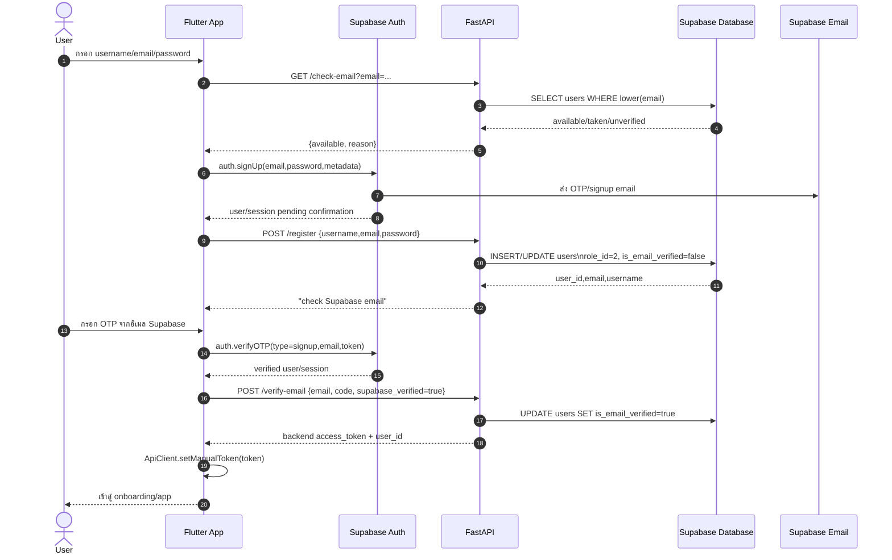

**หลักการ:** Supabase เป็น source of truth สำหรับ email confirmation ส่วน backend mirror ค่า `is_email_verified` เพื่อให้ `/login` และ business logic ฝั่งระบบใช้ตรวจได้

### 4.2 Login Email/Password

```mermaid
sequenceDiagram
    autonumber
    actor U as User
    participant F as Flutter App
    participant SB as Supabase Auth
    participant API as FastAPI
    participant DB as Supabase Database

    U->>F: กรอก email/password
    F->>SB: signInWithPassword(email,password)
    alt Supabase email not confirmed
        SB-->>F: AuthException email not confirmed
        F->>SB: resend signup OTP
        F-->>U: แจ้งให้ยืนยันอีเมล
    else Supabase login OK
        SB-->>F: Supabase session/access_token
        F->>API: POST /login + Authorization: Bearer Supabase token
        API->>API: decode backend JWT; ถ้าไม่ได้ fallback /auth/v1/user
        API->>DB: SELECT users WHERE email AND deleted_at IS NULL
        API->>DB: verify password ถ้าไม่ได้ authenticate by Supabase token
        API->>DB: check is_email_verified
        API->>DB: update last_login_date,total_login_days,current_streak
        opt streak milestone
            API->>DB: INSERT notification achievement
        end
        API-->>F: user_id, role_id, onboarding_required, backend access_token
        F->>F: store backend JWT manually
        alt role_id == 1
            F-->>U: AdminDashboardScreen
        else onboarding_required
            F-->>U: GenderSelectionScreen/onboarding
        else normal user
            F-->>U: MainScreen
        end
    end
```

### 4.3 OAuth Login

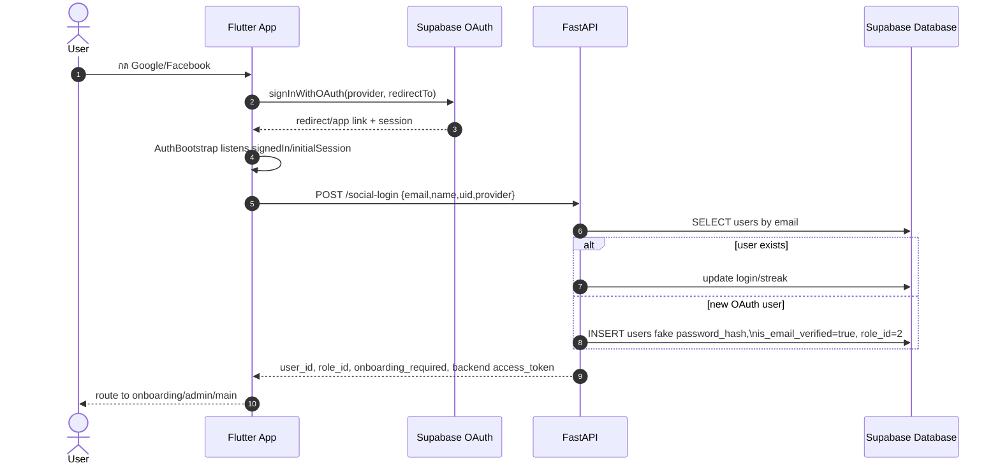

### 4.4 บันทึกอาหารแบบเลือกจากรายการ

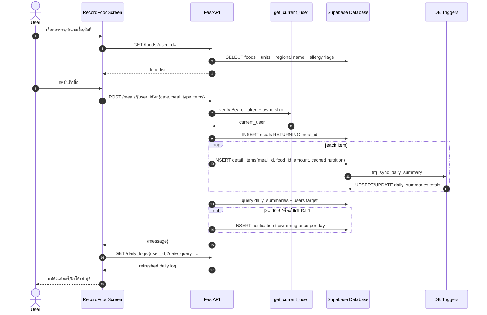

### 4.5 AI Meal Estimate จากข้อความภาษาไทย

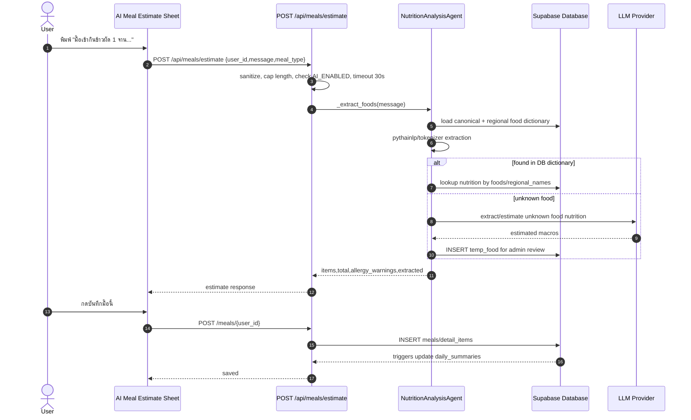

### 4.6 บันทึกน้ำดื่ม

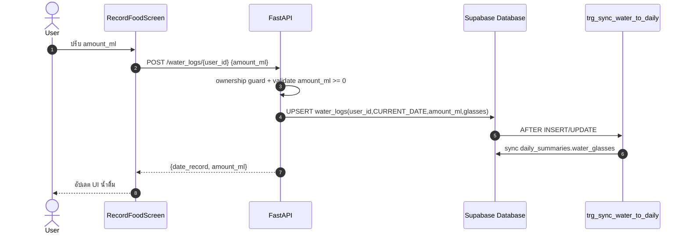

### 4.7 บันทึกน้ำหนักและ Goal Progress

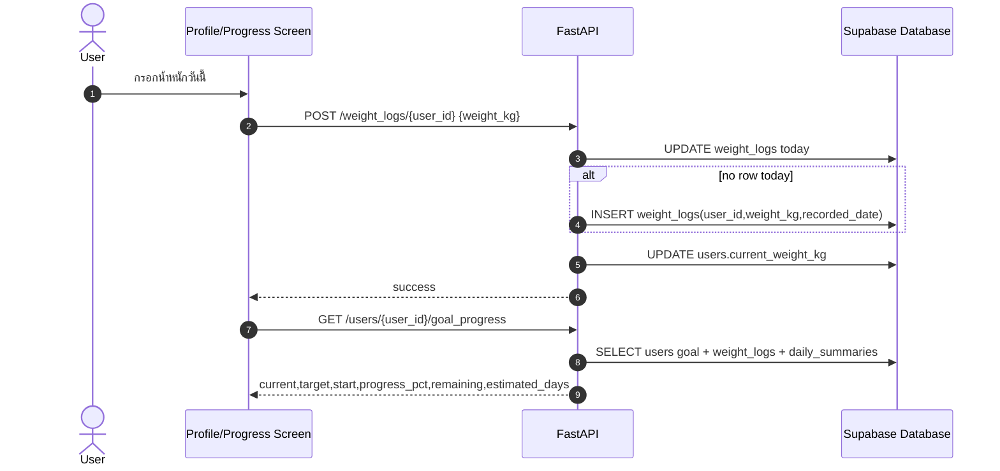

### 4.8 Admin ตรวจอาหารที่ผู้ใช้ส่ง

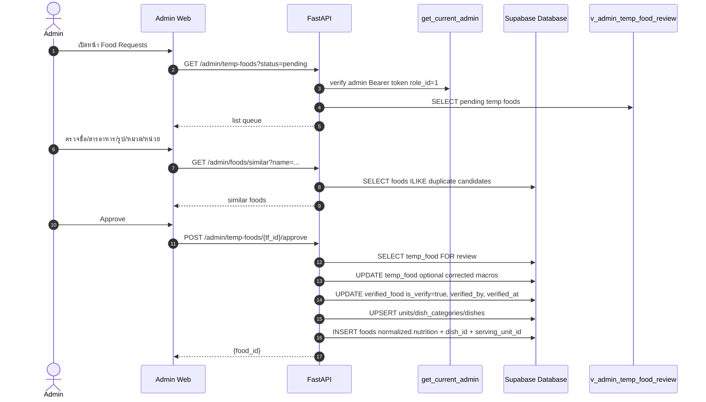

### 4.9 Admin ตรวจชื่ออาหารท้องถิ่น

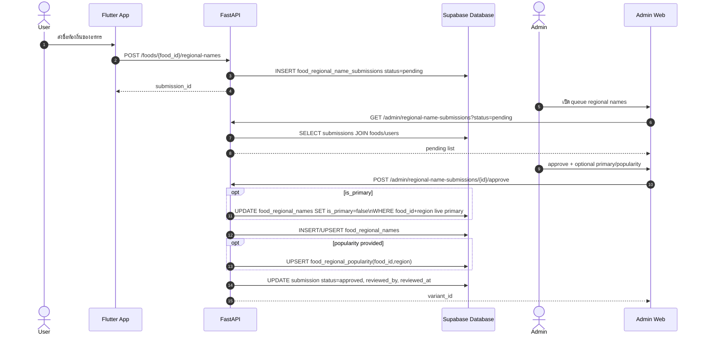

### 4.10 Recipe Lazy Generation

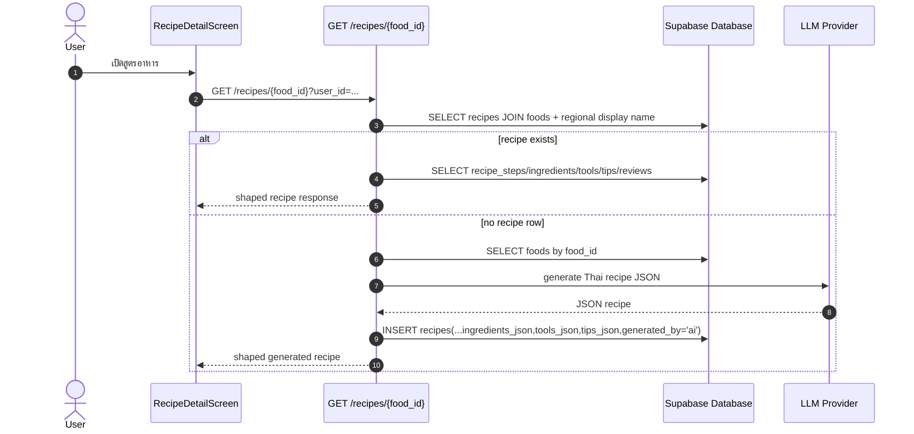

### 4.11 AI Coach Multi-Agent

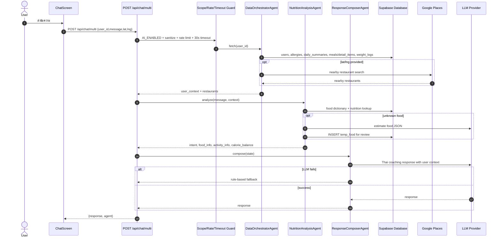

### 4.12 Notification Read Flow

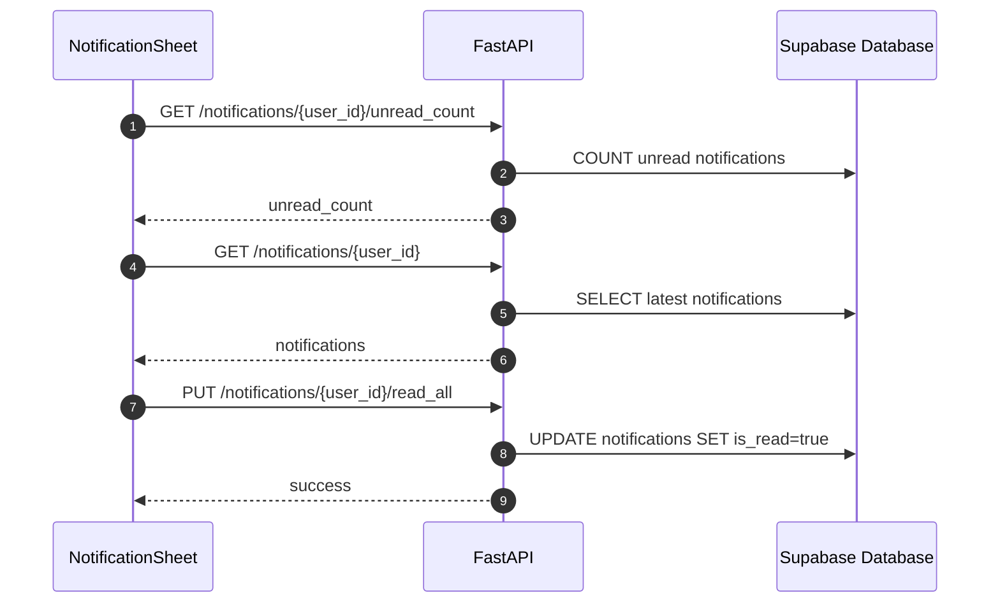

### 4.13 Gamification/Tamagotchi Load และ Claim Mission

```mermaid
sequenceDiagram
    autonumber
    actor U as User
    participant F as TamagotchiScreen
    participant Local as SharedPreferences
    participant API as FastAPI
    participant DB as Supabase Database
    participant Provider as userDataProvider

    U->>F: เปิดหน้าไร่ข้าวของฉัน
    F->>Provider: read userId + daily nutrition/streak state
    F->>Local: read tama_points, max_tier, claimed missions วันนี้, claimed rewards
    Local-->>F: local cached gamification state
    F-->>U: แสดงคะแนน/เลเวลแบบเร็วจาก local cache

    alt userId > 0
        F->>API: GET /users/{user_id}/tama-points
        API->>DB: SELECT tama_points,tier_level,claimed_badges\nFROM user_gamification
        alt มีข้อมูลบน server
            DB-->>API: gamification row
            API-->>F: tama_points,tier_level,claimed_badges
            F->>Local: merge เฉพาะค่าที่ server สูงกว่า local\nและ sync claimed_badges
            F-->>U: update UI ตาม server state
        else ยังไม่มี row
            DB-->>API: empty
            API-->>F: {tama_points:0,tier_level:0,claimed_badges:[]}
        end
    end

    U->>F: กดรับรางวัลภารกิจ
    F->>Provider: ตรวจ mission autoCheck\nเช่น logged meal, hit calories, streak >= 3
    F->>F: คำนวณ points ด้วย tier multiplier
    F->>F: คำนวณ earned tier; tier ขึ้นได้แต่ไม่ลดลง
    F->>Local: save new points, claimed mission today, max tier
    F-->>U: แสดงคะแนนที่ได้รับ
    F->>API: PATCH /users/{user_id}/tama-points\n{tama_points,tier_level}
    API->>DB: UPSERT user_gamification\npoints,tier,updated_at
    API-->>F: {ok:true}
```

**หลักการ:** Gamification ใช้ local-first เพื่อให้หน้า Tamagotchi เปิดเร็วและเล่นได้ลื่น จากนั้น sync กับ backend แบบ best effort โดย server เก็บ state ถาวรใน `user_gamification`.

### 4.14 Gamification Reward Shop / Badge Redeem

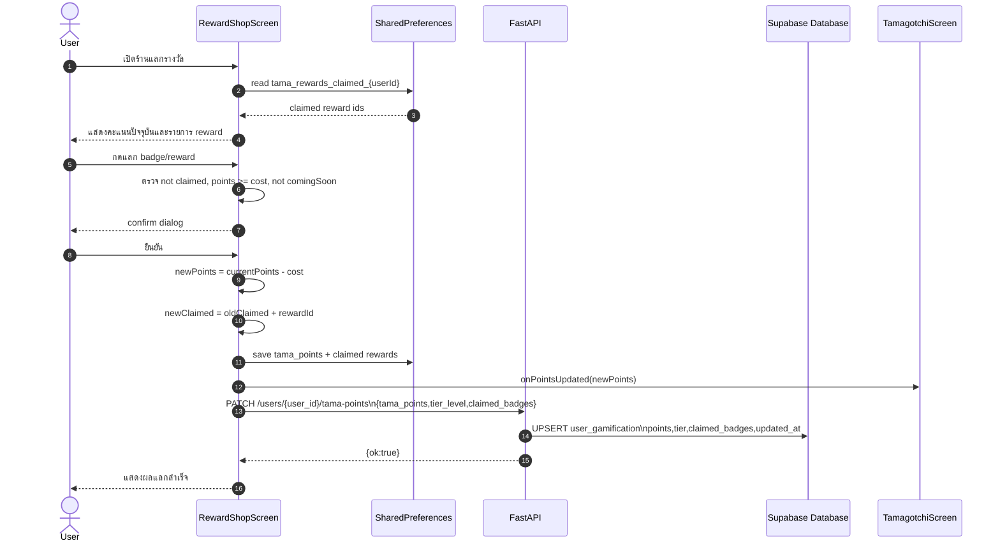

### 4.15 Leaderboard รวม Streak และ Tama Points

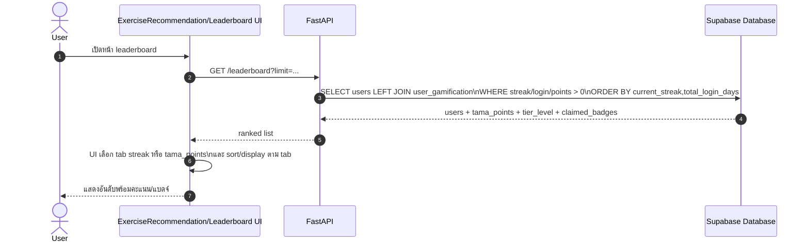

---

## 5. Flow Charts

### 5.1 App Startup Flow

```mermaid
flowchart TD
    A[main()] --> B[WidgetsFlutterBinding.ensureInitialized]
    B --> C{SUPABASE_ANON_KEY exists?}
    C -- No --> D[Show MissingConfigApp]
    C -- Yes --> E[Supabase.initialize]
    E --> F[ApiClient.onUnauthorized = Supabase signOut]
    F --> G{SENTRY_DSN exists?}
    G -- No --> H[runApp ProviderScope MyApp]
    G -- Yes --> I[SentryFlutter.init then runApp]
    H --> J[Post-frame init notifications mobile only]
    I --> J
    J --> K[AuthBootstrap]
    K --> L[Listen Supabase auth state]
    L --> M{event}
    M -- passwordRecovery --> N[ResetPasswordScreen]
    M -- initialSession/signedIn OAuth --> O[socialLogin sync backend]
    M -- none --> P[WelcomeScreen]
```

### 5.2 Auth Decision Flow หลัง Login

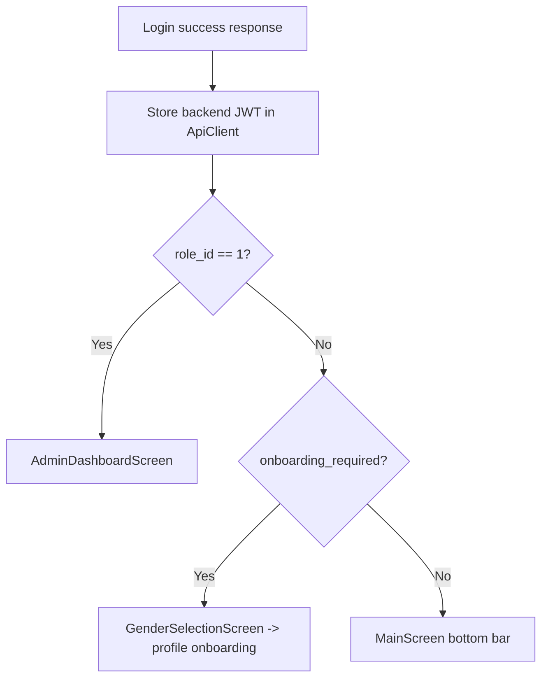

### 5.3 Onboarding/Profile Update Flow

```mermaid
flowchart TD
    A[User completes onboarding fields] --> B[PUT /users/{user_id}]
    B --> C[Ownership check]
    C --> D[Update users fields]
    D --> E{target_calories omitted?}
    E -- Yes --> F[Compute target calories from profile]
    E -- No --> G[Use provided target_calories]
    F --> H{target macros omitted?}
    G --> H
    H -- Yes --> I[Compute protein/carbs/fat targets]
    H -- No --> J[Keep provided macros]
    I --> K{current_weight_kg provided?}
    J --> K
    K -- Yes --> L[Upsert today's weight_logs]
    K -- No --> M[Commit]
    L --> M
    M --> N[Return Update successful]
```

### 5.4 Food Search + Regional Display Flow

```mermaid
flowchart TD
    A[User opens food list/search] --> B{user_id provided?}
    B -- Yes --> C[Resolve users.region]
    B -- No --> D[region = NULL]
    C --> E[Query foods]
    D --> E
    E --> F[LEFT JOIN food_regional_names\nregion=user region,is_primary,not deleted]
    F --> G[display_name = regional name or food_name]
    G --> H[Return foods with allergy_flag_ids]
```

### 5.5 Add Meal Flow

```mermaid
flowchart TD
    A[Submit meal] --> B[Validate bearer token]
    B --> C[check_ownership]
    C --> D[Map meal_type to enum]
    D --> E[Calculate total calories]
    E --> F[INSERT meals]
    F --> G[Loop insert detail_items]
    G --> H[DB trigger sync daily_summaries]
    H --> I[Read daily total vs target]
    I --> J{total >= 90% target?}
    J -- No --> K[Return success]
    J -- Yes, near target --> L[Insert notification tip once/day]
    J -- Yes, over target --> M[Insert notification warning once/day]
    L --> K
    M --> K
```

### 5.6 Unknown Food Moderation Flow

```mermaid
flowchart TD
    A[Unknown food found by AI or user adds food] --> B[INSERT temp_food]
    B --> C[Trigger creates verified_food is_verify=false]
    C --> D[Admin queue v_admin_temp_food_review]
    D --> E{Admin decision}
    E -- Reject --> F[DELETE temp_food cascades verified_food]
    E -- Approve --> G[Optionally correct name/macros]
    G --> H[Update verified_food is_verify=true]
    H --> I[Ensure unit exists]
    I --> J[Ensure dish_category exists]
    J --> K[Ensure dish exists]
    K --> L[INSERT foods normalized row]
    L --> M[Food available in app/search/recommendations]
```

### 5.7 PDPA Delete/Export Flow

```mermaid
flowchart TD
    A[User requests data export] --> B[GET /users/{id}/export]
    B --> C[Ownership check]
    C --> D[Query users row]
    D --> E[Query owned tables list]
    E --> F[Special join detail_items via meals]
    F --> G[Return JSON attachment]

    H[User deletes account] --> I[DELETE /users/{id}]
    I --> J[Ownership check]
    J --> K[UPDATE users.deleted_at = NOW]
    K --> L[Client should signOut Supabase]
    L --> M[Cleanup job hard-deletes after retention period]
```

### 5.8 Admin Authorization Flow

```mermaid
flowchart TD
    A[Admin API request] --> B{Authorization Bearer exists?}
    B -- No --> C[401 Authentication required]
    B -- Yes --> D[Decode HS256 backend JWT]
    D -- Fail --> E[Fallback Supabase /auth/v1/user]
    E -- Fail --> F[401 Invalid or expired token]
    D -- OK --> G[Resolve user_id/role_id from app_metadata or DB by email]
    E -- OK --> G
    G --> H{role_id == 1?}
    H -- No --> I[403 Admin privileges required]
    H -- Yes --> J[Run admin endpoint]
```

### 5.9 API Response Version Flow

```mermaid
flowchart TD
    A[FastAPI response] --> B[Middleware adds X-Api-Version]
    B --> C[Flutter ApiClient reads header]
    C --> D{server major != client expected major?}
    D -- No --> E[Continue normal]
    D -- Yes --> F[Set isUpgradeRequired=true]
    F --> G[onUpgradeRequired callback can show update modal]
```

### 5.10 Gamification Mission Claim Flow

```mermaid
flowchart TD
    A[Open TamagotchiScreen] --> B[Load local points/tier/claimed today/rewards]
    B --> C[Render local-first UI]
    C --> D{userId > 0?}
    D -- No --> E[Use local state only]
    D -- Yes --> F[GET /users/{id}/tama-points]
    F --> G{server has higher points/tier?}
    G -- Yes --> H[Merge server points/tier into local cache]
    G -- No --> I[Keep local state]
    H --> J[Evaluate missions from userDataProvider]
    I --> J
    E --> J
    J --> K{Mission eligible and not claimed today?}
    K -- No --> L[Show disabled/claimed mission]
    K -- Yes --> M[Calculate points with tier multiplier]
    M --> N[Add points locally]
    N --> O[Update max tier if threshold reached]
    O --> P[Save claimed mission for today's key]
    P --> Q[PATCH /users/{id}/tama-points]
    Q --> R[UPSERT user_gamification]
```

### 5.11 Gamification Reward Redeem Flow

```mermaid
flowchart TD
    A[Open RewardShopScreen] --> B[Load claimed rewards from local cache]
    B --> C[Render rewards list]
    C --> D[User selects reward]
    D --> E{Coming soon?}
    E -- Yes --> F[Cannot redeem]
    E -- No --> G{Already claimed?}
    G -- Yes --> H[Show claimed state]
    G -- No --> I{Enough points?}
    I -- No --> J[Show insufficient points]
    I -- Yes --> K[Confirm redeem dialog]
    K --> L{Confirmed?}
    L -- No --> M[Cancel]
    L -- Yes --> N[Deduct points locally]
    N --> O[Add reward id to claimed set]
    O --> P[Save local cache]
    P --> Q[Notify parent points updated]
    Q --> R[PATCH /users/{id}/tama-points with claimed_badges]
    R --> S[UPSERT user_gamification]
```

---

## 6. ขั้นตอนการทำงานของระบบอย่างละเอียด

### 6.1 การเริ่มต้นระบบฝั่ง Backend

1. Railway/Docker start FastAPI จาก `backend/main.py`.
2. `load_dotenv()` โหลด environment สำหรับ database, Supabase, CORS, SMTP, AI, Sentry.
3. ถ้ามี `SENTRY_DSN` จะ init Sentry แบบไม่ส่ง default PII.
4. สร้าง FastAPI app และ slowapi rate limiter.
5. ตั้ง CORS allow origins:
   - domain `caloriesguard.com`
   - domain `calories-guard.com`
   - Cloudflare workers dev domain
   - localhost/127.0.0.1
6. เพิ่ม middleware `X-Api-Version` ทุก response.
7. mount static `/images` สำหรับ local uploaded images fallback.
8. `_init_missing_tables()` สร้าง helper tables ที่จำเป็นถ้ายังไม่มี เช่น `recipe_reviews`, `user_favorites`, `water_logs`, `notifications` และเติม macro columns ใน `detail_items`.
9. include routers ทั้งหมด: health, auth, users, foods, admin, meals, weight, water, insights, social, chat, notifications.
10. ทุก data access ใช้ schema `cleangoal` เป็นขอบเขตข้อมูลหลักของระบบ.

### 6.2 การเริ่มต้นระบบฝั่ง Flutter

1. Flutter เรียก `WidgetsFlutterBinding.ensureInitialized()`.
2. ตรวจ `SUPABASE_ANON_KEY`; ถ้าไม่มีจะแสดง MissingConfigApp เพื่อบอกว่า build config ไม่ครบ.
3. initialize Supabase ด้วย `SUPABASE_URL` และ `SUPABASE_ANON_KEY`.
4. ตั้ง `ApiClient.onUnauthorized` ให้ sign out เมื่อ API ตอบ 401.
5. ถ้ามี Sentry DSN จะ init Sentry; ถ้าไม่มีจะ run app ปกติ.
6. หลังเฟรมแรกบน mobile จะ init local notifications และ schedule:
   - meal reminders
   - daily recap
   - morning motivation
   - water reminders
   - weekly weight check
7. `AuthBootstrap` listen Supabase auth state:
   - `passwordRecovery` ไป ResetPasswordScreen
   - `signedIn`/`initialSession` ของ OAuth จะ sync backend ผ่าน `/social-login`
   - default แสดง WelcomeScreen

### 6.3 Authentication Model

ระบบใช้ auth 2 ชั้น:

1. **Supabase Auth** จัดการ email OTP, password login, OAuth, password recovery และ session ฝั่ง client.
2. **Backend-issued JWT** ออกโดย `/login`, `/verify-email`, `/social-login` ด้วย `SUPABASE_JWT_SECRET` และ payload มี:
   - `sub`
   - `email`
   - `role=authenticated`
   - `app_metadata.user_id`
   - `app_metadata.role_id`

ลำดับการ verify ของ backend:

1. อ่าน `Authorization: Bearer <token>`.
2. พยายาม decode เป็น HS256 ด้วย `SUPABASE_JWT_SECRET`.
3. ถ้า decode ไม่ได้ จะ fallback ไป Supabase `/auth/v1/user`.
4. resolve `user_id`/`role_id` จาก `app_metadata` หรือ lookup `users` ด้วย email.
5. endpoint user-owned เรียก `check_ownership(current_user, path_user_id)`.
6. endpoint admin เรียก `get_current_admin()` และ require `role_id == 1`.

### 6.4 Registration/Email Verification

1. Flutter ตรวจ email format/availability ผ่าน `/check-email`.
2. Flutter เรียก Supabase `signUp`, Supabase ส่ง OTP/email.
3. Flutter sync backend ผ่าน `/register`; backend insert/update row ใน `users`.
4. ผู้ใช้กรอก OTP จาก Supabase.
5. Flutter verify OTP กับ Supabase ก่อน.
6. ถ้า Supabase สำเร็จ Flutter เรียก `/verify-email` พร้อม `supabase_verified=true`.
7. Backend update `users.is_email_verified=true`, ส่ง welcome email แบบ best effort และคืน backend token.

จุดสำคัญ: backend ไม่ยอมรับ OTP legacy เพื่อ mark verified อีกแล้ว เพราะจะทำให้ backend verified แต่ Supabase ยังบอก email not confirmed.

### 6.5 Login/Streak/Notification

1. Flutter login ผ่าน Supabase ก่อน.
2. ถ้า Supabase แจ้ง email not confirmed Flutter resend OTP และ route ไป verify email.
3. ถ้า Supabase login สำเร็จ Flutter เรียก backend `/login` พร้อม Supabase token.
4. Backend ตรวจ user row, password หรือ token, และ `is_email_verified`.
5. Backend update:
   - `last_login_date`
   - `total_login_days`
   - `current_streak`
6. ถ้า streak ถึง milestone 1/3/7/14/30 จะ insert notification type achievement.
7. Backend คืน user info, backend JWT, role, onboarding flag.
8. Flutter route ตาม role/onboarding.

### 6.6 Onboarding และ Goal Calculation

ข้อมูล onboarding ที่สำคัญอยู่ใน `users`:

- gender
- birth_date
- height_cm
- current_weight_kg
- activity_level
- goal_type
- target_weight_kg
- goal_target_date
- target_calories
- target macros

เมื่อ Flutter ส่ง `PUT /users/{user_id}`:

1. Backend update fields ที่ส่งมา.
2. ถ้าไม่ได้ส่ง `target_calories`, backend คำนวณจาก profile ผ่าน `_compute_target_calories`.
3. ถ้าไม่ได้ส่ง macro targets, backend คำนวณ protein/carbs/fat ผ่าน `_compute_target_macros`.
4. ถ้าส่ง `current_weight_kg`, backend upsert `weight_logs` ของวันนี้ด้วย.
5. หน้า profile/progress อ่านกลับด้วย `/users/{id}`, `/goal_progress`, `/progress_summary`.

### 6.7 Food Catalog และ Regional Names

ตารางกลางคือ `foods`, normalize ด้วย:

- `dish_categories` และ `dishes` สำหรับ taxonomy
- `units` สำหรับ serving unit
- `food_regional_names` สำหรับชื่อท้องถิ่น
- `food_allergy_flags` สำหรับ allergy flags

เมื่อ app query `/foods?user_id=...`:

1. Backend resolve `users.region`.
2. Join `foods` กับ `food_regional_names` เฉพาะ region นั้นและ `is_primary`.
3. Response มี `display_name` = ชื่อท้องถิ่นถ้ามี ไม่งั้น fallback `food_name`.
4. Response รวม `allergy_flag_ids`.

เมื่อ search `/foods/search?q=...`:

1. Search ทั้ง `foods.food_name` และ `food_regional_names.name_th`.
2. Result boost match ที่ตรง region ของ user.
3. ส่ง display_name ตาม region กลับไป.

### 6.8 Meal Logging และ Daily Summary

เมื่อผู้ใช้บันทึกอาหาร:

1. Flutter ส่ง `POST /meals/{user_id}` พร้อม date, meal_type, items.
2. Backend insert `meals` เป็น header ต่อมื้อ.
3. Backend insert `detail_items` ทีละรายการ โดย snapshot:
   - food_name
   - amount
   - unit_id
   - cal_per_unit
   - protein/carbs/fat_per_unit
4. Trigger `trg_sync_daily_summary` คำนวณ `daily_summaries`.
5. Backend query daily total เทียบ `users.target_calories`.
6. ถ้าใกล้ถึงเป้าหมายหรือเกิน จะ insert notification ต่อวัน.
7. Flutter refresh daily log/summary เพื่อ update UI.

หลักคิดของ `detail_items`: เป็น cache/snapshot เพื่อให้การคำนวณเร็วและเก็บ nutrition ณ ตอนบันทึก แต่ v24 เพิ่ม trigger sync จาก `foods` เพื่อแก้ stale cache จากการแก้ข้อมูลอาหาร.

### 6.9 Water Logging

1. Flutter อ่านน้ำวันนี้ด้วย `GET /water_logs/{user_id}?date_record=YYYY-MM-DD`.
2. เมื่อผู้ใช้ปรับน้ำดื่ม ส่ง `POST /water_logs/{user_id}`.
3. Backend validate `amount_ml >= 0`.
4. คำนวณ `glasses = round(amount_ml / 250)`.
5. Upsert `water_logs(user_id,date_record)`.
6. Trigger sync `daily_summaries.water_glasses`.

### 6.10 Weight/Progress Lifecycle

1. User บันทึกน้ำหนักผ่าน `POST /weight_logs/{user_id}`.
2. Backend upsert weight row ของวันนี้.
3. Backend update `users.current_weight_kg`.
4. Progress screen อ่าน:
   - `/users/{id}/weight_logs`
   - `/users/{id}/goal_progress`
   - `/progress_summary/{id}`
   - `/weight_status/{id}`
5. Lifecycle service เรียก:
   - `/users/{id}/lifecycle_check`
   - ถ้า TDEE ต้อง update เรียก `/users/{id}/recalc_tdee`

### 6.11 Notification System

Notification เกิดจากหลาย source:

- login streak milestone
- meal calorie warning/tip
- mobile local schedule reminders

Server-side notification อยู่ใน `notifications`; Flutter ดึงผ่าน:

- `/notifications/{user_id}/unread_count`
- `/notifications/{user_id}`
- `/notifications/{user_id}/read_all`

Local notification อยู่ฝั่ง device OS และไม่จำเป็นต้อง persist ใน DB เสมอไป.

### 6.12 AI Coach

`/api/chat/multi` เป็น flow หลัก:

1. Rate limit 10/hour.
2. ตรวจ `AI_ENABLED`.
3. sanitize ข้อความ, ตัด control characters, จำกัด 2000 chars.
4. Scope guard ตรวจว่าเกี่ยวกับอาหาร/สุขภาพ/ออกกำลังกายหรือไม่.
5. Agent 1 ดึง user context:
   - profile/goal/streak
   - allergies
   - today's intake
   - weight logs
   - recent foods
6. ถ้ามี lat/lng, Agent 1 เรียก Google Places เพื่อหาร้านใกล้เคียง.
7. Agent 2 วิเคราะห์:
   - intent
   - food extraction ด้วย tokenizer + DB dictionary + regional names
   - nutrition lookup จาก DB
   - LLM fallback สำหรับอาหาร unknown
   - auto-add unknown food เข้า `temp_food`
   - activity extraction + MET estimate
8. Agent 3 compose คำตอบภาษาไทยด้วย LLM provider.
9. ถ้า LLM fail ใช้ rule-based fallback.

### 6.13 Meal Estimate AI

`/api/meals/estimate` ต่างจาก chat ตรงที่คืน structured data:

- `items`
- `total.calories/protein/carbs/fat`
- `allergy_warnings`
- `meal_type`
- `extracted`

Flutter ใช้ response นี้ใน bottom sheet เพื่อให้ผู้ใช้ confirm ก่อนบันทึกจริงผ่าน `/meals/{user_id}`.

### 6.14 Recipe System

1. Flutter เปิด recipe detail ด้วย `GET /recipes/{food_id}`.
2. Backend query `recipes` จาก food_id.
3. ถ้ามี recipe:
   - query steps, ingredients, tools, tips, reviews
   - shape response ให้ Flutter ใช้
4. ถ้าไม่มี recipe:
   - query food metadata
   - call LLM ด้วย prompt ให้คืน JSON สูตรอาหารไทย
   - parse JSON
   - insert `recipes` พร้อม `ingredients_json`, `tools_json`, `tips_json`, `generated_by='ai'`
   - return shaped response
5. Social endpoints รองรับ review/favorite.

### 6.15 Admin Food Moderation

ผู้ใช้เพิ่มอาหารใหม่ได้ 2 ทาง:

- กด suggest/add food เอง
- AI เจอ unknown food แล้ว estimate

ทั้งสองทางเข้า `temp_food`; trigger สร้าง `verified_food`.

Admin approve:

1. Admin web login `/login`.
2. Admin web เก็บ token และแนบ Authorization.
3. `get_current_admin` ตรวจ role_id.
4. Admin list queue ผ่าน view `v_admin_temp_food_review`.
5. Admin ตรวจ duplicate ผ่าน `/admin/foods/similar`.
6. Admin approve:
   - update temp_food optional
   - update verified_food
   - ensure unit/dish_category/dish
   - insert normalized `foods`
7. เมนูนั้นพร้อมใช้งานใน app.

Admin reject:

1. DELETE `temp_food`.
2. `verified_food` ถูก cascade ตาม FK.

### 6.16 Admin Regional Name Moderation

1. User submit regional name.
2. Row เข้า `food_regional_name_submissions` status pending.
3. Admin list queue.
4. Admin approve:
   - ถ้า `is_primary=true` จะ unset primary เดิมของ food+region.
   - insert/upsert `food_regional_names`.
   - optional upsert `food_regional_popularity`.
   - mark submission approved.
5. ต่อไป search/display จะใช้ชื่อใหม่นี้ทันที.

### 6.17 Upload Image

1. Flutter/Admin เลือกรูป.
2. Client ส่ง multipart ไป `/upload-image/` หรือ `/upload_image`.
3. Backend validate MIME type:
   - jpeg
   - png
   - webp
   - gif
4. Validate size <= 5MB.
5. ถ้ามี `food_id`, filename ใช้ prefix food id.
6. Upload ไป Supabase Storage.
7. Backend คืน public URL.
8. Client นำ URL ไปบันทึกใน `foods.image_url` หรือ `users.avatar_url`.

### 6.18 PDPA และ Data Export

Export:

1. User เรียก `/users/{user_id}/export`.
2. Backend ownership guard.
3. Query `users`.
4. Query owned tables:
   - meals
   - daily_summaries
   - detail_items via meals join
   - weight_logs
   - water_logs
   - exercise_logs
   - notifications
   - user_allergy_preferences
   - user_favorites
   - user_meal_plans
   - temp_food
   - food_regional_name_submissions
5. Return JSON attachment.

Delete:

1. User เรียก `DELETE /users/{user_id}`.
2. Backend set `deleted_at=NOW()`.
3. Client ควร sign out Supabase.
4. Cleanup job hard-delete หลัง retention 30 วัน และ FK cascade ลบ child rows.

### 6.19 Gamification / Tamagotchi

Gamification ปัจจุบันมีแกนข้อมูลอยู่ที่ `user_gamification` และ state บางส่วนอยู่ใน local cache ของเครื่องผู้ใช้เพื่อให้ UI ตอบสนองเร็ว:

- `tama_points` = คะแนนเมล็ดข้าวสะสมปัจจุบัน
- `tier_level` = tier สูงสุดที่ผู้ใช้เคยได้รับ
- `claimed_badges` = reward/badge ที่แลกแล้ว
- local `claimedToday` = mission ที่รับแล้วในวันนั้น เก็บแยกตาม `userId + วันที่`

ขั้นตอนเมื่อเปิดหน้า Tamagotchi:

1. Flutter อ่าน `userId` และข้อมูล nutrition/streak จาก `userDataProvider`.
2. อ่าน local cache จาก `SharedPreferences`:
   - `tama_points_{userId}`
   - `tama_max_tier_{userId}`
   - `tama_claimed_{userId}_{today}`
   - `tama_rewards_claimed_{userId}`
3. แสดง UI จาก local cache ก่อน เพื่อไม่ให้เกิด flicker หรือรอ network.
4. ถ้ามี `userId`, เรียก `GET /users/{userId}/tama-points`.
5. Backend อ่าน `user_gamification`; ถ้ายังไม่มี row จะคืนค่า 0.
6. Flutter merge server state:
   - ถ้า server points มากกว่า local จะใช้ server points
   - ถ้า server tier มากกว่า local จะใช้ server tier
   - ถ้ามี `claimed_badges` จาก server จะ sync ลง local reward cache

ขั้นตอนรับ mission:

1. Mission ถูกนิยามใน Flutter เป็น static list เช่น:
   - เปิดแอปวันนี้
   - บันทึกอาหารอย่างน้อย 1 มื้อ
   - macro ครบเป้า
   - calories อยู่ในช่วง 80-110% ของเป้า
   - streak อย่างน้อย 3 วัน
2. แต่ละ mission มี `autoCheck(UserData u)` เพื่อประเมินจาก state ปัจจุบัน.
3. ถ้า mission ทำได้และยังไม่ claimed วันนี้ ผู้ใช้กดรับได้.
4. คะแนนที่จะได้รับคำนวณจาก base points x tier multiplier.
5. `tier_level` เป็น max tier ที่เคยถึง ดังนั้นการใช้คะแนนแลกรางวัลจะไม่ทำให้ tier ลดลง.
6. Flutter save local cache ก่อน.
7. Flutter sync backend ด้วย `PATCH /users/{userId}/tama-points`.
8. Backend upsert `user_gamification`.

ขั้นตอนแลกรางวัล:

1. RewardShop โหลดรายการ reward static ใน Flutter.
2. ตรวจเงื่อนไข:
   - reward ยังไม่ถูก claim
   - ไม่ใช่ coming soon
   - points เพียงพอ
3. เมื่อยืนยัน จะหัก points ใน local cache และเพิ่ม reward id ใน claimed set.
4. เรียก callback ไปหน้า parent เพื่อ update points ที่ TamagotchiScreen.
5. Sync backend ด้วย `PATCH /users/{userId}/tama-points` พร้อม `claimed_badges`.

Leaderboard:

1. Flutter leaderboard เรียก `GET /leaderboard`.
2. Backend query `users` LEFT JOIN `user_gamification`.
3. Response มี streak, total login days, tama points, tier, claimed badges.
4. ฝั่ง UI สามารถแสดง tab/sort ระหว่าง streak และ tama points ได้.

---

## 7. Cross-Cutting Concerns

### 7.1 Security

- API ใช้ Bearer token.
- User-owned endpoints มี ownership guard.
- Admin endpoints require `role_id == 1`.
- RLS enabled ใน Supabase schema ตามกลุ่ม table.
- Backend ใช้ service/database credentials ผ่าน Railway env.
- CORS จำกัด domain production และ localhost.
- Upload จำกัด MIME type และ file size.
- AI endpoints sanitize input, rate limit, timeout, kill switch.

### 7.2 Reliability

- ทุก response มี `X-Api-Version`.
- Flutter `ApiClient` timeout 30 วินาที.
- AI calls timeout 30 วินาทีใน thread.
- SMTP/welcome email เป็น best effort ไม่ block verification.
- Recipe LLM generation มี error handling 502.
- Sentry optional สำหรับ backend และ Flutter.

### 7.3 Data Consistency

- DB triggers sync daily summaries, water summaries, timestamps, recipe aggregates, food cache.
- Unique constraints ป้องกัน duplicate สำคัญ เช่น email, user+date, user+favorite.
- Soft delete `users` และ `foods/recipes/regional_names` บางส่วนช่วย audit/restore.
- Archive tables เก็บข้อมูลก่อน drop legacy tables.

### 7.4 Known Technical Debt จาก schema ปัจจุบัน

| Debt | สถานะ | ผลกระทบ |
|---|---|---|
| `detail_items` เป็น polymorphic table (`meal_id`, `plan_id`, `summary_id`) | ยังไม่ทำ v23 | Query logic ซับซ้อนและมีความหมายหลายแบบใน table เดียว |
| Auth ยังผสม Supabase token กับ backend JWT | ใช้งานได้ | ต้องระวัง token mapping/metadata |
| บาง endpoint runtime public แต่พึ่ง payload user_id | ใช้งานได้ใน app | ควร tighten auth ในอนาคตโดยเฉพาะ favorite/review/tama ถ้าขึ้น production ใหญ่ |
| `debug-auth` ยังอยู่ | debug endpoint | ควรปิดเมื่อไม่ต้องใช้ |
| enum `notification_type` กับ code insert `warning/tip` ต้องตรง production schema | ต้องตรวจ production | ถ้า enum ไม่รองรับจะ insert notification ล้มแบบเงียบใน meal warning block |

---

## 8. Traceability Matrix

| Feature | Flutter/Admin file หลัก | Backend endpoint/router | Database tables หลัก |
|---|---|---|---|
| Register/Login/Verify | `auth_service.dart`, login/register/verify screens | `auth.py` | `users`, `roles`, `password_reset_codes` |
| Onboarding/profile | onboarding screens, `edit_profile_screen.dart` | `users.py` | `users`, `weight_logs` |
| Record food | `record_food_screen.dart`, `ai_meal_estimate_sheet.dart` | `meals.py`, `foods.py`, `chat.py` | `meals`, `detail_items`, `daily_summaries`, `foods` |
| Water | `record_food_screen.dart` | `water.py` | `water_logs`, `daily_summaries` |
| Weight/progress | `progress_screen.dart`, lifecycle service | `weight.py`, `users.py` | `weight_logs`, `users`, `daily_summaries` |
| Food recommendations | `recommend_food_screen.dart` | `foods.py`, `users.py` | `foods`, `user_favorites`, `detail_items`, `food_regional_names` |
| Recipe detail | `recipe_detail_screen.dart` | `foods.py`, `social.py` | `recipes`, `recipe_*`, `user_favorites` |
| AI Coach | `chat_screen.dart` | `chat.py`, `ai_models/*` | `users`, `daily_summaries`, `meals`, `detail_items`, `foods`, `temp_food` |
| Notifications | `notification_sheet.dart` | `notifications.py`, `meals.py`, `auth.py` | `notifications` |
| Admin foods | `admin-web/src/pages/Foods.tsx`, Flutter admin screens | `foods.py`, `admin.py` | `foods`, `dishes`, `dish_categories`, `units` |
| Admin temp food | `admin-web/src/pages/FoodRequests.tsx` | `admin.py` | `temp_food`, `verified_food`, `v_admin_temp_food_review`, `foods` |
| Regional names | `setting_screen.dart`, recommend/record/recipe screens | `foods.py`, `users.py`, `admin.py` | `food_regional_names`, `food_regional_popularity`, `food_regional_name_submissions`, `users` |
| Gamification/Tamagotchi | `tamagotchi_screen.dart`, `reward_shop_screen.dart`, leaderboard UI | `users.py`, `social.py` | `user_gamification`, `users` |
| PDPA | settings screen | `users.py` | all user-owned tables |

---

## 9. Deployment Flow ปัจจุบัน

```mermaid
flowchart LR
    Dev[Developer local repo] --> Git[Git main branch]
    Git --> Railway[Railway backend deploy]
    Git --> CFApp[Cloudflare deploy Flutter web]
    Git --> CFAdmin[Cloudflare deploy Admin web]
    Railway --> API[api.caloriesguard.com]
    CFApp --> App[app.caloriesguard.com]
    CFAdmin --> Admin[admin.caloriesguard.com]
    API --> Supabase[(Supabase DB/Auth/Storage)]
```

### Environment สำคัญ

| Layer | Env/Config |
|---|---|
| Flutter build | `API_BASE_URL`, `SUPABASE_URL`, `SUPABASE_ANON_KEY`, `GOOGLE_WEB_CLIENT_ID`, optional `SENTRY_DSN` |
| Backend/Railway | DB URL/Supabase DB vars, `SUPABASE_JWT_SECRET`, `SUPABASE_URL`, `SUPABASE_ANON_KEY`, SMTP, AI provider, CORS, Sentry |
| Admin web | `VITE_API_BASE_URL` |
| Supabase | Auth email templates, redirect URLs, storage bucket, database migrations |
| Cloudflare | DNS, Pages/Workers routes, cache, TLS |

---

## 10. Checklist ความครบถ้วน

- [x] ER diagram ครอบคลุม identity, food catalog, meal tracking, AI/admin/regional/social/gamification
- [x] Sequence diagram ครอบคลุม register, login, OAuth, meal logging, AI estimate, water, weight, admin approve, regional approve, recipe, AI coach, notification, gamification และ leaderboard
- [x] Flow chart ครอบคลุม startup, auth routing, onboarding, search, add meal, moderation, PDPA, admin auth, API version และ gamification
- [x] Endpoint map ครบทุก router ปัจจุบันจาก `backend/app/routers/*`
- [x] อธิบายการทำงานระดับระบบและระดับ workflow
- [x] ระบุ cross-cutting concerns: security, reliability, consistency, technical debt

---

## 11. หมายเหตุสำหรับกรรมการ/รีวิว

1. เอกสารนี้สะท้อน codebase ปัจจุบัน ไม่ได้ introspect production database สดในรอบนี้ ดังนั้นถ้า Supabase production มี migration ที่ยังไม่ apply หรือ hotfix ตรง DB เอง ควรเทียบด้วย `docs/DATA_DICTIONARY_FULL.md` และ introspection script ก่อนส่งเล่มสุดท้าย.
2. จุดที่ควรตรวจเชิง production readiness เพิ่มคือ auth hardening ของ endpoints ที่ยังใช้ `user_id` จาก payload และ debug endpoint `/debug-auth`.
3. หากต้องการ export diagram เป็น PNG/PDF ให้ใช้ Mermaid CLI หรือ VS Code Markdown Preview Mermaid แล้ว export.
